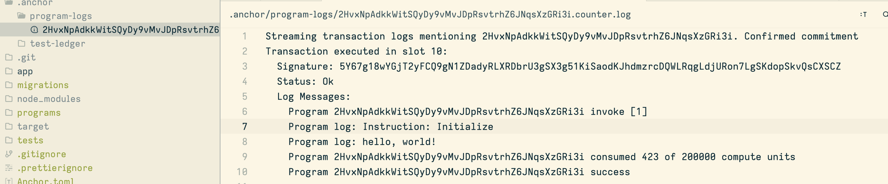

# 什么是Anchor?

今天，开始我们学习从Solana上开发智能合约，这里我打算先从Anchor开始。因为Anchor也是Solana上现在如今用的最多的开发框架，哦，这里主要用的也是Rust语言，对于Anchor还支持的Solidity语法来写合约，暂时我先不考虑。也希望有🧍‍♂️能一起完善。

那今天就简单的介绍下Anchor上如何从项目的初始化，到后面如何部署合约以及前端如何来调用这个简单的Example合约。

## 先来介绍下什么是Anchor吧

这里我先引用下官方的介绍

> Anchor是一个快速构建安全Solana程序的框架。
>
> 使用Anchor，您可以快速构建程序，因为它会为您编写各种样板代码，例如账户和指令数据的（反）序列化。
>
> 由于Anchor为您处理了某些安全检查，因此您可以更轻松地构建安全的程序。除此之外，它还允许您简洁地定义额外的检查，并将其与业务逻辑分开。
>
> 这两个方面意味着，你不必再花费时间在繁琐的Solana原始程序上，而是可以更多地投入到最重要的事情上，即你的产品。
>

简单的点来说，就是Anchor做为一个Solana上的合约开发框架，对于原生使用Rust开发来说的话，anchor 提供了对于一些模版代码，或者说公共代码操作的抽象，使得开发者更加具体的专注与自己的业务逻辑。

简单的Anchor介绍完了，我们看看如何来初始化一个合约以及部署合约到本地测试网。本地测试网的部署查看[这个教程](https://creatorsdao.github.io/Solana-Co-Learn/module1/local_program_development/)完成✅。

## 一个简单的Anchor合约的部署测试

对于要使用Anchor来开发他需要一些前置的环境配置，例如你需要先安装Rust环境，第二个是安装Solana-cli工具。因为这里Anchor要使用solana cli的 `solana-keygen new` 命令来生成一个本地册测试账户。最后一个是Yarn。这里是Anchor官方给出的[安装教程](https://www.anchor-lang.com/docs/installation)，按照这个安装即可。

### 下面是具体的anchor如何安装

官方推荐的是avm，一个Anchor的多版本管理器。前面我们已经安装了Rust语言，我们就可以使用cargo来安装这个工具。

通过执行这个命令，我们就可以安装avm了。

```bash
cargo install --git https://github.com/coral-xyz/anchor avm --locked --force
```

按照完之后我们就可以使用avm选择一个具体的版本安装，下面者一个命令我们安装的Anchor版本是最新的Anchor。

```bash
avm install latest
avm use latest
```

验证安装成功的我们可以执行`anchor --version`命令，我们可以看到有版本号输出，说明我们安装成功了。

### 一个anchor项目的结构

通过执行`anchor init new-workspace-name` 我们就可以初始化一个solana program。

下面是通过执行`anchor init hello-world`的输出。

```bash
ls --tree . --depth 1
 .
├──  .git
├──  .gitignore
├──  .prettierignore
├──  Anchor.toml
├──  app
├──  Cargo.toml
├──  migrations
├──  node_modules
├──  package-lock.json
├──  package.json
├──  programs
├──  target
├──  tests
├──  tsconfig.json
└──  yarn-error.log
```

- `app` 文件夹：初始化之后是一个空文件夹，这里可以用来存放自己的前端代码。
- `programs` 文件夹：此文件夹包含程序代码。它可以包含多个文件，但最初只包含与 `<new-workspace-name>` 相同名称的程序。并且这个program中已经包含了一些示例代码，在`lib.rs`中可以看到。
- `tests` 文件夹：包含您的端到端测试的文件夹。它已经包含一个测试 `programs/<new-workspace-name>` 中示例代码的文件，这里面的测试都是使用typescript写✍️的代码。当执行`anchor test`的时候会在本地启动一个solana的测试节点，执行里面的测试代码。
- `migrations` 文件夹：在这个文件夹中，保存程序的部署和迁移脚本。
- `Anchor.toml` 文件：此文件配置了程序的工作区范围设置。
    - 程序在本地网络上的地址（ `[programs.localnet]` ）
    - 程序可以推送到的注册表 ( `[registry]` )
    - 一个可以在你的测试中使用的也就是通过`solana-keygen new` 生成的私钥文件路径 ( `[provider]` )
- `.anchor` 这个文件是只有在执行`anchor test`之后才生成的文件夹，里面包含了最新的程序日志和用于测试的本地账本。

这个是在执行`anchor test`之后的文件内容。
```bash
ls --tree . --depth 1
 .
├──  .anchor
├──  .git
├──  .gitignore
├──  .prettierignore
├──  Anchor.toml
├──  app
├──  Cargo.lock
├──  Cargo.toml
├──  migrations
├──  node_modules
├──  package-lock.json
├──  package.json
├──  programs
├──  target
├──  tests
├──  tsconfig.json
└──  yarn-error.log
```

下面这个是执行`anchor test`之后`.anchor`里面生成的日志内容。


好说了这么多，我们看下如何使用anchor打印一个hello world， 目前先只通过anchor test 来观察打印，后面在做介绍如何通过前端调用打印。

## 初始化一个 hello world program

通过执行`anchor init hello-world`， 会为我们创建一个solana program的样板代码。

```rust
use anchor_lang::prelude::*;

declare_id!("2HvxNpAdkkWitSQyDy9vMvJDpRsvtrhZ6JNqsXzGRi3i");

#[program]
pub mod counter {
    use super::*;

    pub fn initialize(ctx: Context<Initialize>) -> Result<()> {
        Ok(())
    }
}

#[derive(Accounts)]
pub struct Initialize {}
```

上面这段代码就是通过`anchor init hello-world` 创建出来的代码，文件存放在`hello-world/programs/hello-world/src/lib.rs`中。

下面我们就通过简单的修改下这个简单的代码，在里面添加一个打印hello, world!的消息。


```rust
use anchor_lang::prelude::*;

declare_id!("2HvxNpAdkkWitSQyDy9vMvJDpRsvtrhZ6JNqsXzGRi3i");

#[program]
pub mod counter {
    use super::*;

    pub fn initialize(ctx: Context<Initialize>) -> Result<()> {
        msg!("hello, world!");
        Ok(())
    }
}

#[derive(Accounts)]
pub struct Initialize {}
```

这个是添加了`msg!`这段代码，`msg!`主要做的事情，类似于在rust中打印内容到标准输出的`println!`，
因为是solana program，他是链上代码，我们不可能打印到标准输出的，所以这我们就通过使用`msg!`这个宏记录自己需要打印的东西。

>在Solana中，由于智能合约在执行时是在分布式网络中运行的，无法直接使用传统的标准输出来打印消息。为了在智能合约中输出调试信息或日志，Solana提供了`msg!`宏。
>
>`msg!`宏的使用方式与`println!`宏类似，你可以在智能合约中使用它来打印消息。这些消息将被记录并作为日志输出到Solana节点的日志文件中。
>
>需要注意的是，`msg!`宏只在Solana智能合约中可用，用于在智能合约执行过程中输出消息。它与Rust中的`println!`宏略有不同，因为它将消息记录到Solana节点的日志文件中，而不是直接输出到控制台。

## 观察👀 `hello,world!`消息

想要观察是否打印了`hello, world!`这个消息，我们可以通过运行`anchor test`。这个会记录📝program在测试执行的内容。



我们可以看到通过执行`anchor test`已经将我们打印的hello,world! 记录下来了。

来看下执行的这个测试脚本吧。这里是执行的程序的`initialize`执行的调用。我们在这个指令中添加了打印hello, world的代码。

```ts
import * as anchor from "@coral-xyz/anchor";
import { Program } from "@coral-xyz/anchor";
import { Hello } from "../target/types/hello";

describe("hello", () => {
  // Configure the client to use the local cluster.
  anchor.setProvider(anchor.AnchorProvider.env());

  const program = anchor.workspace.Hello as Program<Hello>;

  it("Is initialized!", async () => {
    // Add your test here.
    const tx = await program.methods.initialize().rpc();
    console.log("Your transaction signature", tx);
  });
});
```

`anchor.setProvider(anchor.AnchorProvider.env());` 这段代码是通过读取的Anchor.toml中的配置初始化了Anchor的provider。

```toml
[features]
seeds = false
skip-lint = false
[programs.localnet]
hello = "2HvxNpAdkkWitSQyDy9vMvJDpRsvtrhZ6JNqsXzGRi3i"

[registry]
url = "https://api.apr.dev"

[provider]
cluster = "Localnet"
wallet = "/Users/davirain/.config/solana/id.json"

[scripts]
test = "yarn run ts-mocha -p ./tsconfig.json -t 1000000 tests/**/*.ts"
```

我们可以看到这里的provider是localnet,wallet是自己本地的私钥路径。

`const program = anchor.workspace.Hello as Program<Hello>;`

这一步是我们初始化了一个solana 的program 实例，通过Hello这个IDL文件。

在测试中，使用`it`函数定义了一个测试用例，名称为"Is initialized!"。在这个测试用例中，调用了`program.methods.initialize().rpc()`方法，该方法是调用合约中的`initialize`方法，并通过RPC方式发送交易。然后，使用`console.log`打印出交易的签名。

这段代码的目的是测试`hello`程序是否能够成功初始化。通过调用`initialize`方法并打印交易签名，可以验证初始化过程是否成功。

这就是一个简单的`Anchor`合约的入门。
