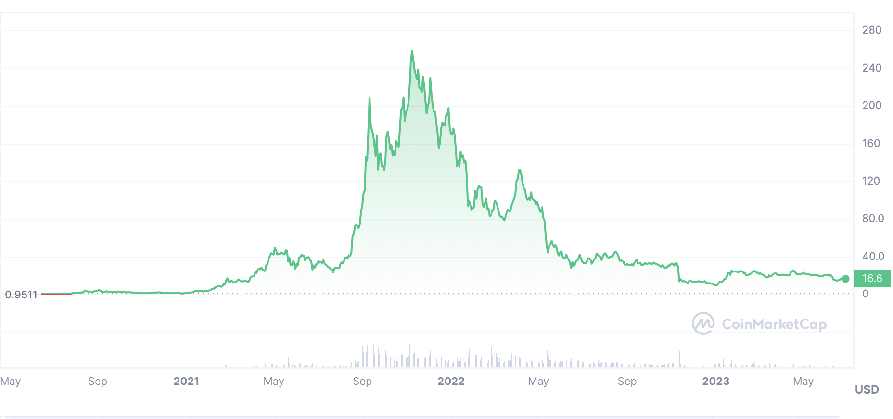

# Solana介绍

一句话概括

> Solana是一条高性能的L1公链

一张图表示

曾经也是辉煌夺目

## Solana历史

2017年11月，Anatoly Yakovenko发表了一篇白皮书，介绍了“Proof of History”这一技术，用于在不信任彼此的计算机之间进行时间同步。根据Anatoly在高通、Mesosphere和Dropbox设计分布式系统的经验，他知道可靠的时钟可以使网络同步变得非常简单。当同步变得简单时，结果的网络可以非常快速，仅受网络带宽的限制。

Anatoly注意到，没有时钟的区块链系统（如比特币和以太坊）在全球范围内的交易速度在15次每秒时遇到困难，而世界中心化支付系统（如Visa）则需要峰值65000次每秒。 没有时钟，很明显他们永远无法成为全球支付系统或全球超级计算机。当Anatoly解决了计算机之间不信任时间一致性的问题时，他知道他拥有将40年分布式系统研究带给区块链世界的关键。由此产生的集群不仅仅是10倍、100倍或1000倍，而是立即实现了出厂时是一万倍的速度！

Anatoly的实施开始是在一个私人代码库中，使用C编程语言进行实现。曾在Qualcomm Incorporated与Anatoly一起合作的Greg Fitzgerald鼓励他以Rust编程语言重新实现该项目。Greg曾在LLVM编译器基础设施上工作，该基础设施是Clang C/C++编译器和Rust编译器的基础。Greg声称该语言的安全保证将提高软件的生产率，并且其无垃圾回收器将使程序能够像使用C编写的程序一样运行。Anatoly尝试了一下，仅用了两个星期，就将他的整个代码库迁移到了Rust上。成功了。计划将全球的交易编织在一个可伸缩的区块链上，Anatoly将该项目命名为Loom。

2018年2月13日，Greg开始为Anatoly的白皮书创建开源实现的原型。该项目在Loom协议组织的GitHub上发布，命名为Silk。2月28日，Greg发布了首个版本，演示了超过10,000个签名交易可以在半秒内验证和处理。不久之后，另一位曾在高通工作的同事Stephen Akridge演示了通过将签名验证转移至图形处理器可以大大提高吞吐量。Anatoly邀请Greg、Stephen和其他三个人共同创办了一家名为Loom的公司。

与此同时，基于以太坊的项目Loom Network涌现出来，许多人对它们是否是同一个项目感到困惑。Loom团队决定进行重新品牌推广。他们选择名为Solana的名字，以致敬他们在工作于高通期间住和冲浪了三年的圣地亚哥北部的一个小海滩城镇Solana Beach。 2018年3月28日，团队创建了Solana GitHub组织，并将Greg的原型命名为Solana。

2018年6月，团队将技术扩展到云网络上运行，并于7月19日发布了一个50个节点的许可,且公开的测试网络，能够始终支持每秒25万个交易的突发。在稍后于12月的v0.10 Pillbox版本中，团队发布了一个以千兆位网络运行150个节点的许可测试网络，演示了平均每秒处理20万个交易和突发500万个交易的吸收测试。该项目还扩展到支持使用C编程语言编写的链上程序，并在称为SBF的安全执行环境中并行运行。

## Solana开发流程

Solana网络是一个庞大的全球计算机，任何人都可以支付费用来存储和执行代码。部署的代码被称为程序，在其他区块链上通常被称为智能合约。要与程序交互，您需要从客户端在区块链上发送一笔交易。这是一个高层次的表示。需要注意的是，这只是为了简单易懂而对Solana网络的过度简化。

Solana开发者工作流程是程序-客户（program-client）模型。程序开发的第一个工作流程允许您直接创建和部署自定义的Rust、C和C++程序到区块链。一旦这些程序部署完成，任何知道如何与它们通信的人都可以使用它们。您可以使用任何可用的客户端SDK（或CLI）编写dApps来与这些程序通信，所有这些SDK都在底层使用JSON RPC API。

客户端开发是第二个工作流，您可以在这里编写与部署的程序通信的dApp。您的应用程序可以通过客户端SDK向这些程序提交交易指令，以创建各种应用程序，如钱包、交易所等。最常用的应用程序是浏览器扩展钱包和Web应用程序，但您也可以构建移动、桌面应用程序或任何能够与JSON RPC API通信的应用程序。

这两个部分共同工作，创建了一个由dApp和程序组成的网络，它们可以相互通信以更新状态并查询区块链。

也就是所谓的前端开发和合约开发。后续我们的课程也是围绕着两个方向来展开。
