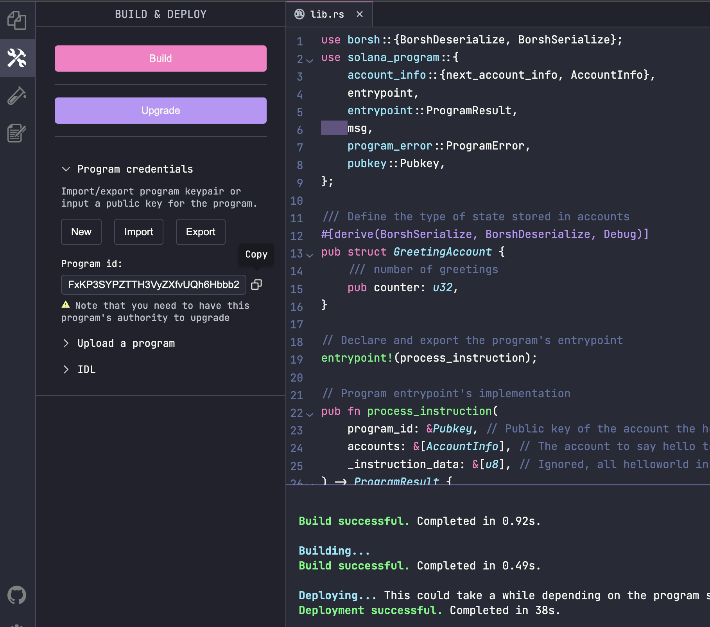

# hello world

`Solana`为了初学者可以快速入门，提供了一个 [`Solane Playground`](https://beta.solpg.io/) 服务。 可以在不需要本地环境的情况下，进行`Dapp`的开发。

## 创建项目

在界面中，我们点击 "`Create a New Project`"


创建完项目后。在`Explorer`里可以看到文件列表，主要有：

```bash
src/
    lib.rs

client/
    clinet.ts

test/
    native.test.ts
```


对应的位置有

- "`Build`"：构建合约
- "`Run`" : 运行客户端端，调试合约。
- "`Test`": 执行测试代码

## 链接钱包

在界面的左下角有个"`unconnect`"的提示，点击后，弹出：


在这里选择我们之前生成的"`~/.config/solana/id.json`"秘钥文件。导入后，可以看到钱包详情


## 开发合约

打开这里的`lib.rs`，在里面贴上:

```rust
use solana_program::{
    account_info::AccountInfo,
    entrypoint,
    entrypoint::ProgramResult,
    pubkey::Pubkey,
    msg,
};


// Declare and export the program's entrypoint
entrypoint!(process_instruction);

// Program entrypoint's implementation
pub fn process_instruction(
    _program_id: &Pubkey, // Public key of the account the hello world program was loaded into
    _accounts: &[AccountInfo], // The account to say hello to
    _instruction_data: &[u8], // Ignored, all helloworld instructions are hellos
) -> ProgramResult {
    msg!("Hello World Rust program entrypoint");

    Ok(())
}
```

然后点击"`Build`",在下面的界面可以看到build的结果：

```bash
Building...
Build successful. Completed in 0.60s.
```

然后点击左侧的 锤子+扳手的图标，点击"`Deploy`":



发布成功，可以在界面上看到发布后的合约地址。在发布过一次后，这里的"`Deploy`"就会变成"`Update`"

如果我们的合约有修改，只要在这里构建后点击"`Update`"就可以进行更新了。

## 客户端开发

回到`Explorer`界面，打开`client.ts`，在里面贴上：

```typescript
// Client
console.log("My address:", pg.wallet.publicKey.toString());
const balance = await pg.connection.getBalance(pg.wallet.publicKey);
console.log(`My balance: ${balance / web3.LAMPORTS_PER_SOL} SOL`);

// create an empty transaction
const transaction = new web3.Transaction();

// add a hello world program instruction to the transaction
transaction.add(
new web3.TransactionInstruction({
    keys: [],
    programId: new web3.PublicKey(pg.PROGRAM_ID),
}),
);

console.log("Sending transaction...");
const txHash = await web3.sendAndConfirmTransaction(
    pg.connection,
    transaction,
    [pg.wallet.keypair],
);
console.log("Transaction sent with hash:", txHash);
```

这里，不需要过多的`import`，`IDE`已经帮忙们做了`import`。可以直接使用`web3`。其中"`pg.wallet`" 就是我们的钱包，其`publicKey`属性就是钱包的地址。而`pg.connection`就如同我们用`web3`创建 的`connection`对象，这里共用`playground`的设置里面的`RPC`地址。

`pb.PROGRAM_ID` 就是我们要刚刚构建并发布的合约的地址。

点击"`Run`"我们可以在日志里面看到:

```bash
Running client...
client.ts:
My address: 5pWae6RxD3zrYzBmPTMYo1LZ5vef3vfWH6iV3s8n6ZRG
My balance: 4.27388232 SOL
Sending transaction...
Transaction sent with hash: 3XcaF6zpXthBQ2mih7DdVBuvwXi7L6Wy4rCHzgwHEaNsqMDNRGC5yppG9xKP9g9hYfT6wPEw127mxgYWBTouS5gz
```

打开[`solana`浏览器](https://explorer.solana.com/)，贴上这里的`hash`地址。可以看到。在日志部分，执行了我们前面合约代码里面的"`HelloWorld`"。


