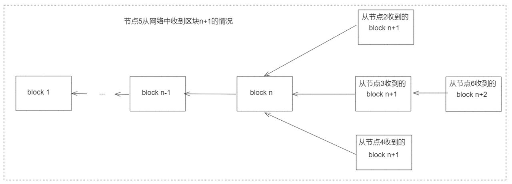
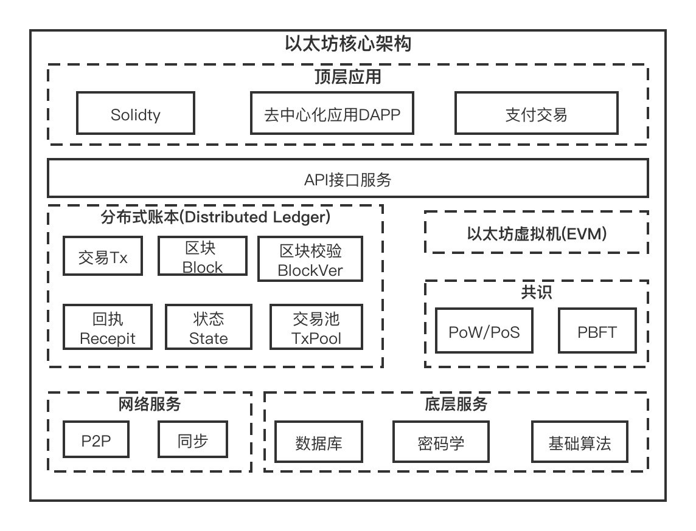

# 区块链基本概念介绍

## 1. 什么是区块链？

### 1.1 区块链的定义

来自维基百科的定义：
- 区块链是借由密码学和共识机制等技术建立与存储庞大交易资料串连的点对点网路系统。

网络上其它一些定义：
- 区块链是一个去中心化的、可共享的、防篡改的分布式账本。
- 区块链技术是一种高级数据库机制，允许在企业网络中透明的共享信息。
- 区块链是一个共享的、不可篡改的账本，旨在促进业务网络中的交易记录和资产跟踪流程。

总结如下：
- 从功能上说，区块链系统是一个去中心化的、可共享的、不可篡改的分布式账本。
- 从使用技术上说，区块链系统是由密码学、共识机制、p2p等技术建立的软件系统。

### 1.2 比特币和区块链的关系

比特币的出现标志着区块链技术的产生，换句话说，比特币系统的主要技术就是区块链技术。
比特币是第一个区块链系统，中本聪可以说是区块链技术的始祖。

### 1.3 区块链技术的演进
- 2008年，中本聪在网上发布了一篇名为《Bitcoin: A Peer-to-Peer Electronic Cash System》。
- 2008年11月16日，中本聪公布了比特币系统的源代码。
- 2009年1月3日（比特币的创世时刻），中本聪在互联网上上线了比特币网络。比特币的产生标志着区块链进入1.0时代。
- 2013年，V神提出：图灵完备、可编程的区块链。从此之后区块链有了智能合约。以太坊的产生标志着区块链进入2.0时代。
- 从以太坊之后，不断有新的区块链技术出现，像`Solana`、`Polkadot`、`Comos`、`Near`等等。

## 2 从使用者的角度看，区块链是怎样运行的？

下面主要以比特币为例，看看区块链系统是怎么运行的。在开始之前，我们需要明确一下比特币的功能。比特币系统是一个软件系统，这个软件系统的主要功能实际就是记账，记录的内容就是谁有多少个比特币，例如“小明有3个比特币”。当然比特币真正的记账不会这么简单，因为它实际上是以一种叫做`UTXO`的结构在记账，但是此处希望大家明白的是它主要的功能就是记账。

### 2.1 比特币的运行

下面我们就从小明和小红之间的转账过程来看看区块链系统是怎么样运行的。
s
- 假定开始时：小明已经有了3个比特币，小红没有比特币，此时在比特币系统中就会类似记录“小明， 3个比特币”。
- 当小明通过比特币系统转给小红1个比特币后，比特币系统中的记录就会变成“小明，2个比特币；小红，1个比特币”。
特别说明：比特币是使用`UTXO`的方式记账，此处为了方便演示区块链系统运行的过程，所以对记账以账户类型方式做替代，如需了解比特币正在的记账方式请查阅`UTXO`相关资料。

当“小明转给小红1个比特币”时，其发生的过程主要如下：

1. 小明通过终端（手机或者电脑）将交易发给比特币系统的某个节点（例如上图中的计算机1），这个交易记录的主要信息就是“小明转给小红1个比特币”。

2. 计算机1上的比特币程序就会做如下几件事情：
  - 检查交易的合法性。
  - 将交易广播给其它相连的节点（计算机上的比特币程序实际上就是比特币网络中的一个节点，后面我们都称为节点）。

3. 其它节点通过网络收到这个交易后，也都会做如下的事情：
  - 检查交易的合法性。
  - 广播给其它相连的节点。

4. 除了上述的上述的动作外，每个节点还会持续进行挖矿的操作（这里假定系统中所有的节点都是全节点，便于说明原理），具体行为为：
  - 将收到的交易进行打包，打包之后的结构叫做区块。
  - 区块的区块头里面要填充一些信息，这些信息包括前一个区块头的哈希，区块链中所有交易哈希的默克尔树的树根，还有解一个难题的难度值等。
  - 将打包好的区块广播给网络中的其它节点。

5. 每个节点收到区块后（每个节点自己打包区块，同时也会从网络中收到其它的区块），会进行如下处理：
  - 对收到的区块进行验证。
  - 然后将新收到的区块进行存储，这样每个节点上就会有一个区块组成的链条形式的账本（因为每个区块头里面有前一个区块头的信息）。

6. “小明转给小红1个比特币”这个交易信息最终就被记录在某个区块中，我们就可以认为这个信息已经被记录在比特币系统中了，其对应的效果就类似于记录“小明，2个比特币；小红，1个比特币”。

### 2.2 几个重要的问题

1. 如何验证交易的合法性？

每个节点收到交易后如何验证交易的合法性，换句话说，就是怎么知道“小明可以给小红转1个比特币”。这是因为，每个节点都保存有区块链的账本（一个区块连着一个区块），在收到交易后，它会查自己账本中对应的情况，看小明是不是有3个比特币。

2. 如何保证挖矿的节点真实的打包区块？

上面的交易相对来说好验证，但是如果某个节点打包时，自己私自写一个交易或者篡改一个交易到区块中，其它区块怎么验证，如果无法验证的话，那么这个账本的可信度岂不是无法保证。

这里就涉及到每个节点挖矿时都需要解决一个难题，而这个难题的计算需要一定的代价（需要不断的计算，花费电费），当它打包的区块被大部分节点都加入到区块链条中后，会得到相应的奖励。当其它节点收到别的节点打包的区块时，会进行下面的验证：
- 验证这个难题的答案是不是正确。
- 验证是不是区块链里面的每笔交易是不是正确（会根据自己本地的账本验证交易是不是正确）。

试想一下，如果有一个作恶的节点，当它花费一定的电量打包了一个区块，而此区块中有一笔或者多笔篡改的交易；当其它节点收到该区块后，根据上面的第二点验证时，验证不过，那么就会抛弃此区块。此时作恶节点就得不到挖矿的奖励，但是它挖矿时是花费了成本的，这对它来说并不划算，所以正常来说，挖矿的节点不会做这种吃力不讨好的事情。即使有个别的节点做这样的事情，也不会对最终的结果产生影响。

3. 多个节点都在打包区块，那么当其它节点收到区块后，必然会出现一个高度有多个区块的情况（即每个区块的前一个区块头信息都一样），那么存储时以那个区块中的信息为准？

这个问题描述是下面这种情形：

在上图中，当节点5收到多个高度为`n+1`的区块，它的区块链链条该选择那个区块呢？在比特币中，选择链条最长的作为最终的账本，其它分叉上的区块就会无效。每个矿工节点在挖矿时，都会基于自己看到的最长的链条上的最新区块进行打包（例如接下来节点5要打包第`n+3`个区块，它就会选择在中间那个链条上block `n+2`作为父区块挖矿。），当所有节点都如此选择时，在所有节点上的链条最终会一致（就是那条最长的链条）。

小结：

上面的第2和第3个问题实际上可以合成一个问题，就是如何保证所有节点上的账本一致？而在区块链系统中解决这部分问题的机制就叫做共识机制。

## 3 从实现的角度看，看区块链的架构

### 3.1 比特币系统架构

根据上一节比特币系统的运行，我们大致可以知道比特币系统（区块链系统类似）的架构。

- 用户可以发送交易到比特币系统，所以比特币系统中有`Rpc server`或者是`http server`。
- 节点之间可以通信，且节点之间的地位对等，那么需要`P2P`网络部分。
- 每个节点收到交易后，首先是将交易放在交易池中，挖矿时是从交易池取出交易进行打包，所以需要交易池。
- 需要保证所有节点上的账本一致，所以需要共识模块。
- 区块形成的链条在每个节点上都是持久化存储的，所以需要数据库用于节点上数据的持久化。
- 共识里面涉及到的区块链条、区块、交易等结构的一些定义和组织形式，所以需要账本模块。
- 其它还涉及到一些安全、加密相关的模块。

根据这些推断，我们可以得出比特币的大致架构如下：

### 3.2 以太坊系统架构

下图是从网络中找到的以太坊的架构图：

我们可以看到和比特币的架构图大体上差不多，主要是多了智能合约相关的内容。

## 3. 通常的区块链系统架构

其实从前面的比特币和以太坊架构，我们也可以推断出来，大部分区块链系统的架构都差不太多，尤其是现在常见的区块链系统，其架构都类似于以太坊的架构。有差别的主要在于共识模块、分布式账本的具体实现。

## 4 solana的原理

前面主要介绍了区块链的基础知识，再讲讲`Solana`的相关原理。具体内容可以参考[这篇文章](https://web3caff.com/zh/archives/14903)。

## 5 推荐资料

- 《精通比特币》

## 参考资料💾

- [https://www.xinbaoku.com/blockchain/](https://www.xinbaoku.com/blockchain/)
