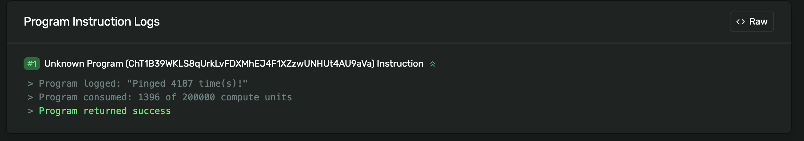

# 📝 构建一个互动脚本

你准备好与`Solana`网络交互了吗？

我们将编写一个脚本，生成一个密钥对，使用`devnet` `SOL`进行充值，并与`Solana`网络上的现有程序进行交互。

这个程序是一个简单的“`ping`”计数器：每次我们触发它，它就会记录我们的`ping`行为，并增加一个计数器。稍后我们会深入了解`Rust`和自己的程序开发，但现在我们先使用`JS/TS`来实现。

## 🚧 在本地设置 Solana 客户端

现在让我们换一种方式来操作 - 我们将不再使用`React/Next.js`，而是采用纯`TypeScript`来构建一个本地客户端。这样的方法比搭建前端并构建复杂用户界面要快得多。你可以在单独的 TS 文件中进行开发，并通过异步方式让它与网络进行交互。

首先，在你的`Solana`工作区中创建一个新文件夹，然后使用以下便捷命令来设置本地客户端：

```bash
npx create-solana-client solana-intro-client
```

如果系统询问你是否要安装`create-solana-client`软件包，请选择“是”。

接下来，只需导航到新创建的目录，并使用文本编辑器打开它：

```bash
cd solana-intro-client
code .
```

现在你可以开始你的`Solana`客户端开发之旅了！

## ⚙ 客户端脚本的设置

使用 `create-solana-client` 的好处在于，我们可以立即开始编写客户端代码！打开 `index.ts`，导入必要的依赖项，并添加这个 `initializeKeypair` 函数：

```ts
import * as Web3 from '@solana/web3.js';
import * as fs from 'fs';
import dotenv from 'dotenv';
dotenv.config();

async function main() {

}

main()
  .then(() => {
    console.log('执行成功完成');
    process.exit(0);
  })
  .catch((error) => {
    console.log(error);
    process.exit(1);
  });
```

在终端中运行 `npm start` 后，你将看到脚本已经开始运行！只需一条命令，`Solana` 客户端就已设置完毕。

现在让我们添加一个 `initializeKeypair` 函数。如果我们没有密钥对，它将自动为我们创建一个。在导入之后添加以下代码：

```ts
async function initializeKeypair(connection: Web3.Connection): Promise<Web3.Keypair> {
  // 如果没有私钥，生成新密钥对
  if (!process.env.PRIVATE_KEY) {
    console.log('正在生成新密钥对... 🗝️');
    const signer = Web3.Keypair.generate();

    console.log('正在创建 .env 文件');
    fs.writeFileSync('.env', `PRIVATE_KEY=[${signer.secretKey.toString()}]`);

    return signer;
  }

  const secret = JSON.parse(process.env.PRIVATE_KEY ?? '') as number[];
  const secretKey = Uint8Array.from(secret);
  const keypairFromSecret = Web3.Keypair.fromSecretKey(secretKey);
  return keypairFromSecret;
}
```

这个函数非常聪明 - 如果你的 `.env` 文件中没有私钥，它就会创建一个新的！

你已经非常熟悉这里的操作了 - 我们调用 `Web3.Keypair.generate()` 函数并将结果写入本地的 [`dotenv`](https://www.npmjs.com/package/dotenv) 文件。创建后，我们返回密钥对，以便我们可以在脚本的其他部分中使用它。

你可以更新 `main` 函数并使用 `npm start` 运行脚本进行测试：

```ts
async function main() {
  const connection = new Web3.Connection(Web3.clusterApiUrl('devnet'));
  const signer = await initializeKeypair(connection);

  console.log("公钥：", signer.publicKey.toBase58());
}
```

你应该会在终端中看到类似的输出：

```bash
> solana-course-client@1.0.0 start
> ts-node src/index.ts

正在生成新密钥对... 🗝️
正在创建 .env 文件
公钥: jTAsqBrjsYp4uEJNmED5R66gHPnFW4wvQrbmFG3c4QS
执行成功完成
```

很好！如果你检查 `.env` 文件，你会发现一串字节格式的私钥！请注意保密此文件。如果你将此文件推送到公共的 `GitHub` 存储库，任何人都可以访问其中的资金，因此请确保不要用它处理真实的货币。

再次运行 `npm start` 会使用现有的私钥而不会创建新的。

保持测试账户的独立非常重要，这也是这个脚本特别酷的原因 - 它消除了创建和管理测试钱包的麻烦。

现在，如果我们还能自动获取 `devnet SOL` 就更好了。哦等等，我们确实可以！

看看这个超酷的空投功能。

```ts
async function airdropSolIfNeeded(
  signer: Web3.Keypair,
  connection: Web3.Connection
) {
  // 检查余额
  const balance = await connection.getBalance(signer.publicKey);
  console.log('当前余额为', balance / Web3.LAMPORTS_PER_SOL, 'SOL');

  // 如果余额少于 1 SOL，执行空投
  if (balance / Web3.LAMPORTS_PER_SOL < 1) {
    console.log('正在空投 1 SOL');
    const airdropSignature = await connection.requestAirdrop(
      signer.publicKey,
      Web3.LAMPORTS_PER_SOL
    );

    const latestBlockhash = await connection.getLatestBlockhash();

    await connection.confirmTransaction({
      blockhash: latestBlockhash.blockhash,
      lastValidBlockHeight: latestBlockhash.lastValidBlockHeight,
      signature: airdropSignature,
    });

    const newBalance = await connection.getBalance(signer.publicKey);
    console.log('新余额为', newBalance / Web3.LAMPORTS_PER_SOL, 'SOL');
  }
}
```

这可能看得让人有些头大，但其实你对于这里正在发生的事情应该相当了解！我们正在借助我们熟悉的`getBalance`来查看我们的余额是否不足，如果不足，我们就会用`requestAirdrop`函数来获取一些资金。

区块哈希和区块高度是识别区块的标识符，用以确保我们是最新的，也不会发送陈旧的交易。

不过，别试图反复运行它，因为水龙头有冷却时间，如果你不停地向它请求，请求将会失败。

在创建或获取密钥对之后，请确保更新`initializeKeypair`函数，以便调用空投。

```ts
// 当生成密钥对时
await airdropSolIfNeeded(signer, connection);

// 当从密钥解析时
await airdropSolIfNeeded(keypairFromSecret, connection);
```

现在，当你运行`npm run start`时，你将看到空投的情况：

```bash
当前余额为 0 SOL
正在空投 1 SOL
新的余额为 1 SOL
公共密钥: 7Fw3bXskk5eonycvET6BSufxAsuNudvuxF7MMnS8KMqX
```

我们已经准备好大展身手了，让我们一展拳脚吧 🥊！

## 🖱 调用链上程序

现在是时候让我们的客户端显示实力了。我们将在`Solana`网络上的现有程序中写入数据。有人可能会以为`Solana`的开发只和用`Rust`编写程序有关，其实不然！大部分区块链开发实际上与现有程序进行交互。

你可以构建数百个只与现有程序交互的应用，这就是真正有趣的地方！我们会让事情保持简单——我们的客户端会发送一个计数器程序，并递增计数器。这样你就能在网络上公告你是一名开发者了。

首先，我们需要告诉客户端它将与哪些程序交互。在导入语句下方的开头部分，添加这些地址：

```ts
const PROGRAM_ID = new Web3.PublicKey("ChT1B39WKLS8qUrkLvFDXMhEJ4F1XZzwUNHUt4AU9aVa")
const PROGRAM_DATA_PUBLIC_KEY = new Web3.PublicKey("Ah9K7dQ8EHaZqcAsgBW8w37yN2eAy3koFmUn4x3CJtod")
```

`PROGRAM_ID` 是“`ping`”程序本身的地址。`PROGRAM_DATA_PUBLIC_KEY` 是存储程序数据的账户地址。记得，**可执行代码和状态数据在`Solana`上是分开存储的！**

然后，添加下列函数以在任何地方调用“`ping`”程序：

```ts
async function pingProgram(connection: Web3.Connection, payer: Web3.Keypair) {
  const transaction = new Web3.Transaction()
  const instruction = new Web3.TransactionInstruction({
    // Instructions need 3 things

    // 1. The public keys of all the accounts the instruction will read/write
    keys: [
      {
        pubkey: PROGRAM_DATA_PUBLIC_KEY,
        isSigner: false,
        isWritable: true
      }
    ],

    // 2. The ID of the program this instruction will be sent to
    programId: PROGRAM_ID

    // 3. Data - in this case, there's none!
  })

  transaction.add(instruction)
  const transactionSignature = await Web3.sendAndConfirmTransaction(connection, transaction, [payer])

  console.log(
    `Transaction https://explorer.solana.com/tx/${transactionSignature}?cluster=devnet`
    )
}
```

这个过程并不像看起来那么复杂！你已经熟悉这部分了：

- 我们创建一个交易
- 我们制定一项指令
- 我们将指令添加到交易中
- 我们将交易发送到网络！

回顾一下上面的代码注释，了解指令的三个主要部分。

其中关键的部分是`keys`值——它是一个数组，包含指令将读取或写入的每个账户的元数据。在我们的例子中，我告诉你该指令将处理哪些账户。

你必须知道这个是什么——可以通过阅读程序本身或其文档来了解。如果你不了解这一点，就无法与程序互动，因为指令会无效。

可以将这个过程想象成试图开车去一个没有 GPS 地址的地方。你知道你想去哪里，但不知道如何到达那里。

由于此操作不需要数据账户的签名，我们将`isSigner`设置为`false`。`isWritable`设置为`true`，因为该账户将被写入。

通过告知网络我们需要与哪些账户交互，以及我们是否正在向它们写入数据，`Solana`运行时就会知道哪些交易可以并行运行。这部分就是`Solana`速度如此之快的原因之一！

在`main()`中加入此函数的调用`await pingProgram(connection, signer)`，并用`npm start`运行脚本。访问所记录的资源管理器链接，你将在页面底部看到你写入的数据（其他所有内容可以忽略）。



你刚刚将数据写入了区块链。感觉简单吗？

虽然看起来很简单，但你确实已经成功了。当推特上的人们都在热衷于猴子图片时，你正在构建真正有价值的东西。你在本节学到的内容——从`Solana`网络读取和写入数据——足以制作价值 1 万美元的产品。想象一下，当你完成这个项目时，你还能做些什么🤘！


## 🚢 挑战 - SOL 转账脚本

既然我们一同学习了如何将交易发送到网络，现在是时候让你独立尝试了。

参照前一步骤的流程，从头开始创建一个脚本，让你能够在`Devnet`上从一个账户转移 SOL 到另一个账户。请确保打印交易签名，以便你可以在`Solana Explorer`上查看它。

回顾一下到目前为止你学到的东西：

- 将数据写入网络是通过事务实现的
- 交易需要指令
- 指令向网络指示涉及哪些程序及其功能
- `SOL`的转移是通过系统程序完成的（嗯，我在想这个过程叫什么名字。🤔 转移吗？）

你在这里需要做的就是找出准确的函数名称，以及指令应该是怎样的。你可以从`Google`开始查找：P

附注：如果你确定自己已经了解了这些内容，但转账仍然失败，那么问题可能是转账金额太少——尝试至少转账`0.1 SOL`。

就像以往一样，在查看解决方案代码之前，尽量自己完成这个任务。当你真正需要参考解决方案时，[请点击这里查看](https://github.com/all-in-one-solana/solana-co-learn-code/blob/main/src/transferSol.ts)。👀
