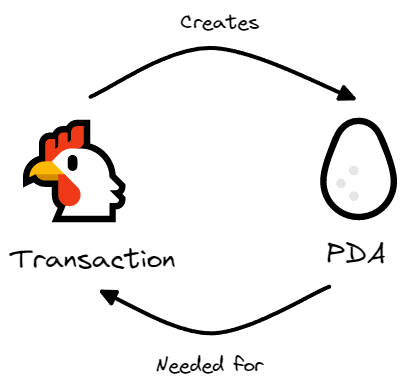

# 🎥 构建一个电影评论应用

现在我们已经完成了钱包连接的设置，是时候让我们的`ping`按钮发挥作用了！我们将整合所有元素，构建一个基于区块链的电影评论应用——它将允许任何人提交对他们最喜欢的电影的评论，有点像烂番茄网站那样。

## 在`Solana`工作空间中设置初始代码

首先，你可以从[GitHub克隆起始代码](https://github.com/all-in-one-solana/solana-movie-frontend.git)，并安装所需的依赖项：

```bash
git clone https://github.com/all-in-one-solana/solana-movie-frontend.git
cd solana-movie-frontend
git checkout starter
npm i
```

运行 `npm run dev` 后，你应该能在 `localhost:3000` 上看到如下内容：


这是一个基于 `Next.js` 的常规应用程序，已预安装了一些模板组件和`Solana`依赖项，以帮助你节省时间。你会看到一些模拟评论，请浏览各个组件以了解应用程序的工作方式。

### 结构调整

你会注意到，我们已将钱包上下文提供程序从 `_app.tsx` 移至了它自己的组件中。这样做的效果是一样的，但将其与更大的应用程序隔离开，可以提高性能。

### 功能构建

目前，应用程序所做的只是将你的评论记录到控制台中。接下来的工作将集中在 `Form.tsx` 文件中，我们将在其中设置 `handleTransactionSubmit` 函数。

通过这个项目，你将学习如何在`Solana`上构建真实世界的应用程序，把钱包集成、交易处理、和区块链数据管理结合在一起。

准备好了吗？让我们开始吧！

## 🗺 定义架构

序列化的第一步是为我们要序列化的数据创建一个模式或映射。我们需要告诉`Borsh`数据将被称为什么，以及每个项目的大小。

### 安装 `borsh`

首先，你需要安装 `borsh` 库。在终端中运行以下命令：

```bash
npm install @project-serum/borsh --force
```

### 在 `Movie.ts` 中定义架构

接下来，前往 `Movie.ts` 文件，导入 `borsh`，然后在 `Movie` 类中添加架构。以下是你需要做的代码段：

```ts
// 引入borsh库
import * as borsh from '@project-serum/borsh'

export class Movie {
    title: string;
    rating: number;
    description: string;

    // 构造函数和模拟将保持不变
    constructor(title: string, rating: number, description: string) {}
    static mocks: Movie[] = []

    // 这里是我们的架构定义！
    borshInstructionSchema = borsh.struct([
        borsh.u8('variant'),
        borsh.str('title'),
        borsh.u8('rating'),
        borsh.str('description'),
    ])
}
```

在电影评论程序中，我们期望指令数据包括：

- `variant`：一个无符号的`8`位整数，表示要执行的指令（换句话说，应在程序上调用哪个函数）。
- `title`：一个字符串，代表你正在评价的电影的标题。
- `rating`：一个无符号的`8`位整数，表示你对正在评论的电影的评分（满分为`5`）。
- `description`：一个字符串，表示你为电影留下的书面评论。

这个架构必须与程序所期望的完全匹配，包括结构中项目的顺序。当程序读取你的数据时，它将按照定义的顺序进行反序列化。如果你的顺序不同，它生成的数据将无效。由于我们使用的是已部署的程序，所以我已经为你提供了架构。通常，你会需要阅读文档或自己检查程序代码来了解这些细节。

## 🌭 创建序列化方法

我们已经知道数据的结构，现在需要编写一个方法将其序列化。在 `Movie` 类中的架构下方添加以下代码：

```ts
serialize(): Buffer {
    const buffer = Buffer.alloc(1000) // 创建一个1000字节的缓冲区
    this.borshInstructionSchema.encode({ ...this, variant: 0 }, buffer) // 使用模式对数据进行编码
    return buffer.slice(0, this.borshInstructionSchema.getSpan(buffer)) // 返回缓冲区中的有效数据部分
}
```

首先，我们创建了一个超大的缓冲区——`1000`字节。为什么是`1000`字节呢？因为我知道它足以容纳我们需要的所有内容，并且在最后还留有额外空间。

接下来，我们使用创建的模式对数据进行编码。`encode` 接受两个参数——我们要编码的数据和我们要存储它的位置。`this` 指的是我们当前所在的对象，因此我们通过解构电影对象，并将其与 `...this` 一起传递，就像传递 `{ title, rating, description, variant }` 一样。

最后，我们移除缓冲区中的多余空间。`getSpan` 就像 `array.length` 一样——它根据模式为我们提供缓冲区中最后使用的项目的索引，因此我们的缓冲区只包含我们需要的数据，而不包括任何多余的内容。

以下是最终的 `Movie.ts` 文件：

```ts
import * as borsh from '@project-serum/borsh'

export class Movie {
    title: string;
    rating: number;
    description: string;

    constructor(title: string, rating: number, description: string) {
        this.title = title;
        this.rating = rating;
        this.description = description;
    }

    static mocks: Movie[] = [
      new Movie('The Shawshank Redemption', 5, `For a movie shot entirely in prison where there is no hope at all, Shawshank redemption's main message and purpose is to remind us of hope, that even in the darkest places hope exists, and only needs someone to find it. Combine this message with a brilliant screenplay, lovely characters, and Martin freeman, and you get a movie that can teach you a lesson every time you watch it. An all-time Classic!!!`),
       new Movie('The Godfather', 5, `One of Hollywood's greatest critical and commercial successes, The Godfather gets everything right; not only did the movie transcend expectations, it established new benchmarks for American cinema.`),
       new Movie('The Godfather: Part II', 4, `The Godfather: Part II is a continuation of the saga of the late Italian-American crime boss, Francis Ford Coppola, and his son, Vito Corleone. The story follows the continuing saga of the Corleone family as they attempt to successfully start a new life for themselves after years of crime and corruption.`),
       new Movie('The Dark Knight', 5, `The Dark Knight is a 2008 superhero film directed, produced, and co-written by Christopher Nolan. Batman, in his darkest hour, faces his greatest challenge yet: he must become the symbol of the opposite of the Batmanian order, the League of Shadows.`),
    ]

    borshInstructionSchema = borsh.struct([
        borsh.u8('variant'),
        borsh.str('title'),
        borsh.u8('rating'),
        borsh.str('description'),
    ])

    serialize(): Buffer {
        const buffer = Buffer.alloc(1000)
        this.borshInstructionSchema.encode({ ...this, variant: 0 }, buffer)
        return buffer.slice(0, this.borshInstructionSchema.getSpan(buffer))
    }
}
```

就是这样！我们已经完成了序列化部分。现在你可以尽情欣赏几部电影了🍿。

## 🤝 用数据创建交易

最后一块拼图是获取用户的数据，使用刚刚创建的方法对其进行序列化，并用它创建一个交易。

首先，我们要更新 `Form.tsx` 中的导入：

```tsx
import { FC } from 'react'
import { Movie } from '../models/Movie'
import { useState } from 'react'
import { Box, Button, FormControl, FormLabel, Input, NumberDecrementStepper, NumberIncrementStepper, NumberInput, NumberInputField, NumberInputStepper, Textarea } from '@chakra-ui/react'
import * as web3 from '@solana/web3.js'
import { useConnection, useWallet } from '@solana/wallet-adapter-react'
```

接下来，在 `handleSubmit` 函数前，我们需要建立 RPC 连接并获取钱包的详细信息：

```tsx
const { connection } = useConnection();
const { publicKey, sendTransaction } = useWallet();
```

现在来看看重点，`handleTransactionSubmit` 函数。除了序列化部分，这对于之前进行的交易来说非常熟悉：处理交易、定义指令、提交交易。

前半部分代码如下：

```tsx
const handleTransactionSubmit = async (movie: Movie) => {
    if (!publicKey) {
        alert('请连接你的钱包！')
        return
    }

    const buffer = movie.serialize()
    const transaction = new web3.Transaction()

    const [pda] = await web3.PublicKey.findProgramAddress(
        [publicKey.toBuffer(), new TextEncoder().encode(movie.title)],
        new web3.PublicKey(MOVIE_REVIEW_PROGRAM_ID)
    )
}
```

除了 `pda` 外，你应该对所有内容都很熟悉。回想一下指令的要求。它需要与之交互的程序`ID`、可选的数据和它将从中读取或写入的账户列表。由于我们要将数据提交到网络上进行存储，我们将创建一个新的账户来存储它。

在提到`PDA`（程序派生地址）时出现了“`Patrick`”！这是用来存储我们电影评论的账户。你可能开始注意到了，这里出现了经典的“先有鸡还是先有蛋”的情况...



我们需要知道账户地址才能进行有效交易，但我们又需要处理交易才能创建账户。解决方案呢？理论上先有的蛋。如果交易创建者和程序都使用相同的过程来选择地址，我们就可以在交易处理之前确定地址。

这就是 `web3.PublicKey.findProgramAddress` 方法的功能。它接受种子和生成种子的程序两个变量。在我们的例子中，种子是发件人的地址和电影的标题。通常你需要通过阅读文档、查看程序代码或逆向工程来了解种子的要求。

完成 `handleTransactionSubmit` 功能的剩余部分就是创建指令并发送它。以下是完整代码：

```tsx
const handleTransactionSubmit = async (movie: Movie) => {
      if (!publicKey) {
          alert('请连接你的钱包！')
          return
      }

      const buffer = movie.serialize()
      const transaction = new web3.Transaction()

      const [pda] = await web3.PublicKey.findProgramAddress(
          [publicKey.toBuffer(), new TextEncoder().encode(movie.title)],
          new web3.PublicKey(MOVIE_REVIEW_PROGRAM_ID)
      )

      const instruction = new web3.TransactionInstruction({
          keys: [
              {
                  // 你的帐户将支付费用，因此会写入网络
                  pubkey: publicKey,
                  isSigner: true,
                  isWritable: false,
              },
              {
                  // PDA将存储电影评论
                  pubkey: pda,
                  isSigner: false,
                  isWritable: true
              },
              {
                  // 系统程序将用于创建PDA
                  pubkey: web3.SystemProgram.programId,
                  isSigner: false,
                  isWritable: false
              }
          ],
          // 这是最重要的部分！
          data: buffer,
          programId: new web3.PublicKey(MOVIE_REVIEW_PROGRAM_ID)
      })

      transaction.add(instruction)

      try {
          let txid = await sendTransaction(transaction, connection)
          console.log(`提交的交易：https://explorer.solana.com/tx/${txid}?cluster=devnet`)
      } catch (e) {
          alert(JSON.stringify(e))
      }
  }
```

通过细致地阅读代码中的注释，你将理解为何我们在指令键数组中需要每一个地址。

就这样了！请确保你的钱包连接到开发网络，并且拥有一些开发网络的`SOL`，然后访问 `localhost:3000`。提交评论后，访问控制台中记录的浏览器链接。向下滚动到底部，你会看到你的电影名称以及其他一些信息：


哇，你刚刚将自定义数据写入 `Solana` 网络。

给自己一个掌声，这可不是件容易的事情！到了这个阶段，可能有人已经放弃了这个项目。给他们一些鼓励，展示你所建立的成果！如果你已经坚持到了这一步，我相信你会一直坚持到最后 :)

## 本地部署 Movie Review 程序

这里`Moview Review Program`的程序: https://github.com/all-in-one-solana/movie-review-program

你需要在本地部署这个程序，然后才能在本地运行这个项目。

然后你还需要修改下前端代码的 `MOVIE_REVIEW_PROGRAM_ID` 常量，改成你本地部署的程序的地址。

这个`commit` : https://github.com/all-in-one-solana/solana-movie-frontend/commit/6451fcfb60ea5feba485a7d1d1cb882833329654#diff-70f76b2487583dcb8b512614274040921abaa29ab8b993b19a45140fdbe7b8c8R10 包含了你需要修改的两个地方，一个就是 `program id` ,还有一个是你需要将链接的 `devnet` 换成`localhost`网络。


## 🚢 挑战：`Solana`构建者的自我介绍

现在，是时候挑战你的思维能力了，让我们的大脑多折几道皱纹 🧠。
我们的目标是继续创建一个应用程序，允许`Solana Core`中的构建者进行自我介绍。我们将会使用地址`HdE95RSVsdb315jfJtaykXhXY478h53X6okDupVfY9yf`上的`Solana`程序来实现这个目的。

:::caution
HdE95RSVsdb315jfJtaykXhXY478h53X6okDupVfY9yf 合约是devnent 上的一个测试合约。所以，运行你的 dapp 之前，保证你的 钱包和应用的网络设置均为 devnent。
:::

最终，你的应用程序应该看起来与电影评论应用程序相似：


### 起始代码和设置

你可以通过以下命令设置项目：

```bash
git clone https://github.com/all-in-one-solana/solana-student-intros-frontend.git
cd solana-student-intros-frontend
git checkout starter
npm i
```

### 提示与指导

程序预计将接收以下顺序的指令数据：

1. `variant` 以无符号`8`位整数表示，用于指示要调用的指令（在本例中应为`0`）。
2. `name` 以字符串形式表示名字。
3. `message` 以字符串形式表示消息。

值得注意的是，程序将使用连接到钱包的公钥来生成每个学生的介绍账户。这意味着每个公钥只能初始化一个学生介绍账户，如果使用相同的公钥提交两次，则交易将失败。

### 自我挑战

与往常一样，首先请尝试独立完成此操作。如果你遇到困难，或者只是想将你的解决方案与我们的解决方案进行比较，请查看[此存储库](https://github.com/all-in-one-solana/solana-student-intros-frontend/tree/solution-serialize-instruction-data)中的`solution-serialize-instruction-data`分支。

祝你好运，期待看到你的成果！
