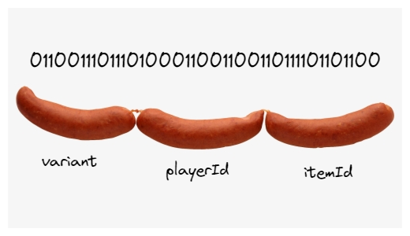

# 🤔 自定义指令

既然我们已经完成了钱包连接的设置，那么让我们使我们的`ping`按钮真正有所作为吧！你现在知道如何读取数据并通过简单的交易将其写入网络。几乎立刻，你可能会发现自己想要通过交易发送数据。那么让我们了解一下如何向`Solana`区块链讲述你的故事。

`Solana`中关于数据的棘手之处在于程序是无状态的。与以太坊等其他区块链中的智能合约不同，程序不存储任何数据，只存储逻辑。


图为：`Solana` 创始人 `Anatoly Yakovenko` 正在制作 `Solana`。

`Solana` 程序中绝对不存储任何内容。它不知道所有者是谁，甚至不知道是谁部署了它。所有的信息都存储在帐户内。

## 📧 指令数据

我们来稍微了解一下引擎盖下面的工作机制。在这部分，许多工作实际上会由像`Anchor`这样的库来处理，但是了解原子指令级别上发生的事情还是很重要的。

让我们退后一步，了解一下指令数据是如何放置的。


交易可以包含一个或多个指令，每个指令可以附带一些数据。

关于指令数据的关键在于其格式 - 它是**8位数据**。"位"是指它是机器码：`1`和`0`。`8`仅仅是指其大小，就像`32`位或`64`位一样。如果你的指令数据不符合这个格式，`Solana`运行时将无法识别它。

这就是`Solana`如此快速的原因之一！它不是让网络转换你的数据，而是由你提供已经转换好的数据，然后网络只需处理它。可以想象一下，如果你在开始烹饪之前已经准备好了所有的食材，你将能够更快地完成烹饪，因为你不需要再切割食材。

你不需要了解机器码是如何工作的。你只需要记住指令数据是某种特定类型的，当你想要在指令中包含数据时，你需要将数据转换为该类型。

:::info
这段文字解释了`Solana`网络如何处理事务和指令数据。在`Solana`中，一个事务可以包含一条或多条指令，每条指令都可以携带一些数据。

重点是，这些指令数据需要以特定的`8`位数据格式提供。这里的“`8`位”并不是指数据的大小，而是指数据的格式，这种格式是机器代码格式，用`1`和`0`表示。如果你提供的指令数据不是这种格式，`Solana`运行时就无法识别和处理它。

这种处理方式使得`Solana`能够高速运行。你不需要让网络转换你的数据，而是自己转换数据并提供给网络，网络只负责处理它。这就像在开始烹饪前就准备好所有食材，你就能更快地烹饪，因为你不需要在烹饪过程中去切东西。

作者强调，你并不需要了解机器代码是如何工作的。你需要记住的是，当你想要在指令中包含一些数据时，这些数据需要是特定类型的，你需要把数据转换为这种类型。这意味着你在编写并提交给`Solana`网络的代码中，需要负责将数据转换为适当的格式。

这是低级别编程的一个常见特点。虽然许多高级编程语言（如`Python`或`JavaScript`）会自动处理这些类型转换，但在低级语言（如`Rust`，也是`Solana`主要使用的语言）中，你需要自己处理这些转换。不过，有些库，如`Anchor`，可以帮助你处理这些转换，使编程更为简单。
:::

## 🔨 序列化和`borsh`

序列化就是将常规的代码或数据转换为字节数组（机器代码：`1`和`0`）的过程。

在我们的项目中，我们将使用 [`Borsh`](https://borsh.io/) 序列化格式，因为它提供了一个方便的库供我们使用。

以装备一个链上游戏物品为例，我们需要以下三个数据：

- `variant` - 我们想要调用的命令的名称（如“装备”或“删除”）
- `playerId` - 将装备物品的玩家的`ID`
- `itemId` - 我们想要装备的物品`ID`

将这些数据序列化包括以下四个步骤：

1. 创建数据模式/映射，明确数据的预期结构。
2. 分配一个比实际所需空间大得多的缓冲区。
3. 将数据编码并添加到缓冲区中。
4. 去掉缓冲区末端的额外空白。

作为网络开发人员，通常不需要处理这样的底层内容，下图可以让这个概念更具形象化：


下面的代码片段展示了如何使用`Borsh`库实现这一过程：

```ts
import * as Borsh from "@project-serum/borsh"

const equipPlayerSchema = Borsh.struct([
  Borsh.u8("variant"),
  Borsh.u8("playerId"),
  Borsh.u8("itemId"),
])

// 创建一个1000字节的缓冲区
const buffer = Buffer.alloc(1000)
equipPlayerSchema.encode({ variant: 2, playerId: 1435, itemId: 737498}, buffer)

// 截取缓冲区以达到所需的长度
const instructBuffer = buffer.slice(0, equipPlayerSchema.getSpan(buffer))
```

在这里，我们定义了一个包括三个无符号整数的`Borsh`结构，并将它们编码为一个字节缓冲区。图示解释了如何将这些数据分解为适当的长度，就像切香肠一样。



接下来的代码片段展示了如何构建和发送交易：

```ts
const endpoint = clusterApiUrl("devnet")
const connection = new Connection(endpoint)

const transaction = new Transaction().add({
  keys: [
    {
      pubkey: player.Publickey,
      isSigner: true,
      isWritable: false,
    },
    {
      pubkey: playerInfoAccount,
      isSigner: false,
      isWritable: true,
    },
    {
      pubkey: SystemProgram.programId,
      isSigner: false,
      isWritable: false,
    },
  ],
  data: instructBuffer,
  programId: PROGRAM_ID,
})

sendAndConfirmTransaction(connection, transaction, [player])
```

一旦我们拥有正确格式的数据，剩下的部分就相对简单了。这个交易的结构应该看起来很熟悉，唯一的新元素是我们之前没有的可选项`data`。

如果你对机器码和内存分配不太了解，也不必担心。你不必深入学习，只需观看一两个相关视频，了解大致的概念即可。

现代开发人员很少直接处理字节缓冲区，因为这被认为是较低级别的工作。所以，如果你感觉这些内容陌生或新奇，也不必担心。通过实际应用，你将能更好地掌握这些概念，从而更接近真正的软件工程师的角色。😎
