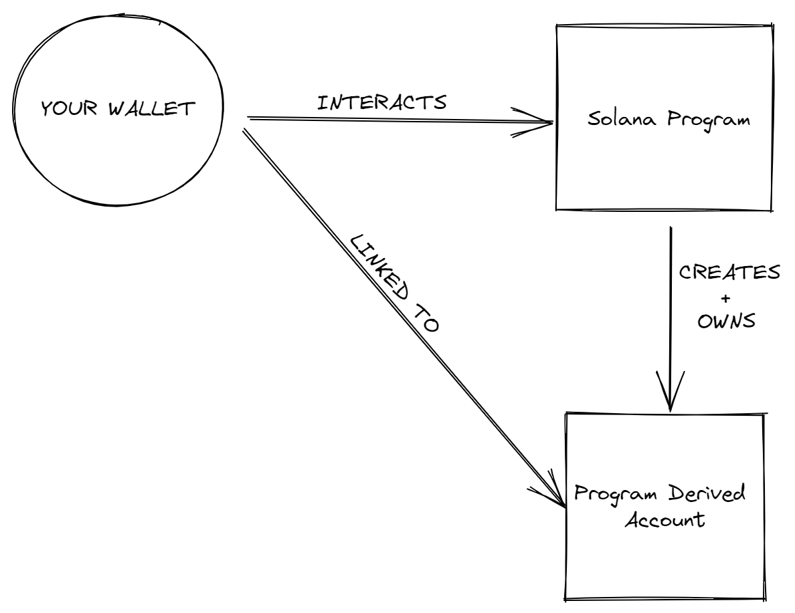

# 📡 Run is back - 反序列化

现在我们已经完成了钱包连接的设置，是时候让我们的 `ping` 按钮真正起作用了！向网络账户写入数据只是任务的一半，另一半则是读取这些数据。在第一部分，我们借助`Web3.js`库中的内置函数来读取内容，这只适用于基础数据，如余额和交易详情。但正如我们在上一部分所见，所有精彩的东西都藏在 `PDAs` 里。

## 🧾 程序派生地址（`Program Derived Addresses`）

账户是Solana的重要话题。如果你听过“账户”这个词，你可能听说过有人提到 `PDA`。**`PDA` 是Solana上用于存储数据的特殊类型账户。实际上，它们不被称为账户，而是称为地址，因为它们没有私钥，而只能由创建它们的程序控制。**


:::caution
这里说了`PDA`是一种特殊类型的账户，但是它们不是真正的账户。它们只是一种特殊的地址，由程序控制，而不是私钥。这意味着它们不是真正的账户，因为它们没有私钥，因此无法对其进行签名。
:::




普通的`Solana`账户是使用[`Ed25519`](https://ed25519.cr.yp.to)签名系统创建的，这个系统为我们提供了公钥和私钥。而 `PDA` 由程序控制，因此它们不需要私钥。因此，我们使用不在 `Ed25519` 曲线上的地址来制作 `PDA`。


有时，`findProgramAddress`会给我们一个位于曲线上的密钥（意味着它也有一个私钥），所以我们添加了一个可选的“`bump`”参数以将其移出曲线。

事实就是如此，你不需要深入了解`Ed25519`或数字签名算法是什么。你只需了解 `PDA` 看起来就像普通的`Solana`地址，并且由程序控制。

你需要了解 **`PDA` 的工作原理的原因是，它们提供了链上和链下程序确定性地定位数据的方法。可以将其视为一个键值存储，其中 `seeds`、`programId` 和 `bump` 结合形成密钥，以及网络在该地址上存储的值。**知道密钥是什么使我们能够可靠且一致地查找存储在网络上的数据。

多亏了程序派生地址（`PDAs`），我们在`Solana`上拥有了一个可以被所有程序访问的通用数据库。想想我们与第一个程序互动的情景——我们向其发送了一个 `ping` 请求，然后它递增了一个数字。以下是你可能与所有账户互动的程序共享数据的示例代码：

```ts
// 用于全局状态的示例
const [pda, bump] = await PublicKey.findProgramAddress(
  [Buffer.from("GLOBAL_STATE")],
  programId
);

// 为每个用户存储单独计数器的示例
const [pda, bump] = await PublicKey.findProgramAddress(
  [
    publickey.toBuffer()
  ],
  programId
);

// 创建链上笔记系统，每个用户都可以存储自己的笔记的示例
const [pda, bump] = await PublicKey.findProgramAddress(
  [
    publickey.toBuffer(),
    Buffer.from("First Note")
  ],
  programId
);
```

请注意，无论是你还是调用方都必须支付存储费用，并且每个账户有`10` Mb 的限制，所以要谨慎选择要放在链上的内容。

:::caution
每个数据账户的大小最大是`10MB`的大小。
:::

## 🎢 反序列化

在找到要读取的账户之后，你需要将数据反序列化，以便你的应用程序可以使用它。回忆一下我们在这个程序中学到的第一件事——账户及其包含的内容。来回顾一下：

| 字段 | 描述 |
| --- | --- |
| `lamports` | 账户所拥有的 `lamports` 数量 |
| `owner` | 该账户的程序所有者 |
| `executable` | 该账户是否可以处理指令（可执行） |
| `data` | 该账户存储的原始数据字节数组 |
| `rent_epoch` | 这个账户将要支付的下一个时期的租金 |

数据字段包含了一个庞大的字节数组。就像我们将可读数据转换为字节进行指令处理一样，我们在此处要做的是相反的操作：将字节数组转换为我们的应用程序可以处理的数据。这是真正的魔法开始之处，你会感受到自己就像在玻璃上冲浪一样😎。

我们在这里见到了我们最好的新老朋友 `Borsh` 先生：

```ts
import * as borsh from '@project-serum/borsh';

const borshAccountSchema = borsh.struct({
  borsh.bool('initialized'),
  borsh.u16('playerId'),
  borsh.str('name')
});

const { playerId, name } = borshAccountSchema.decode(buffer);
```

这些步骤与我们对序列化所做的工作相似：

1. 创建一个描述字节数组中存储内容的模式/映射。
2. 使用该模式来解码数据。
3. 提取我们想要的信息。

这一流程应该感觉很熟悉，但如果你不熟悉，不用担心，当我们付诸实践时，一切都会变得清晰！

## 构建一个反序列化器

曾经考虑过要如何构建一个反序列化器吗？我们将继续前面的电影评论应用开发。你可以在上一节的项目基础上继续（推荐），或者使用已完成的版本开始设置：

```bash
git clone https://github.com/all-in-one-solana/solana-movie-frontend.git
cd solana-movie-frontend
git checkout solution-serialize-instruction-data
npm i
```

当你运行 `npm run dev` 时，你将看到一些模拟数据。与假冒的鞋子不同，假数据总是让人失望的。让我们在 `Movie.ts` 文件中保持真实（仅复制/粘贴新内容）：

```ts
import * as borsh from '@project-serum/borsh'

export class Movie {
    title: string;
    rating: number;
    description: string;
...

  static borshAccountSchema = borsh.struct([
    borsh.bool('initialized'),
    borsh.u8('rating'),
    borsh.str('title'),
    borsh.str('description'),
  ])

  static deserialize(buffer?: Buffer): Movie|null {
    if (!buffer) {
        return null
    }

    try {
        const { title, rating, description } = this.borshAccountSchema.decode(buffer)
        return new Movie(title, rating, description)
    } catch(error) {
        console.log('Deserialization error:', error)
        return null
    }
  }
}
```

就像序列化一样，我们定义了一个模式和一个方法。该架构包括：

- `initialized`：一个布尔值，表示账户是否已初始化。
- `rating`：无符号`8`位整数，代表评论者对电影的评分（满分`5`分）。
- `title`：表示所评论电影的标题的字符串。
- `description`：表示评论的文字部分的字符串。

这应该看起来很熟悉！真正的精髓在 `deserialize` 方法中。此处的返回类型可以是 `Movie` 或 `null`，因为账户可能根本没有任何数据。

最后，我们需要在页面加载时使用此方法从 `PDA` 获取数据。我们在 `MovieList.tsx` 文件中执行此操作。

```ts
import { Card } from './Card'
import { FC, useEffect, useState } from 'react'
import { Movie } from '../models/Movie'
import * as web3 from '@solana/web3.js'

const MOVIE_REVIEW_PROGRAM_ID = 'CenYq6bDRB7p73EjsPEpiYN7uveyPUTdXkDkgUduboaN'

export const MovieList: FC = () => {
    const connection = new web3.Connection(web3.clusterApiUrl('devnet'))
    const [movies, setMovies] = useState<Movie[]>([])

    useEffect(() => {
        connection.getProgramAccounts(new web3.PublicKey(MOVIE_REVIEW_PROGRAM_ID))
        .then(async (accounts) => {
            const movies: Movie[] = accounts.reduce((accum: Movie[], { pubkey, account }) => {
                const movie = Movie.deserialize(account.data)
                if (!movie) {
                    return accum
                }

                return [...accum, movie]
            }, [])
            setMovies(movies)
        })
    }, [])

    return (
        <div>
            {
                movies.map((movie, i) => <Card key={i} movie={movie} /> )
            }
        </div>
    )
}
```

就像以前一样，我们配置了导入和连接。主要的变化发生在 `useEffect` 中。

```ts
connection.getProgramAccounts(new web3.PublicKey(MOVIE_REVIEW_PROGRAM_ID))
```

在获取电影评论之前，我们需要获取包含它们的账户。我们可以通过获取电影评论程序的所有程序账户来实现，这可以使用 `getProgramAccounts` 端点完成。

:::caution
**注意，这是一个非常消耗资源的端点。如果在大型程序上尝试，结果可能会非常庞大，甚至会引起问题。在现实世界中，你很少需要同时获取多个账户，所以现在不用担心。但你应该意识到，不应该对数据进行建模，使得 `getProgramAccounts` 成为必要条件。**
:::

```ts
.then(async (accounts) => {
          const movies: Movie[] = accounts.reduce((accum: Movie[], { pubkey, account }) => {
              // Try to extract movie item from account data
              const movie = Movie.deserialize(account.data)

              // If the account does not have a review, movie will be null
              if (!movie) {
                  return accum
              }

              return [...accum, movie]
          }, [])
          setMovies(movies)
})
```

为了存储电影评论，我们将创建一个 `Movie`s 类型的数组。为了填充它，我们使用 `reduce` 反序列化每个账户，并尝试解构 `movie` 项。如果该账户有电影数据，那么这就会起作用！如果没有，电影将为空，我们可以返回累积的电影列表。

如果这看起来有些复杂，请逐行阅读代码，并确保你理解 `reduce` 方法是如何工作的。

确保你正在运行 `npm run dev` 并访问 `localhost:3000`，你应该会看到其他开发者添加的许多随机评论。😃


## 🚢 挑战

现在，我们已经能够序列化和反序列化数据了，不错吧？现在让我们回到序列化部分开始时的 "`Student Intros`" 应用程序。

**目标**：更新应用程序，以便能够获取并反序列化程序的帐户数据。支撑此功能的 Solana 程序地址是：`HdE95RSVsdb315jfJtaykXhXY478h53X6okDupVfY9yf`。

你可以从上次挑战的地方继续，或者从[此代码库](https://github.com/all-in-one-solana/solana-student-intros-frontend/tree/solution-serialize-instruction-data)开始。确保从 `solution-serialize-instruction-data` 分支开始。

### 提示：

1. 在 `StudentIntro.ts` 文件中创建帐户缓冲区布局。

    帐户数据应该包括：
    - `initialized`：一个布尔值，表示账户是否已初始化。
    - `name`：一个表示学生姓名的字符串。
    - `message`：一个表示学生分享的关于 `Solana` 旅程的消息的字符串。

2. 在 `StudentIntro.ts` 文件中创建一个静态方法，使用缓冲区布局将帐户数据缓冲区反序列化为 `StudentIntro` 对象。

3. 在 `StudentIntroList` 组件的 `useEffect` 中，获取程序的帐户，并将其数据反序列化到 `StudentIntro` 对象列表中。

### 解决方案代码：

像往常一样，首先尝试自己完成此挑战。但如果你陷入困境，或者只是想把你的解决方案与我们的解决方案进行对比，你可以在此代码库中查看 `solution-deserialize-account-data` [分支](https://github.com/all-in-one-solana/solana-student-intros-frontend/tree/solution-deserialize-account-data)。

祝你好运，开发者朋友！🚀
