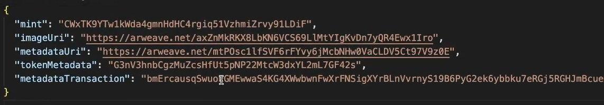

# 🎨 创建奖励代币

既然我们已经铸造了一个`NFT`，那么接下来我们要探讨如何铸造一系列的`NFT`。为了达成这个目标，我们将采用`Candy Machine`——一款在`Solana`上广泛使用的程序，允许创作者将其资产上链。`Candy Machine`在`Solana`上受到欢迎的原因在于，它具备了如机器人防护和安全随机化等实用功能。现在我们可以回归到我们自定义的`NFT`质押应用上来，借助我们在代币程序和`Candy Machine`上的经验来构建这个应用。

请按照以下步骤操作：

1. 在根目录中创建名为`tokens`的新文件夹。
2. 在`tokens`文件夹内，我们要创建`2`个子文件夹，分别命名为`bld`和`candy-machine`，它们的结构应如下图所示：

   

我们这样做的目的是整理建立`Builder`时所需的奖励代币和与我们的`NFT`有关的内容。

3. 接下来，我们要创建资源文件夹，用于存放代币的图像。请进入你的`bld`文件夹，并创建名为`assets`的新文件夹。同时，在你的`bld`文件夹内，创建名为`index.ts`的新文件。目录结构应如下所示：

```bash
├── styles
├── tokens
│   ├── bld
│   |   ├── assets
│   |   ├── index.ts
```

注意：确保你的`index.ts`文件位于`bld`文件夹中，而不是在`assets`文件夹中。

4. 你可能会发现`index.ts`文件被标记为红色，这是因为我们目前还没有任何代码。让我们通过向你的`index.ts`文件中添加以下代码来解决这个问题。我们还需将`initializeKeypair`文件移动到`bld`文件夹中，并在`bld/assets`文件夹中添加一张图片作为你的代币图片。

```ts
import * as web3 from "@solana/web3.js";
import * as token from "@solana/spl-token";
import { initializeKeypair } from "./initializeKeypair";

async function main() {
  const connection = new web3.Connection(web3.clusterApiUrl("devnet"));
  const payer = await initializeKeypair(connection);
}

main()
  .then(() => {
    console.log("Finished successfully");
    process.exit(0);
  })
  .catch((error) => {
    console.log(error);
    process.exit(1);
  });
```

太棒了！现在我们已经有了初始代码，可以继续将下一段代码粘贴到你的`index.ts`文件中，你可以将其放在`main`函数的上方。

```ts
import * as fs from "fs";
import {
  bundlrStorage,
  keypairIdentity,
  Metaplex,
  toMetaplexFile,
} from "@metaplex-foundation/js";

import {
  DataV2,
  createCreateMetadataAccountV2Instruction,
} from "@metaplex-foundation/mpl-token-metadata";

const TOKEN_NAME = "BUILD";
const TOKEN_SYMBOL = "BLD";
const TOKEN_DESCRIPTION = "A token for buildoors";
const TOKEN_IMAGE_NAME = "unicorn.png"; // Replace unicorn.png with your image name
const TOKEN_IMAGE_PATH = `tokens/bld/assets/${TOKEN_IMAGE_NAME}`;

async function createBldToken(
  connection: web3.Connection,
  payer: web3.Keypair
) {
    // This will create a token with all the necessary inputs
    const tokenMint = await token.createMint(
        connection, // Connection
        payer, // Payer
        payer.publicKey, // Your wallet public key
        payer.publicKey, // Freeze authority
        2 // Decimals
    );

    // Create a metaplex object so that we can create a metaplex metadata
    const metaplex = Metaplex.make(connection)
        .use(keypairIdentity(payer))
        .use(
        bundlrStorage({
            address: "https://devnet.bundlr.network",
            providerUrl: "https://api.devnet.solana.com",
            timeout: 60000,
        })
        );

    // Read image file
    const imageBuffer = fs.readFileSync(TOKEN_IMAGE_PATH);
    const file = toMetaplexFile(imageBuffer, TOKEN_IMAGE_NAME);
    const imageUri = await metaplex.storage().upload(file);

    // Upload the rest of offchain metadata
    const { uri } = await metaplex
        .nfts()
        .uploadMetadata({
        name: TOKEN_NAME,
        description: TOKEN_DESCRIPTION,
        image: imageUri,
        });

    // Finding out the address where the metadata is stored
    const metadataPda = metaplex.nfts().pdas().metadata({mint: tokenMint});
    const tokenMetadata = {
        name: TOKEN_NAME,
        symbol: TOKEN_SYMBOL,
        uri: uri,
        sellerFeeBasisPoints: 0,
        creators: null,
        collection: null,
        uses: null,
    } as DataV2

    const instruction = createCreateMetadataAccountV2Instruction({
        metadata: metadataPda,
        mint: tokenMint,
        mintAuthority: payer.publicKey,
        payer: payer.publicKey,
        updateAuthority: payer.publicKey
    },
    {
        createMetadataAccountArgsV2: {
            data: tokenMetadata,
            isMutable: true
        }
    })

    const transaction = new web3.Transaction()
    transaction.add(instruction)
    const transactionSignature = await web3.sendAndConfirmTransaction(
            connection,
            transaction,
            [payer]
    )
```

这段代码将创建一个代币，并与其关联所有必需的输入。它还会读取图像文件，上传文件，并执行其他必要操作，从而为你的代币创建完整的元数据。

通过上述步骤，你将能够在Solana上成功创建并管理你的代币。


## 🥳 代码解析

好的，我们逐一分析一下上述代码的各个部分。

首先，我们通过调用 `createMint` 函数来创建并初始化一个新的代币铸造。你可以通过[这个链接](https://solana-labs.github.io/solana-program-library/token/js/modules.html#createMint?utm_source=buildspace.so&utm_medium=buildspace_project)了解更多有关该函数的信息。

```ts
// 这段代码将根据所有必要的输入创建一个代币
const tokenMint = await token.createMint(
  connection, // 连接信息
  payer,      // 付款方
  payer.publicKey, // 你的钱包公钥
  payer.publicKey, // 冻结权限
  2 // 小数位数
);
```

接下来，我们创建一个`Metaplex`对象，以便我们可以创建`Metaplex`元数据，并将其上传到`BundlrStorage`中。

```ts
// 创建一个Metaplex对象，这样我们就可以创建Metaplex元数据了
const metaplex = Metaplex.make(connection)
  .use(keypairIdentity(payer))
  .use(
    bundlrStorage({
      address: "https://devnet.bundlr.network",
      providerUrl: "https://api.devnet.solana.com",
      timeout: 60000,
    })
  );
```

这部分代码比较直观。我们正在尝试读取存储在`bld/assets`文件夹中的图像文件，并将元数据上传到存储空间中。

```ts
// 读取图像文件
const imageBuffer = fs.readFileSync(TOKEN_IMAGE_PATH);
const file = toMetaplexFile(imageBuffer, TOKEN_IMAGE_NAME);
const imageUri = await metaplex.storage().upload(file);
// 上传其余的离线元数据
const { uri } = await metaplex
  .nfts()
  .uploadMetadata({
    name: TOKEN_NAME,
    description: TOKEN_DESCRIPTION,
    image: imageUri,
  });
```

一旦我们成功将图像上传到`Metaplex`，我们就可以通过调用以下部分来查找元数据存储的地址。

```ts
// 查找元数据存储的地址
const metadataPda = metaplex.nfts().pdas().metadata({mint: tokenMint});
const tokenMetadata = {
    name: TOKEN_NAME,
    symbol: TOKEN_SYMBOL,
    uri: uri,
    sellerFeeBasisPoints: 0,
    creators: null,
    collection: null,
    uses: null,
} as DataV2

const instruction = createCreateMetadataAccountV2Instruction({
    metadata: metadataPda,
    mint: tokenMint,
    mintAuthority: payer.publicKey,
    payer: payer.publicKey,
    updateAuthority: payer.publicKey
},
{
    createMetadataAccountArgsV2: {
        data: tokenMetadata,
        isMutable: true
    }
})

const transaction = new web3.Transaction()
transaction.add(instruction)
const transactionSignature = await web3.sendAndConfirmTransaction(
    connection,
    transaction,
    [payer]
)
```

这部分代码将创建一个代币，并将其所需的所有输入与其关联起来。它还会读取图像文件，上传文件，并完成为你的代币创建完整元数据所需的其他操作。

通过这样的操作，你将能够在`Solana`上成功创建并管理你的代币。

## 🫙 元数据的存储

现在，我们已经创建了带有特定元数据的代币铸造（薄荷）。下一步我们要将这些元数据信息存储到我们的文件夹中。让我们看看如何做到这一点：

就在你定义了 `transactionSignature` 的代码下方，添加以下代码。

```ts
fs.writeFileSync(
  "tokens/bld/cache.json",
  JSON.stringify({
    mint: tokenMint.toBase58(),
    imageUri: imageUri,
    metadataUri: uri,
    tokenMetadata: metadataPda.toBase58(),
    metadataTransaction: transactionSignature,
  })
);
```

太棒了！这样就完成了 `createBldToken` 函数的编写。现在，我们可以在下面的主函数中调用它。你的 `main` 函数现在应该是这个样子的。

```ts
async function main() {
  const connection = new web3.Connection(web3.clusterApiUrl("devnet"));
  const payer = await initializeKeypair(connection);

  await createBldToken(connection, payer);
}
```

这样就可以了。你现在已经准备好了。让我们开始运行代码吧！

## 🚀 运行我们的代码

首先，我们需要在`VS Code`中打开终端，并安装一个名为 `ts-node` 的模块，因为我们要运行一些`TypeScript`命令。在终端中输入 `npm install --save-dev ts-node`。然后，转到你的 `package.json` 文件，并将以下行添加到 `scripts` 部分。

```json
"create-bld-token": "ts-node ./src/tokens/bld/index.ts"
```

现在你的配置应该是这个样子的。


记得保存更改！现在你可以通过在终端中运行 `npm run create-bld-token` 来使用新添加的命令。这将在开发网络中为你创建和铸造代币。完成后，你应该能在文件夹中看到一个名为 `cache.json` 的文件。打开它，你将看到类似以下的内容。

注意：如果你收到如 `SyntaxError: Cannot use import statement outside a module` 的错误，请检查你的 `tsconfig.json` 文件，并更改或添加 `"module": "CommonJS"`。



现在，请复制 `mint` 下列出的地址，并将其粘贴到 [`https://explorer.solana.com/?cluster=devnet`](https://explorer.solana.com/?cluster=devnet)。你现在应该能够看到显示你选择图像的代币，就像下图所示。


以上就是如何在`Solana`网络上创建和铸造你自己的代币的全部步骤。现在你已经成功地执行了这一过程，可以在`Solana`网络上与你的代币互动了。
