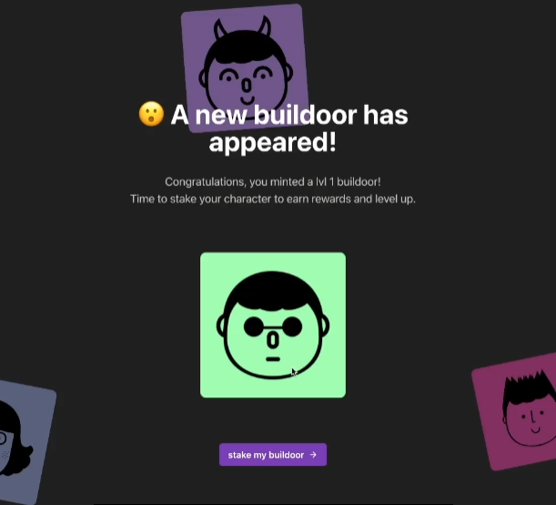

# 🎨 创建铸币用户界面

现在我们成功创建了代币和非同质化代币（`NFT`），让我们继续着手构建我们的铸币用户界面。这样一来，我们就能直观地与智能合约互动，并允许他人在我们的浏览器上铸造我们的`NFT`。是不是非常酷？你可能已经注意到，你的网站上现有一个名为 `minting` 的按钮，但它目前尚未实现任何功能。让我们从定义一个函数开始，然后添加逻辑来允许我们铸造`NFT`。如果你没有起始代码，可以在[这里](https://github.com/buildspace/buildoors/tree/solution-core-2-candy-machine)克隆。

首先，我们将以下代码添加到你的 `newMint.tsx` 文件中。注意：不要盲目地复制粘贴代码。我只提供了必要的部分，你需要明白这些代码应放在何处。提示：应该放在 `Container` 元素下方。

```ts
// 你的其余代码
import { Button, Text, HStack } from "@chakra-ui/react";
import { MouseEventHandler, useCallback } from "react";
import { ArrowForwardIcon } from "@chakra-ui/icons";

const Home: NextPage = () => {
  const handleClick: MouseEventHandler<HTMLButtonElement> = useCallback(
    async (event) => {},
    []
  );

  return (
    <MainLayout>
      {/* 你的其余代码 */}
      <Image src="" alt="" />
      <Button
        bgColor="accent"
        color="white"
        maxWidth="380px"
        onClick={handleClick}
      >
        <HStack>
          <Text>stake my buildoor</Text>
          <ArrowForwardIcon />
        </HStack>
      </Button>
    </MainLayout>
  );
};
```

完成后，我们可以进入 `Connected.tsx` 并添加一些代码。在 `handleClick` 函数上方，我们可以添加 `const router = useRouter()`。记得在文件顶部导入 `useRouter` 函数。然后，在你的 `handleClick` 函数中添加 `router.push("/newMint")`。现在它应该是这个样子。

```ts
const handleClick: MouseEventHandler<HTMLButtonElement> = useCallback(
  async (event) => {
    if (event.defaultPrevented) return;
       if (!walletAdapter.connected || !candyMachine) return;

       try {
         setIsMinting(true);
         const nft = await metaplex
           .candyMachinesV2()
           .mint({ candyMachine });

         console.log(nft);
         router.push(`/newMint?mint=${nft.nft.address.toBase58()}`);
       } catch (error) {
         alert(error);
       } finally {
         setIsMinting(false);
       }
  },
  [metaplex, walletAdapter, candyMachine]
);
```

现在，当你点击 `stake my buildoor` 按钮时，将提示你从幽灵钱包批准交易。但是，你可能会注意到一旦成功批准交易，页面会刷新并导致你的钱包被登出。别担心，下一部分我们将解决这个问题。

接下来，请前往 `newMint.tsx`。我们将创建一个接口来解决这个问题。将此代码添加到你的 `Home` 函数之上。

```ts
import { PublicKey } from "@solana/web3.js";

interface NewMintProps {
  mint: PublicKey;
}
```

一旦完成，你应该看到以下代码结构。

```ts
// 你的其余代码
import { PublicKey } from "@solana/web3.js";
import { Metaplex, walletAdapterIdentity } from "@metaplex-foundation/js";

interface NewMintProps {
  mint: PublicKey;
}

const Home: NextPage<NewMintProps> = ({ mint }) => {
  const [metadata, setMetadata] = useState<any>()
   const { connection } = useConnection()
   const walletAdapter = useWallet()
   const metaplex = useMemo(() => {
       return Metaplex.make(connection).use(walletAdapterIdentity(walletAdapter))
   }, [connection, walletAdapter])

   useEffect(() => {
       // What this does is to allow us to find the NFT object
       // based on the given mint address
       metaplex.nfts().findByMint({ mintAddress: new PublicKey(mint) })
           .then((nft) => {
               // We then fetch the NFT uri to fetch the NFT metadata
               fetch(nft.uri)
                   .then((res) => res.json())
                   .then((metadata) => {
                       setMetadata(metadata)
                   })
           })
   }, [mint, metaplex, walletAdapter])
};

```

注意到我们是如何在上述函数中调用 `setMetadata(metadata)` 的吗？这是为了让我们能够将元数据对象设置为状态，以便我们可以用它来渲染图像。现在让我们在 `Image` 元素中使用此对象。

```ts
<Image src={metadata?.image ?? ""} alt="" />
```

我们快完成了。如果你现在尝试铸造一个新的`NFT`，你可能会注意到网站会抛出一个错误，说它无法读取未定义的属性。我们可以通过在底部添加以下几行代码来修复这个问题。

```ts
NewMint.getInitialProps = async ({ query }) => {
  const { mint } = query;
  if (!mint) throw { error: "No mint" };

  try {
    const mintPubkey = new PublicKey(mint);
    return { mint: mintPubkey };
  } catch {
    throws({ error: "Invalid mint" });
  }
};

```

太棒了！现在你已经添加了所有必要的代码，你应该可以铸造一个`NFT`，并看到该图像。这就是我看到的样子。



## 🛠️小修复

请注意网站未能准确显示内容，为了解决这个问题，我们需要前往 `WalletContextProvider.tsx` 并修改一些代码。

改变

```ts
const phantom = new PhantomWalletAdapter();
```

to

```ts
const phantom = useMemo(() => new PhantomWalletAdapter(), []);
```

我们还需要给你的 `autoConnect` 添加一个属性。就像这样。

```ts
<WalletProvider wallets={[phantom]} autoConnect={true}>
  <WalletModalProvider>{children}</WalletModalProvider>
</WalletProvider>
```

我们需要使用 `useMemo` 的原因是为了防止钱包适配器被多次构建。你可以在[这里](https://reactjs.org/docs/hooks-reference.html#usememo?utm_source=buildspace.so&utm_medium=buildspace_project)了解更多关于useMemo的信息。
