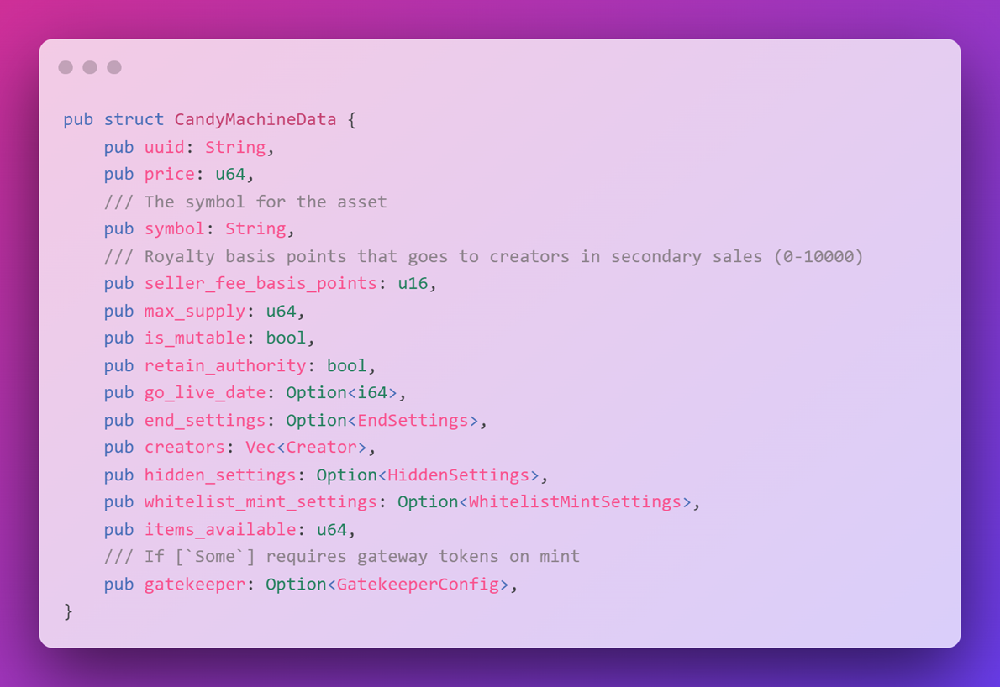
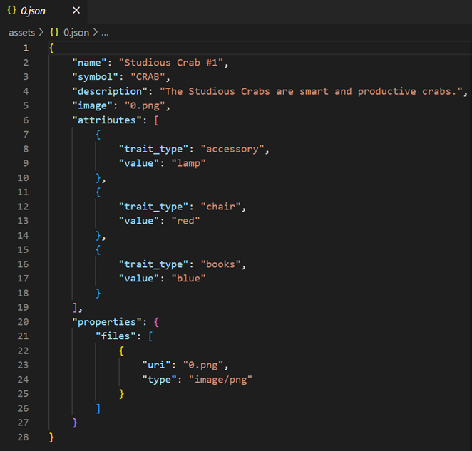
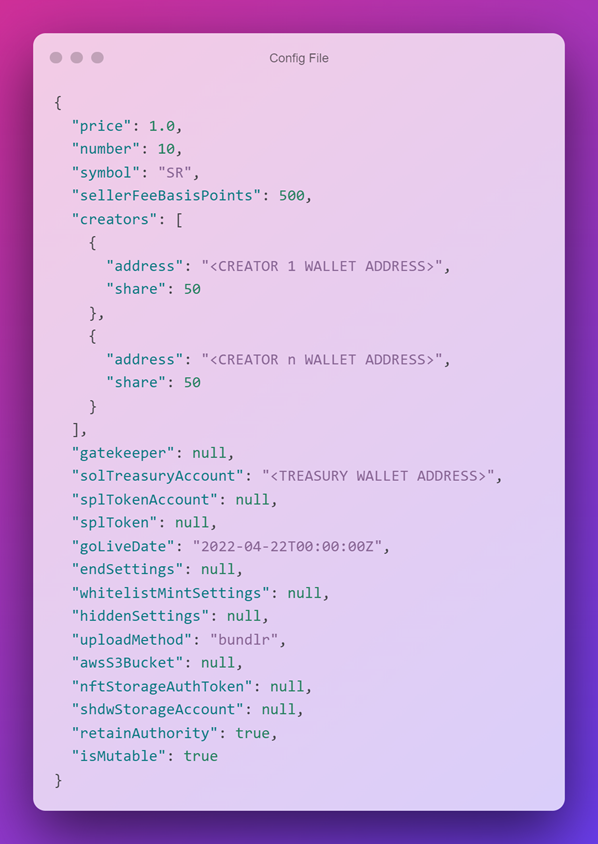
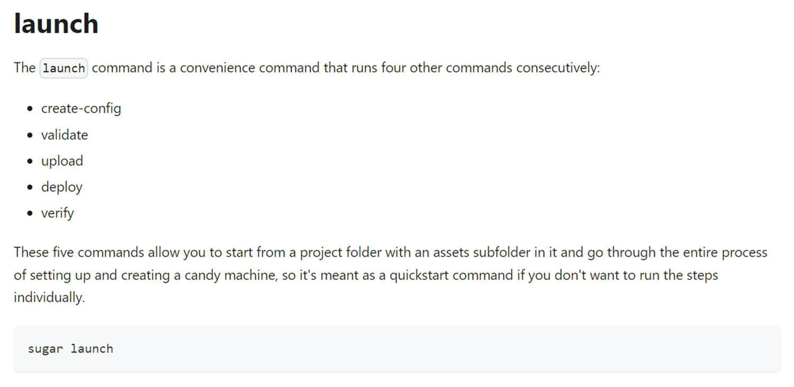
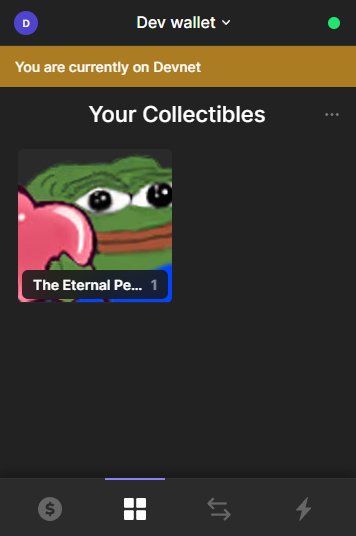

# 🍭 糖果机和Sugar CLI

将自己的脸做成`NFT`有何不好呢？你可以永久地将自己视为一个早期的建设者，并告诉你的妈妈你已经进入了区块链世界。既然我们已经铸造了一个单独的`NFT`，现在我们将学习如何铸造一系列的`NFT`。为了实现这一目标，我们将使用`Candy Machine`——这是一个`Solana`程序，让创作者能够将他们的资产上链。尽管这不是创建系列的唯一方法，但在`Solana`上它已经成为一种标准，因为它拥有一些有用的功能，如防机器人保护和安全随机化。

由于这是一个链上程序，所有的数据都存储在账户中。你首先需要为你的收藏创建一个糖果机实例。这只是一个账户，其中存储了一些关于所有者的重要信息以及糖果机在元数据字段中的配置。


注意那个数据字段？那里存放的就是元数据，它的结构如下图所示：



再次强调一下，这里有很多细节，我们将在适当的时候逐一解释。

为了与糖果机程序互动，我们将使用[`Sugar CLI`](https://docs.metaplex.com/developer-tools/sugar/overview/introduction)。这是一个非常棒的工具，让你能够直接从命令行与程序交互。

## 🛠 安装命令行界面（CLIs）

在我们开始之前，我们需要安装以下两样东西：

- 1. `Solana CLI` - `Sugar CLI` 依赖于此。你可以在[这里](https://docs.solana.com/cli/install-solana-cli-tools)找到适合你操作系统的安装指南。

- 2. `Sugar CLI` - 你可以在[这里](https://docs.metaplex.com/developer-tools/sugar/overview/installation)找到安装方法。

注意 - 如果你想将CLI的安装与你的计算机隔离开来，你可以在Docker上设置`Solana CLI`，然后下载`Sugar CLI`。Docker镜像在[这里](https://hub.docker.com/r/solanalabs/solana)。如果你不了解Docker是什么，也不要担心！

如果安装正确，当你在终端中运行 `solana --version` 和 `sugar --version` 时，应该会看到版本号而不是错误信息。

如果你还没有本地的`Solana`钱包，现在是配置开发网络的好时机。在终端中运行以下命令：

```bash
solana config set --url devnet
solana-keygen new --outfile ~/.config/solana/devnet.json
solana airdrop 2
solana balance
```

这些命令与我们在本地客户端脚本中执行的操作相同，只不过现在是在终端中完成。这样，你就为在`Solana`上创建一系列`NFT`做好了准备。

## 🍬 创建你的珍藏品

这可能是整个构建过程中最具挑战的部分：确定你想要制作的`NFT`收藏品的内容。你至少需要准备5张图片，每张图片对应收藏中的一个`NFT`。我挑选了一些经典的`pepes`图像，因为它们总能引起我的共鸣。

在`Solana`工作空间中，创建一个新的项目文件夹，并在其中创建一个名为 `assets` 的文件夹。你需要将每个`NFT`资产与一份元数据`JSON`文件配对，并从零开始为每一对编号。因此，你的文件夹结构应该如下所示：

```
...
|
|── assets
|   |── 0.png
|   |── 0.json
|   |...
|   |── 5.png
|   |── 5.json
|
|── node_modules
|── src
|── package.json
....
```

下面是一个`JSON`文件的示例：



在实际操作中，你可以编写脚本来生成这些文件，但现在我们暂时手动完成。你可以从这些[示例资产](https://arweave.net/RhNCVZoqC6iO0xEL0DnsqZGPSG_CK_KeiU4vluOeIoI?utm_source=buildspace.so&utm_medium=buildspace_project)开始，然后用你自己的图片替换它们。别忘了更新JSON文件！

你还可以选择添加与之匹配的 `collection.json` 和 `collection.png` 文件，市场将使用这些文件作为集合的名称、描述和缩略图。

以下是模板：

```json
{
  "name": "Studious Crabs Collection",
  "symbol": "CRAB",
  "description": "Collection of 10 crabs seeking refuge from overfishing on the blockchain.",
  "image": "collection.png",
  "attributes": [],
  "properties": {
    "files": [
      {
        "uri": "collection.png",
        "type": "image/png"
      }
    ]
  }
}
```

拯救🦀螃蟹，使其免受🎣渔民捕捞

现在，你的资产文件夹应该只包括商品（如果你使用`Windows`系统，可能还会有一个~文件夹）。

## 🍭 配置你的糖果机

接下来，我们需要创建一个糖果机的配置文件。这个文件用于在链上创建糖果机实例。`Sugar CLI`将指导你完成最基本的设置，无需手动操作！以下是它的样子：



你是否听说过吃太多糖对身体不好？开发`Sugar CLI`的人似乎也这么认为。要设立一个糖果机，你只需运行 `launch` 命令，其余的工作它都会为你处理。



## 🚀 发行你的NFT珍藏品

在终端中输入 `sugar launch` 命令，当它询问是否要创建新的配置文件时，按下`y`键。回答问题后，你的项目文件夹中会生成一个 `config.json` 文件。

以下是我的回答：

```bash
✔ What is the price of each NFT? · 0.3
✔ Found 10 file pairs in "assets". Is this how many NFTs you will have in your candy machine? · ye
✔ Found symbol "CRAB" in your metadata file. Is this value correct? · no
✔ What is the symbol of your collection? Hit [ENTER] for no symbol. · PEPE
✔ What is the seller fee basis points? · 100
? What is your go live date? Many common formats are supported. · now
✔ How many creator wallets do you have? (max limit of 4) · 1
✔ Enter creator wallet address #1 · B1aLAAe4vW8nSQCetXnYqJfRxzTjnbooczwkUJAr7yMS
✔ Enter royalty percentage share for creator #1 (e.g., 70). Total shares must add to 100. · 100
? Which extra features do you want to use?  ·
✔ What is your SOL treasury address? · B1aLAAe4vW8nSQCetXnYqJfRxzTjnbooczwkUJAr7yMS
✔ What upload method do you want to use? · Bundlr
✔ Do you want to retain update authority on your NFTs? We HIGHLY recommend you choose yes. · yes
✔ Do you want your NFTs to remain mutable? We HIGHLY recommend you choose yes. · yes
```

你可能会收到 `MISSING COLLECTION FILES IN ASSETS FOLDER` 的警告，不用担心，这是因为我们没有在 `assets` 文件夹中设置 `collection.png` 和 `collection.json` 文件。继续回答 y。如果你想了解更多关于这些文件的信息，可以在[此处](https://docs.metaplex.com/developer-tools/sugar/guides/preparing-assets)了解更多。

现在我们暂时不需要任何特殊功能。如果你感兴趣，可以在[此处](https://docs.metaplex.com/developer-tools/sugar/learning/settings)阅读更多相关信息。

如果遇到任何问题或中途改变主意，你可以随时退出并重新开始。你还可以直接编辑 `config.json` 文件。`Sugar CLI`会显示非常有用的错误信息，所以如果遇到困难，只需仔细阅读，通常就能找到解决方案。

如果一切顺利，最终你会看到一个绿色的“命令成功”消息。在消息上方，你会看到一个SolanEyes链接。点击该链接，你就可以在`Solana`网络上查看你的糖果机！复制糖果机的ID以备后用。

如果这还不足以让你惊奇，那么你可以尝试使用 `sugar mint` 命令来铸造一个`NFT`，这简直是一种美味的体验。

一旦你整理好你的收藏品，并在巴厘岛享受休闲时光，"糖"工具也可以帮助你执行各种操作。如果你感到好奇，可以查看[这里的命令](https://docs.metaplex.com/developer-tools/sugar/reference/commands)了解更多。


## 🌐 为你的NFT收藏创建前端界面

希望你已经用过晚餐，因为现在又到了享用更多糖果的时刻。

`Metaplex`基金会为你提供了一个时尚的`React UI`模板，你可以使用它来为你的NFT收藏打造前端界面。下面，让我们开始设置：

```bash
git clone https://github.com/metaplex-foundation/candy-machine-ui
cd candy-machine-ui
npm i
```

虽然这里进行了很多操作，但我们不必过于担心。只需将 `.env.example` 文件重命名为 `.env`，并粘贴你之前复制的糖果机`ID`。

```bash
REACT_APP_CANDY_MACHINE_ID=GNfbQEfMA1u1irEFnThTcrzDyefJsoa7sndACShaS5vC
```

这就是你需要做的全部工作！现在，如果你运行 `npm start`，你将在 `localhost:3000` 上看到一个精美的用户界面，可以用它来铸造你的NFT。

对于`Mac`用户，如果遇到 `export NODE_OPTIONS=--openssl-legacy-provider` 问题，请在终端中运行。

铸造完成后，你可以在钱包的收藏品部分查看`NFT`。



你会注意到铸造的`NFT`并不是`1.png`。这是因为糖果机的铸造过程默认是随机的。

我们只是浅尝辄止地触及了`Candy Machine`和`Sugar CLI`的潜力。未来我们还会深入探讨更多内容——本节的目的是让你具备足够的基础知识，以便能够自主深入研究。随着我们对`NFT`项目的不断完善，我们将继续探索。

## 🚢 挑战

让我们再享受一会儿糖果机的乐趣吧！🍭

通过更新 `config.json` 文件并运行 `sugar update` 命令，你可以挖掘创造力并尝试不同的糖果机配置。

例如：

- 修改 `goLiveDate`
- 启用 `gatekeeper`（验证码功能）
- 启用 `whitelistMintSettings`
    - 需要创建令牌
- 使用 `splToken` 来代替本地的`sol`进行付款
    - 需要创建令牌

想了解更多提示和文档，请访问：

[https://docs.metaplex.com/developer-tools/sugar/learning/settings](https://docs.metaplex.com/developer-tools/sugar/learning/settings)
