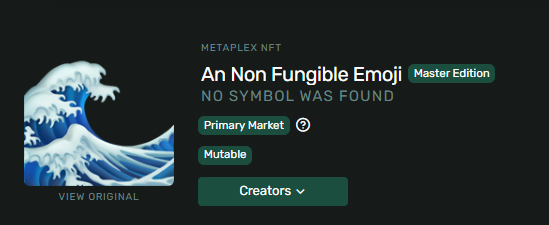

# 🤨 NFT你的脸

有什么比将你的脸做成`NFT`更有趣的选择呢？你可以将自己永远铭记为早期的开拓者，并骄傲地告诉你的妈妈你已经成为了区块链的一部分。

我们将从创建一个客户端开始：

```bash
npx create-solana-client [name] --initialize-keypair
cd [name]
```

紧接着，请执行以下命令：

```bash
npm install @metaplex-foundation/js fs
```

在 `src` 文件夹中添加两个图像文件。我们将使用其中一个作为初始图像，第二个作为更新后的图像。

接下来是我们在 `src/index.ts` 中所需的导入项，这些都不是什么新鲜事：

```ts
import { Connection, clusterApiUrl, PublicKey } from "@solana/web3.js"
import {
  Metaplex,
  keypairIdentity,
  bundlrStorage,
  toMetaplexFile,
  NftWithToken,
} from "@metaplex-foundation/js"
import * as fs from "fs"
```

如果我们声明一些常量，那么在创建和更新`NFT`之间更改变量将会变得更容易：

```ts
const tokenName = "Token Name"
const description = "Description"
const symbol = "SYMBOL"
const sellerFeeBasisPoints = 100
const imageFile = "test.png"

async function main() {
		...
}
```

我们不需要创建任何辅助函数，而是可以将所有内容放在 `main()` 函数中。首先，我们将创建一个 Metaplex 实例：

```ts
async function main() {
  ...

  const metaplex = Metaplex.make(connection)
    .use(keypairIdentity(user))
    .use(
      bundlrStorage({
        address: "https://devnet.bundlr.network",
        providerUrl: "https://api.devnet.solana.com",
        timeout: 60000,
      })
    )
}
```

上传图片的步骤包括：

- 读取图像文件
- 将其转换为`Metaplex`文件
- 上传图片

```ts
async function main() {
	...

  // 将文件读取为缓冲区
  const buffer = fs.readFileSync("src/" + imageFile)

  // 将缓冲区转换为Metaplex文件
  const file = toMetaplexFile(buffer, imageFile)

  // 上传图像并获取图像URI
  const imageUri = await metaplex.storage().upload(file)
  console.log("图像URI:", imageUri)
}
```

最后，我们可以使用我们得到的图像`URI`上传元数据：

```ts
async function main() {
	...

  // 上传元数据并获取元数据URI（链下元数据）
  const { uri } = await metaplex
    .nfts()
    .uploadMetadata({
      name: tokenName,
      description: description,
      image: imageUri,
    })

  console.log("元数据URI:", uri)
}
```

在这里，创建一个专门的铸造`NFT`功能是个不错的主意，将其放在主函数之外：

```ts
// 创建NFT
async function createNft(
  metaplex: Metaplex,
  uri: string
): Promise<NftWithToken> {
  const { nft } = await metaplex
    .nfts()
    .create({
      uri: uri,
      name: tokenName,
      sellerFeeBasisPoints: sellerFeeBasisPoints,
      symbol: symbol,
    })

  console.log(
    `代币Mint地址：https://explorer.solana.com/address/${nft.address.toString()}?cluster=devnet`
  )

  return nft
}
```

现在你只需在主函数的末尾调用它即可：

```ts
async function main() {
	...

  await createNft(metaplex, uri)
}
```

我们已经准备好铸造我们的`NFT`了！在终端中运行脚本 `npm run start` ，然后点击Solana Explorer的URL，你应该会看到类似这样的内容：


我们刚刚在`Solana`上制造了一个`NFT`🎉🎉🎉。这简直就像把现成的饭菜再热一热那么简单。

## 🤯 更新你的NFT

总结一下，我们来快速看一下如何更新刚刚铸造的`NFT`。

首先，在你的脚本顶部，将 `imageFile` 常量更新为你的`NFT`的最终图像的名称。

唯一改变的是我们将称之为`Metaplex`的方法。你可以将下面的代码添加到 `main` 函数之外的任何位置：

```ts
async function updateNft(
  metaplex: Metaplex,
  uri: string,
  mintAddress: PublicKey
) {
  // 通过薄荷地址获取 "NftWithToken" 类型
  const nft = await metaplex.nfts().findByMint({ mintAddress })

  // 省略任何保持不变的字段
  await metaplex
    .nfts()
    .update({
      nftOrSft: nft,
      name: tokenName,
      symbol: symbol,
      uri: uri,
      sellerFeeBasisPoints: sellerFeeBasisPoints,
    })

  console.log(
    `代币Mint地址：https://explorer.solana.com/address/${nft.address.toString()}?cluster=devnet`
  )
}
```

现在，在主函数中，你可以注释掉 `createNFT` 的调用，并使用新的 `updateNFT` 辅助函数：

```ts
async function main() {

  ...

  // 你可以暂时注释掉 createNft 的调用
  // await createNft(metaplex, uri)

  // 你可以从Solana Explorer的URL中获取薄荷地址
  const mintAddress = new PublicKey("EPd324PkQx53Cx2g2B9ZfxVmu6m6gyneMaoWTy2hk2bW")
  await updateNft(metaplex, uri, mintAddress)
}
```

你可以从在铸造`NFT`时记录的URL中获取薄荷地址。它出现在多个位置 - `URL`本身、"地址"属性和元数据选项卡中。

如此一来，你就可以轻松地更新你的`NFT`的图像和其他相关信息了。



这一系列操作既简单又直观，现在你已经掌握了在`Solana`上创建和更新`NFT`的完整流程！
