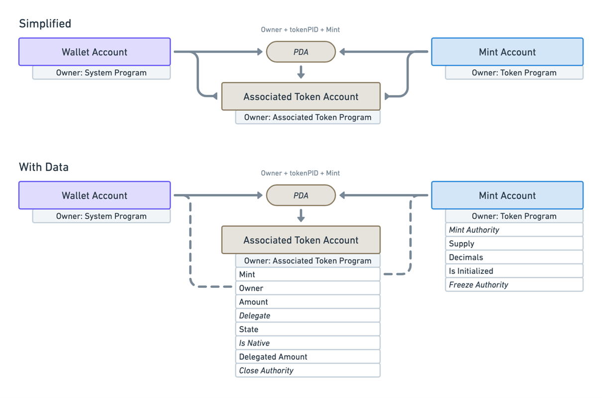

# 💵 Token Program

作为区块链最基本的承诺，这些代币也许是你安装钱包的主要原因，它们是区块链上资产最纯粹的表现形式，从合成股票到数百种狗币。

本课将主要讲解在`Solana`上代币是如何工作的。如果你对其他区块链有所了解，可能会发现这里存在一些差异，所以尽量不要与你当前对代币的理解联系起来。

探讨`Solana`中代币的工作原理也是一个深入了解不同程序如何使用账户的绝佳机会。你越深入了解`Solana`，就越能意识到账户的重要性。虽然它们在文件系统中的抽象和灵活性与文件类似，但这也意味着任何特定程序上的账户可能变得相当复杂！初开始可能会感到混乱，但随着时间的推移，它会变得更加清晰。

Solana上的代币是通过`Solana Token Program`来创建和管理的，它是`Solana Program Library（SPL）`的一部分程序。常规代币和非同质化代币（`NFTs`）都属于`Solana`程序库中的代币类型。今天我们不会涉及`NFTs`，但不要担心，我们会很快介绍。

## 🗃 账户关系

首先，我们要了解一下整体情况。`Token Program`需要三个必要的账户：


- `Wallet Account` - 就是你的钱包！
- `Mint Account` - 存储关于代币铸造的元数据
- `Token Account` - 与钱包关联，存储有关特定钱包的信息，例如它持有多少代币。

现在让我们深入了解每个账户，看看它们的内部情况。

## 🌌 铸币账户(`Mint Account`)


铸币账户存储关于代币本身的元数据，不是关于你对代币的所有权，而是涉及代币的更广泛内容。它具有以下属性：

- `mint authority` - 只有一个账户可以从铸币账户签名并铸造代币。创建铸币账户时，必须指定铸币权限，可以是你的个人钱包或其他程序。
- `supply` - 存在的总代币数量。“`supply`”基本上是在说：“码农大神，你好！这是发行的总代币数量。”
- `decimals` - 这是我们允许代币被分割的小数位数，即代币的精度。这可能会有些棘手，因为实际上链上没有小数。整个供应量表示为整数，所以你必须进行数学计算以在小数之间进行转换。例如，如果你将小数位数设置为两位，而你的供应量是一百，那么实际上你只有一个代币。供应量中只有一个代币，但你允许它被分割成较小的面额。
- `Is Initialized` - 基本上指的是该账户是否已准备就绪。这与账户本身有关，而不是`代币程序`。
- `Freeze authority ` - 冻结权限与`mint authority`类似，表示一个人或程序具有冻结（或铸造）代币的权限。

将铸币权限设置为你的钱包是一种相当标准的做法。你可以铸造任何你想要的代币，然后撤销铸币权限，基本上意味着未来不会再有更多的供应量。或者，如果你有某种动态发行代币的方式，常见的做法是将其放入权限中，作为一个程序来管理代币的铸造。

冻结权限的工作方式相同。

##  👛 代币账户(`Token Account`)

你可能已经注意到了生态系统中流通的众多不同代币。你的钱包里现在可能充满了各种各样的代币。但是，网络是如何识别你持有某些代币的呢？答案就在于存储这些数据的账户！最好的方式就是通过关联代币账户来实现。下面这张图可以帮助你理解：



这就是数据关系和账户属性的示例图。

Token账户必须与用户或钱包关联。一种简便的方式是创建一个`PDA`（程序衍生地址），其地址将铸币账户和钱包连接在一起。令牌账户`PDA`的种子由铸币账户的地址和钱包地址组成（其中令牌程序ID是默认存在的）。

虽然包括了很多不同的信息，但现在你只需要理解的是，你的钱包并不直接持有具体的代币。它与一个存储了代币数量的关联账户有关。此外，还有一个铸币账户，存储了有关所有代币和铸币的更广泛信息。

请花些时间仔细研究这个图表，对不明白的部分进行搜索（例如关联的令牌程序究竟是什么？）。处理了所有复杂的部分后，这一切将变得非常简单！

## 🤑 代币铸造过程

别再盯着图表看了，让我们来深入一些代码，了解这一切是如何实现的。

要创建一个新的`SPL-Token`，首先必须创建一个`Token Mint`（一个存储该特定代币相关数据的账户）。

你可以将这个过程想象为制作比萨饼。你需要食谱（关于代币的数据）、食材（铸币账户和钱包地址），还有一个人将它们组合在一起（派生一个新的`PDA`）。就像制作比萨一样，只要你有正确的食材并按照食谱操作，最终你就能得到一枚美味的新代币！

由于`Token Program`是`SPL`的一部分，你可以使用 [`@solana/spl-token`](https://www.npmjs.com/package/@solana/spl-token) `TypeScript SDK`相当轻松地进行创建交易。

下面是一个`createMint`的示例：

```ts

import { createMint, TOKEN_PROGRAM_ID } from "@solana/spl-token";

// 生成token 的 account地址，此项为可选项
const newToken = web3.Keypair.generate();
const tokenMint = await createMint(
  connection,
  payer,
  mintAuthority,
  freezeAuthority,
  decimals,
  newToken,
  null,
  TOKEN_PROGRAM_ID
)
```

你需要以下参数：
- `connection` - 与集群的`JSON-RPC`连接
- `payer` - 付款方交易的公钥
- `mintAuthority` - 被授权铸造新代币的账户
- `freezeAuthority` - 被授权冻结代币的账户。如果你不想冻结代币，请将其设置为`null`！
- `decimals` - 指定代币所需的小数精度

可选参数:
- newToken 生成token 的 account地址，为空，将默认生成一个
- null 为 confirmOptions ，按照默认即可
- TOKEN_PROGRAM_ID token 程序的ID

完成这个步骤后，你可以继续以下步骤：

- 创建关联的`Token`账户
- 将代币铸造到某个账户中
- 如果你想通过转账功能空投到多个账户

你在 `@solana/spl-token SDK`中需要的一切都已准备好。如果你对某个具体部分感兴趣，可以[查看文档](https://spl.solana.com/token)。

在大多数情况下，`@solana/spl-token SDK`就足够了，你无需自己创建原始交易。

此外，一个有趣的附注——如果出于某种原因，你想要在创建铸币指令的同时创建另一个指令，你可以自己创建这些指令，并将它们组合成一个事务，以确保所有操作都是原子性的。也许你正在构建一个高度保密的代币程序，你希望在铸币后立即锁定所有代币，使没有人能够转移它们。

不用说，围绕这些代币发生了许多有趣的事情。你可以在[此处](https://www.soldev.app/course/token-program)了解每个功能背后的工作原理，甚至还可以查看一些关于销毁代币等的说明。:)

## 参考资料

- [通过代币程序创建代币](https://www.soldev.app/course/token-program)
