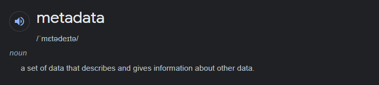
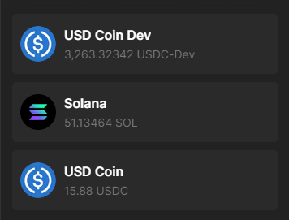

# 🧮 令牌元数据

`Token`元数据指的是代币的基本信息，例如名称、符号和标志。注意你钱包中的各种代币都拥有这些特性，除了你自己创建的代币。

这就是所有的元数据！这适用于所有代币，不仅仅是可替代代币。在`Solana`上，`NFT`与任何其他代币无异，只不过通过属性（例如小数位）来定义它们作为`NFT`。

所有这些都是通过[`Token Metadata Program`](https://docs.metaplex.com/programs/token-metadata/overview)实现的 - 这是处理`Solana`区块链上的`Token`和`NFT`时最重要的程序之一。它的主要任务是将额外数据附加到`Solana`上的可替代或不可替代`Token`。它使用从`Mint`账户地址派生的程序派生地址（`PDAs`）来实现这个目标。

## 🎭 令牌元数据账户

一旦我们制造了一个闪亮的新代币，我们需要使其更具吸引力。我们将使用`Token Metadata Program`来完成这个任务，以下是生成的账户样式：

这被称为元数据账户。它能存储有关特定代币铸造账户的各种信息。你会注意到一个 `URI`（统一资源标识符）属性 - 它指向链下的一个`JSON`文件，主要用于非同质化代币（`NFT`）。由于链下部分不受链上费用限制，你可以存储高质量图形和其他大型数据对象。

元数据账户有许多属性，你不需要了解其中大部分。我们将在需要时深入探讨相关部分。现在，我们只关心链下部分，这是我们制作`Pizzacoin`所需的第一步。

## 🖼 代币标准

链下部分遵循[`Metaplex`代币](https://docs.metaplex.com/programs/token-metadata/token-standard)标准，基本上是一种格式，你需要按照这个格式来实现不同类型的代币元数据。我们在元数据账户链上部分的 `Token Standard` 字段中通知网络上的所有应用程序我们的代币类型。我们的选择有：

- `NonFungible`：带有主版本的非同质化代币（`NFTs`）。
- `FungibleAsset`：具有元数据和属性的代币，有时也被称为半可替代代币（例如游戏物品）。
- `Fungible`：具有简单元数据的代币（如USDC或SOL这样的常规代币）。
- `NonFungibleEdition`：一个具有`Edition`账户的非同质化代币（从主版中打印出来的，例如100个中的1个）。

`Metaplex Token`标准在整个行业中得到了广泛接受。各种应用程序、交易所和钱包都希望令牌符合此标准。`Token`标准由`Token`元数据程序自动设置，不能手动更新。以下是它如何决定应用正确的标准：

- 如果令牌拥有主版本账户，则为 `NonFungible`。
- 如果令牌具有`Edition`账户，则为 `NonFungibleEdition`。
- 如果代币没有（主）版账户（确保其供应量大于`1`）并且使用零位小数，那么它是 `FungibleAsset`。
- 如果代币没有（主）版账户（确保其供应量大于`1`）并且使用至少一位小数，那么它是 `Fungible`。

你现在可以忽略“`Master Edition`”是什么意思，`Pizzacoin`是完全可替代的，因此我们将专注于可替代代币。

## 🧰 Metaplex SDK

欢迎接触`Solana`上其中一款极为实用的`SDK`——`Metaplex SDK`。如果你之前在`Solana`上铸造过`NFT`，那么你很可能在毫不知情的情况下已经使用过`Metaplex SDK`了。我们将利用 `@metaplex-foundation/js` 和 `@metaplex-foundation/mpl-token-metadata` 库来创建和我们的代币铸造项目相关联的元数据账户。现在是时候赋予`Pizzacoin`独一无二的身份了。

我们首先将着手于链下部分，准备好后，再继续创建代币元数据账户。

一般的操作流程如下：

1. 安装`Metaplex SDK`——你可能会使用现有的密钥对。
2. 上传一个图像作为代币标志——我们会使用本地文件，但SDK也支持直接从浏览器上传。
3. 上传链下元数据（包括你上传的图像的`URI`），这样你就可以开始进行链上操作了。
4. 生成元数据账户的程序派生地址（`PDA`，俗称“蛋”）。
5. 创建链上的`Token`元数据账户，包括各种指令、交易等。

感觉有些不确定吗？别担心，我们接下来会通过一些代码来帮助你消除疑虑 🤺。
