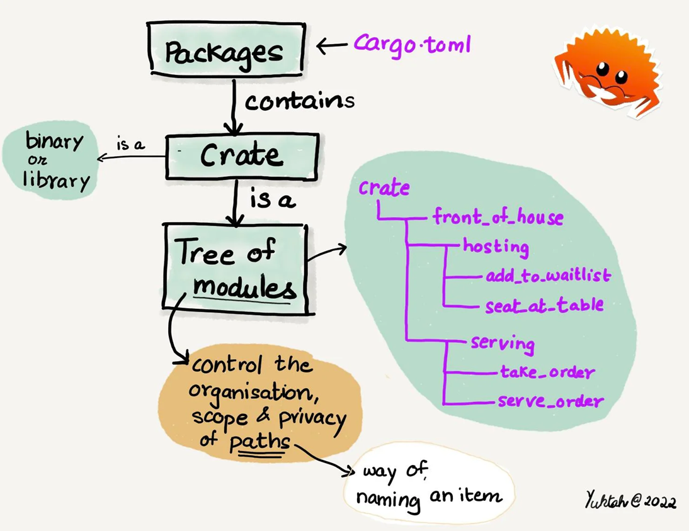
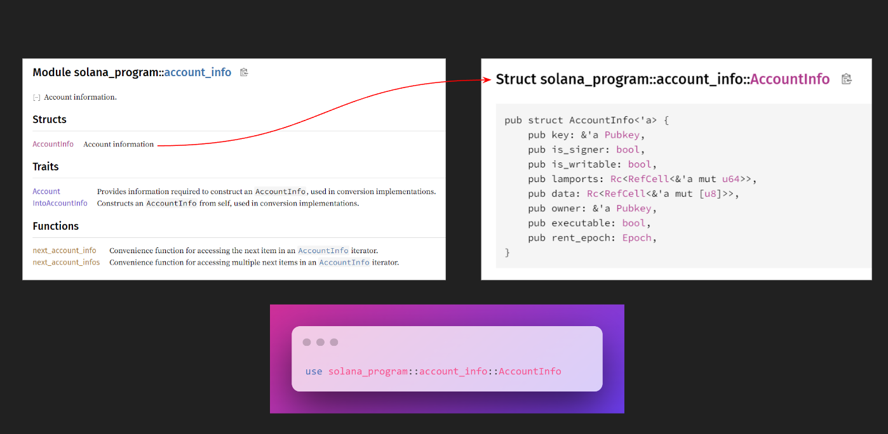

# 📝 你好，世界

我们将在游乐场上制作一个简单的`Hello World`程序，这个程序只会在交易日志中记录一条消息，相当有趣。

## 📦 Rust模块系统

在`Solana`上编写程序，我们会像对待客户一样用到一系列的库，免去了大量手动编写样板代码的麻烦。`Rust`采用一种被称为“模块系统”的方式来组织代码，它和`Node.js`中的模块或`C++`中的命名空间有许多相似之处。

下面是一个直观的可视化展示：



这个系统的三个部分包括：

- `package` - 这是一个包含一组`crate`和用于指定元数据及包之间依赖关系的清单文件的包。你可以将其理解为`Node.js`中的 `package.json`。
- `crate（木箱）` - 一个`crate`可以是一个库或一个可执行程序。`crate`的源代码通常会被细分为多个模块。这就像一个`Node.js`模块。
- `module` - 模块用于将代码分割成逻辑单元，为组织、作用域和路径的隐私提供了独立的命名空间。它们基本上是单独的文件和文件夹。

## 🛣 路径和范围

`Crate`模块可以在项目中被重复使用，就像你可以在`React`中重用组件和在`Node`中重用模块一样。比较棘手的是我们需要知道它们的路径才能引用它们。

将`crate`结构想象成一棵树，其中`crate`是树的基础，模块是树枝，每个模块可能有子模块或额外的分支。

我们所需的其中一个事物是`AccountInfo`子模块中的`account_info`结构体，以下是它的样子：



`struct`是一种自定义数据类型。把它想象成一种自定义的原始数据类型，就像字符串或整数一样，但与只存储一个值的原始类型不同，`struct`可以包含多个值。

在`Rust`中， `::` 用作路径分隔符，就像 `.` 或 `/` 一样。因此，要引用 `AccountInfo` 结构体，我们可以这样写：

```rust
use solana_program::account_info::AccountInfo;
```

这里的层次结构是：

- 基础`crate`是 `solana_program`
- `solana_program` 包含一个名为 `account_info` 的模块
- `account_info` 包含一个名为 `AccountInfo` 的结构体

`Rust`文件的顶部常常会有一系列的 `use` 命令，这与 `import` 或 `require` 语句相似。

我们还需要一些其他项目。我们可以使用花括号从单个模块中引入多个项目，这有点像`JS`中的解构。

```rust
use solana_program::{
    account_info::AccountInfo,
    entrypoint,
    entrypoint::ProgramResult,
    pubkey::Pubkey,
    msg
};
```

到目前为止，一切都很简单明了。 `AccountInfo` 结构体是`Solana`账户数据的通用描述符，它定义了账户应具备的所有属性。

如果你以前从未使用过像`TypeScript`或`Java`这样的静态类型语言，你可能会想知道为什么我们要导入像 `PubKey` 或 `AccountInfo` 这样的“数据类型”。简言之，在`Rust`中，我们需要在声明变量时定义其类型。这有助于我们在编译或运行代码之前捕捉错误。因此，当程序在区块链上执行交易时，它不会崩溃，而是在开发过程中出错，这样你就可以更快地准备好可运行的代码。


我会在需要的时候介绍剩下的这些项目。现在让我们继续前进！


## 🏁 Solana程序入口

回想一下我们的`TypeScript`客户端。我们在 `index.ts` 的 `main` 中有一个函数，它是我们脚本的入口点。同样的，`Rust`脚本也是这样的方式！但是，我们不仅仅是编写任何`Rust`脚本，我们正在编写一个将在`Solana`上运行的脚本。

这就是我们第二个 `use` 语句的用途 —— 它引入了 `entrypoint!` 宏：一种特殊类型的 `main` 函数，`Solana`将用它来执行我们的指令。

宏就像是代码的快捷方式 —— 它们是一种可以编写代码的代码。在编译时，`entrypoint!(process_instruction)`; 将展开为一堆样板代码，有点像模板。你不必深入了解宏的工作原理，但你可以在[这里](https://doc.rust-lang.org/book/ch19-06-macros.html)阅读更多相关信息。

我们的入口函数将调用 `process_instruction`，所以这是我们的 `lib.rs` 文件目前应该的样子：

```rust
use solana_program::{
    account_info::AccountInfo,
    entrypoint,
    entrypoint::ProgramResult,
    pubkey::Pubkey,
    msg
};

entrypoint!(process_instruction);
```

接下来是关于 `process_instruction` 函数的部分。

## 🔨 Rust中的函数

`Rust`中的 `fn` 与`Typescript`中的`function`非常相似 —— 它们只需要参数、类型和返回类型。在 `entrypoint!` 宏下面添加以下内容：

```rust
pub fn process_instruction(
    // 参数及其类型
    program_id: &Pubkey,
    accounts: &[AccountInfo],
    instruction_data: &[u8]
    // 返回类型（即函数返回的数据类型）
) -> ProgramResult{
  // 暂时留空函数体
}
```

我们的 `process_instruction` 函数需要以下参数：

- `program_id`：程序账户的公钥。用于验证程序是否由正确的账户调用。类型为 `&Pubkey`。
- `accounts`：指令所涉及的账户。必须为类型 `&[AccountInfo]`。
- `instruction_data`：我们交易中的`8`位指令数据。必须为 `&[u8]` 类型。

其中 `[]` 表示 `AccountInfo` 和 `u8` 是“切片”类型，类似于长度未知的数组。我们不称它们为数组，因为它们更底层 —— 在`Rust`中，切片是指向一块内存块的指针 🤯。

稍后我们会讨论 `&` :)

## 📜 Result 枚举

现在是时候介绍我们的第三个 `use` 语句 - `ProgramResult` 了。这是一个`Rust`枚举，代表了`Solana`程序执行的结果。

现在试着点击左侧栏上的“构建”按钮来编译脚本。你应该会得到一个警告和一个错误，错误信息是：

```bash
error[E0308]: mismatched types
  --> /src/lib.rs:12:6
   |
7  | pub fn process_instruction(
   |        ------------------- implicitly returns `()` as its body has no tail or `return` expression
...
12 | ) -> ProgramResult {
   |      ^^^^^^^^^^^^^ expected enum `Result`, found `()`
   |
   = note:   expected enum `Result<(), ProgramError>`
           found unit type `()`
```

我想花点时间欣赏一下`Rust`错误信息的精确性。它准确地告诉你出了什么问题，问题在哪里，以及如何修复。如果`JavaScript`也这样友好，我会少失去多少头发呢 😢。

由于我们的函数体为空，它会隐式地返回 `()` - 空元组。错误消息表示它期望 `Result`，但我们声明的返回类型是 `ProgramResult`。嗯，这里发生了什么呢🤔？

这是因为`Solana`的 `ProgramResult` 类型是用Rust的 `Result` 类型实现的：

```rust
pub type ProgramResult = Result<(), ProgramError>;
```

`Result` 是一个标准库类型，代表两个离散的结果：

- 成功（ `Ok` ）
- 失败 ( `Err` )

```rust
pub enum Result<T, E> {
    Ok(T),
    Err(E),
}
```

把它理解成`HTTP`错误代码也许会更直观——`200`代表 `Ok`，`404`代表 `Err`。因此，当我们返回 `ProgramResult` 时，实际上是在表示我们的函数可以返回 `()`（一个空值）以示成功，或者通过自定义的 `ProgramError` 枚举来告知出现了何种问题。非常实用！

我们所需要做的就是：

```rust
pub fn process_instruction(
    program_id: &Pubkey,
    accounts: &[AccountInfo],
    instruction_data: &[u8]
) -> ProgramResult{
  // 成功时返回 Ok()
  Ok(())
}
```

## 🚀 部署你的首个程序

我们的程序现在已经接近完成了！唯一缺失的部分就是实际上输出“`Hello World`”，我们可以通过使用 `msg!` 宏来实现这一目的。由于我们暂时不会对指令数据进行任何操作，为了避免出现“未使用的变量”警告，只需在变量名前加上下划线即可。

以下是 `process_instruction` 函数的完整样式：

```rust
pub fn process_instruction(
    _program_id: &Pubkey,
    _accounts: &[AccountInfo],
    _instruction_data: &[u8]
) -> ProgramResult{
  msg!("Hello World!");
  Ok(())
}
```

如果你点击构建，控制台上应该会出现绿色的“构建成功”消息。恭喜你！你已经成功编写了你的第一个`Solana`程序🎉。

在这个在线环境中部署程序非常便捷。只需切换到左上角的“构建和部署”选项卡，在“资源管理器”图标下方，点击“部署”按钮即可。
