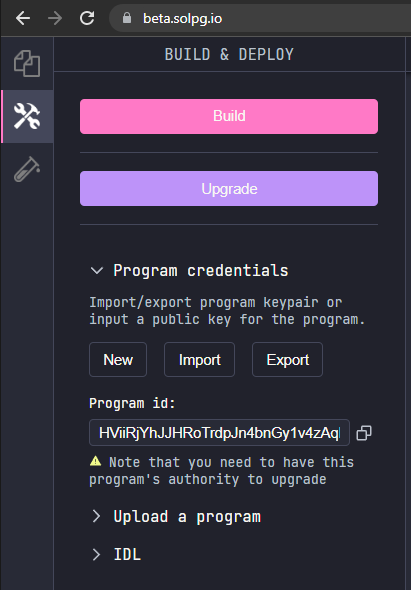
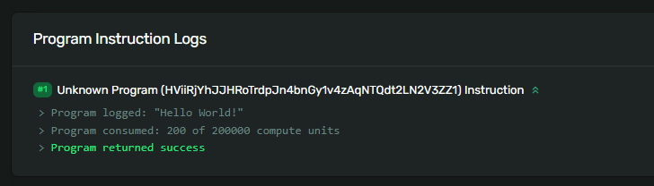

# 👋 与你部署的程序互动

我们将在`Solana`的游乐场上创建一个简单的`Hello World`程序。它只会在交易日志中记录一条消息。现在我们的程序已经部署完成了，是时候与之互动了。别忘了，在之前的阶段，你已经多次实现过这个过程！你可以像之前一样通过`create-solana-client`设置本地客户端，或者直接使用`Solana`的游乐场。

我倾向于选择游乐场，因为那里更加方便快捷 :P

首先，你需要获取程序`ID`。你可以在“程序凭证”选项卡下找到它：



接下来我们来查看我们的`TS`脚本。返回“资源管理器”选项卡，然后在左侧的 `Client` 部分下找到并打开 `client.ts`。以下是我们所需的代码：

```ts
const programId = new web3.PublicKey(
  "REPLACE_WITH_YOUR_PROGRAM_ID"
);

async function sayHello(
  payer: web3.Keypair
): Promise<web3.TransactionSignature> {
  const transaction = new web3.Transaction();

  const instruction = new web3.TransactionInstruction({
    keys: [], // 这里暂时不使用任何账户
    programId,
    // 这里不需要添加数据！
  });

  transaction.add(instruction);

  const transactionSignature = await web3.sendAndConfirmTransaction(
    pg.connection,
    transaction,
    [payer]
  );

  return transactionSignature;
}

async function main() {
  const transactionSignature = await sayHello(pg.wallet.keypair);

  console.log(
    `交易链接: https://explorer.solana.com/tx/${transactionSignature}?cluster=devnet`
  );
}

main();
```

你会发现这部分代码非常熟悉。在`Solana`的游乐场中，获取密钥对和连接到开发网络的方式有所不同，这是这个脚本的两个变化要点。全局对象 `pg` 包含了这两个要素。

运行这个脚本后，你应该能在控制台上看到已记录的交易。打开链接并向下滚动，你就会看到你的消息！



# 🚢 接下来的挑战

现在轮到你自己来构建一些东西了。由于我们从非常基础的程序开始，你所创建的程序应该与我们刚才创建的程序非常相似。尽量自己编写代码，而不是从这里复制粘贴。

在`Solana Playground`中创建一个新程序，使用`msg!`宏将自定义消息打印到程序日志中。按照我们演示的方式构建和部署你的程序。编写一个客户端脚本来调用你新部署的程序，然后使用`Solana Explorer`来检查程序日志中是否打印了你的消息。

除了创建一个基础程序外，也可以花些时间去探索`Rust`。你可以查阅[Rust书籍](https://doc.rust-lang.org/book/)，并使用[Rust Playground](https://play.rust-lang.org/)来更好地理解这门语言的工作原理。这样，当我们深入探讨更具挑战性的`Solana`程序主题时，你就能领先一步。

或许，你可以尝试让程序使用一组词汇的组合来随机生成登出时的消息，而不是固定的消息？这将是一个有趣的挑战！
