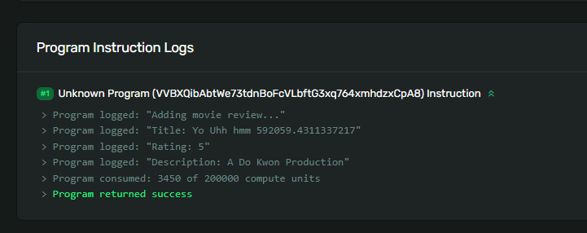

# 🎥 构建一个电影评论程序

还记得我们在第一节中互动开发的电影评论节目吗？现在我们要继续深入开发它。当然，你可以随意评论任何内容，不仅限于电影，毕竟我并不是你的长辈，你自由发挥就好。

让我们回到操场（是上一节课的操场，不是中学时的那个），开始一个全新的项目。我们将从基础的结构编写开始，具体如 `lib.rs` 文件：

如果是在本地开发的话，我们需要执行`cargo init <your-program-name> --lib`。
下面这个是以`cargo init hello --lib`生成的`Cargo.toml`文件。

```toml
[package]
name = "hello"
version = "0.1.0"
edition = "2021"

# See more keys and their definitions at https://doc.rust-lang.org/cargo/reference/manifest.html

[dependencies]
```

并且还需要添加`solana-program`, `borsh`,通过在命令行执行`cargo add solana-program`和`cargo add borsh`安装。

执行后的`Cargo.toml`内容是：

```toml
[package]
name = "hello"
version = "0.1.0"
edition = "2021"

# See more keys and their definitions at https://doc.rust-lang.org/cargo/reference/manifest.html

[dependencies]
borsh = "0.10.3"
solana-program = "1.16.10"
```

还有需要配置下`Cargo.toml`,在文件内添加如下内容：

```toml
[package]
name = "hello"
version = "0.1.0"
edition = "2021"

# See more keys and their definitions at https://doc.rust-lang.org/cargo/reference/manifest.html

[dependencies]
borsh = "0.10.3"
solana-program = "1.16.10"

# 这是你需要添加的内容
[lib]
crate-type = ["cdylib", "lib"]
```

然后是将`lib.rs`里面的内容替换为下面的内容。

```rust
use solana_program::{
    entrypoint,
    entrypoint::ProgramResult,
    pubkey::Pubkey,
    msg,
    account_info::AccountInfo,
};

entrypoint!(process_instruction);

pub fn process_instruction(
    program_id: &Pubkey,
    accounts: &[AccountInfo],
    instruction_data: &[u8]
) -> ProgramResult {

    Ok(())
}
```

就像我们构建记事程序一样，我们将从定义指令结构开始，并创建用于反序列化的逻辑。

## 🔪 反序列化指令数据

我们将在一个名为 `instruction.rs` 的新文件中完成这个任务。

```rust
use borsh::{BorshDeserialize};
use solana_program::{program_error::ProgramError};

pub enum MovieInstruction {
    AddMovieReview {
        title: String,
        rating: u8,
        description: String
    }
}

#[derive(BorshDeserialize)]
struct MovieReviewPayload {
    title: String,
    rating: u8,
    description: String
}
```

我们需要引入的只有 `BorshDeserialize` 宏和 `ProgramError` 枚举。

虽然我们只有一种指令类型，但我们仍然会使用枚举。未来我们可能会考虑添加更多的指令 :)

你可能会好奇，为何我们需要在有效负载中指定类型。这些类型告诉`Borsh`如何分割字节。在切割之前，得先知道香肠有多长，记得吗？

我们还需要为 `MovieInstruction` 枚举添加实现。在枚举定义下方添加以下内容。

```rust
impl MovieInstruction {
    pub fn unpack(input: &[u8]) -> Result<Self, ProgramError> {

        let (&variant, rest) = input.split_first().ok_or(ProgramError::InvalidInstructionData)?;

        let payload = MovieReviewPayload::try_from_slice(rest).unwrap();

        Ok(match variant {
            0 => Self::AddMovieReview {
                title: payload.title,
                rating: payload.rating,
                description: payload.description },
            _ => return Err(ProgramError::InvalidInstructionData)
        })
    }
}
```

你应该能理解这里发生的一切！我们正在解析指令数据，并返回枚举的正确变体。

注意我们在分割第一个字节时使用的 `?`。

```rust
let (&variant, rest) = input.split_first().ok_or(ProgramError::InvalidInstructionData)?;
```

如果 `unpack` 的结果是错误，这是一种返回错误并退出 `unpack` 函数的简写方式。就像一个精简版的 `try/catch`。这在`Rust`中是常见的模式，你会经常看到它。

```rust
let payload = MovieReviewPayload::try_from_slice(rest).unwrap();
```

此外，我还想深入探讨一下 `.unwrap();` 在`Rust`中，“`unwrap`”意味着“给我计算的结果，如果出错就产生恐慌并停止程序。”你可能会想：“嗯，但是为什么我们需要从函数的结果中返回东西呢？难道 `try_from_slice()` 函数不会返回我们想要的吗？”

不是的。`Rust`有一个 `Option` 类型：一种使用`Rust`类型系统来表示可能缺失的方式。这与其他语言中的 `null` 不同。 `Option` 是一种类型，可以是 `Some` 或 `None` 。 `Some` 是一个值，`None` 是一个值的缺失。为什么呢？因为有时候你没有一个值，这是可以接受的。从[文档](https://web.mit.edu/rust-lang_v1.25/arch/amd64_ubuntu1404/share/doc/rust/html/book/first-edition/error-handling.html#unwrapping-explained?utm_source=buildspace.so&utm_medium=buildspace_project)中了解更多：

:::info
将缺失的可能性编码到类型系统中是一项重要的概念，因为它会迫使编译器强制程序员处理这种缺失的情况。
:::

`Rust`助你成为更出色的开发者！现在，你又多了解了`Rust`的另一部分内容🍰

## 👀 将指令添加到程序中

最后一部分的工作是将指令整合到程序中。我们将在 `lib.rs` 文件中完成此操作。

```rust
pub mod instruction;
use instruction::{MovieInstruction};
```

如果你更改了枚举名称，请确保相应地更新导入。

现在我们只需将指令数据记录到控制台。在 `process_instruction` 函数后添加以下代码。

```rust
pub fn add_movie_review(
    program_id: &Pubkey,
    accounts: &[AccountInfo],
    title: String,
    rating: u8,
    description: String
) -> ProgramResult {

    msg!("正在添加电影评论...");
    msg!("标题: {}", title);
    msg!("评分: {}", rating);
    msg!("描述: {}", description);

    Ok(())
}
```

现在，我们可以更新 `process_instruction` 函数，使用 `unpack` 和 `add_movie_review` 函数：

```rust
pub fn process_instruction(
    program_id: &Pubkey,
    accounts: &[AccountInfo],
    instruction_data: &[u8]
) -> ProgramResult {

    let instruction = MovieInstruction::unpack(instruction_data)?;

    match instruction {
        MovieInstruction::AddMovieReview { title, rating, description } => {
            add_movie_review(program_id, accounts, title, rating, description)
        }
    }
}
```

我们在这里做的只是解析指令数据，然后使用正确的参数调用 `add_movie_review` 函数。

我们的程序现在已经完成了！请确保你点击部署按钮，并从游乐场复制程序`ID`。

如果你觉得这有点让人失望，那是因为我们在上一课已经逐一讲解了每个部分。现在，让我们尝试使用客户端将电影评论添加到我们的程序中。

## 提交电影评论

我们的进展飞速，走吧！

不需要从头开始编写脚本，我相信你知道该怎么做 :)

下面是如何设置完整脚本的步骤，包括你所需的一切：

```bash
git clone https://github.com/all-in-one-solana/solana-movie-client
cd solana-movie-client
npm install
```

打开 `src/index.js` 并将第`94`行的程序`ID`更新为从`playground`复制的`ID`。如果你对程序做了任何更改，这里还需要更新客户端。

在终端输入 `npm run start` ，你应该会得到一个资源管理器链接。点击该链接，然后向下滚动到程序指令日志，你应该能看到你的电影评论！



轻松有趣，我们可以做到，继续前进！

## 🚢 挑战

对于本课程的挑战，尝试复制一个学生介绍程序。

该程序接收用户的姓名和短信作为指令数据，并创建一个账户以将数据存储在区块链上。

利用你在本课程中学到的知识，构建一个学生介绍程序，使得当程序被调用时，能够将用户提供的姓名和信息打印到程序日志中。

解决方案代码
你可以通过构建[这个前端](https://github.com/all-in-one-solana/solana-student-intros-frontend.git)并在`Solana Explorer`上检查程序日志来测试你的程序。记得用你部署的程序`ID`替换前端代码中的`ID`。

如果可以的话，尽量自己独立完成这个任务！但如果遇到困难，可以[参考解决方案代码](https://beta.solpg.io/62b0ce53f6273245aca4f5b0)。

我对你有信心。
