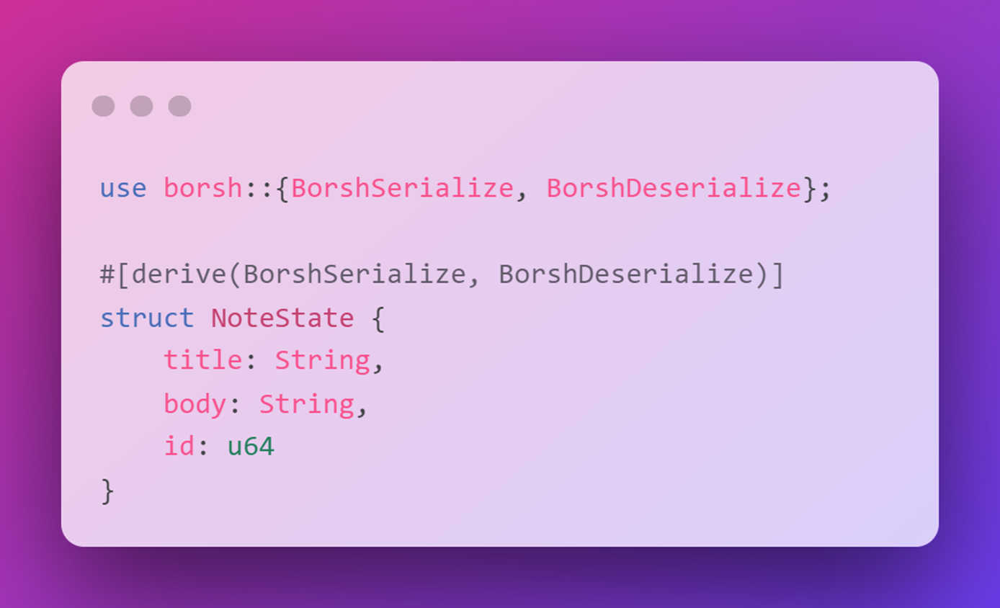

# 🤠 状态管理

还记得我们在第一节中互动的电影评论程序吗？我们要在这里构建它。随意评论其他东西，而不仅仅是电影，我不是你爸爸。嘿！准备好成为一位州长了吗？不不，我们不是在做那种类型的状态管理。我们所说的状态是指存储在链上的程序数据。

我们有一个可靠的程序，它接收指令数据并准备进行处理。要执行这些指令，我们需要学习更多关于Rust的知识。

## 📝 程序状态作为Rust数据类型

Solana保持其速度和效率的一部分原因是程序是无状态的。这意味着您无法更改程序上的数据 - 所有数据都存储在外部账户中，通常是由程序拥有的账户。大多数这些账户是PDA（Program Derived Accounts） - 我们现在将查看它们的数据存储元素，并稍后深入了解其余部分。

就像我们将指令数据转换为Rust类型一样，我们将把程序状态也转换为Rust类型，以便更容易处理。

回想一下 Solana 账户中的 `data` 字段 - 它存储了一个原始字节数组。我们可以通过序列化和反序列化来表示它在 Rust 类型中的形式。


我们将再次使用`borsh macro`：



数据在传输和存储时以原始字节的形式进行，但在我们希望处理数据时，会将其转换为Rust类型。有道理，对吧？


## 🏠 空间和租金

是的，Solana也有房东：验证者将区块链的状态存储在他们的机器上。

租金以`Lamports`支付，`Lamport`是SOL的最小单位（`0.000000001 SOL = 1 Lamport`），根据账户占用的空间大小计算。以下是常见类型占用的字节空间的表格：


付房租有两种方式：

- 按每个时期支付租金。这就像每月支付租金一样 - 只要你继续支付，你就可以继续居住。如果账户没有足够的SOL，它将被重置，数据将丢失。
-  保持等于2年租金的最低余额。这样账户就免除了租金。这里的逻辑是硬件成本每2年下降50%，所以如果你有足够的SOL支付2年的租金，你就永远不用担心了！

现在要求免租金，所以只有选项#2。这种方法的最大优点是，当您不再需要存储数据时，可以销毁账户并取回您的SOL！区块链上的免费存储（减去交易费用）🥳

为什么要在区块链上租赁呢？嗯，这是一种防止人们创建大量账户却从未使用的方式。这将浪费空间和验证者资源。这个系统是Solana上存储如此廉价的原因之一——与以太坊不同，我的愚蠢的Hello World NFT收藏将被所有验证者永久存储。

你可以在[这里](https://docs.solana.com/implemented-proposals/rent)阅读更多相关内容，我觉得挺酷的！

## 📊 计算租金

计算租金很简单 - 有一个很有用的功能可以帮助你。棘手的部分是弄清楚你需要多少空间。

这是我们的超级笔记程序的样子：

```rust
// Calculate account size required for struct NoteState
// 4 bytes to store the size of the subsequent dynamic data (string)
// 8 bytes to store the 64 bit interger for the id
let account_len: usize = (4 + title.len()) + (4 + body.len()) + 8;

// Calculate rent required
let rent = Rent::get()?;
let rent_lamports = rent.minimum_balance(account_len);
```

我们首先要做的是计算我们存储的数据的总长度。我们可以通过将字符串的长度和8个字节的id相加来实现这一点。

在我们的情况下， `title` 和 `body` 是动态数据类型（字符串）-它们可以是任意长度。我们使用前4个字节来存储每个项目的长度，因此我们将每个字符串的长度加上4。

然后我们可以使用 `Rent::get()` 函数来获取账户的租金。轻松愉快！

## 📜 程序派生地址

我们已经从指令中获取了我们的数据，我们已经计算出我们需要支付多少租金，现在我们需要一个账户来存放它。嗨，PDAs！还记得前端的鸡和蛋问题吗？这里也是一样的！我们将从程序ID和一组种子中推导出账户的地址。


我们将在未来深入探讨PDA的工作原理，但现在你只需要知道 `find_program_address` 功能，并且只有 `program_id` 中的程序可以为PDA签名。就像安全存储一样，不需要密码。


## 🛫 跨程序调用

最后一步是初始化PDA（我们只在最后一步中找到了地址）。我们将使用跨程序调用（CPI）来完成此操作。正如其名称所示，我们将在我们的程序中与Solana网络上的另一个程序进行交互。

CPI可以使用 `invoke` 或 `invoke_signed` 进行


当您不需要签署交易时，使用 `invoke` 。当您需要签署交易时，使用 `invoke_signed` 。在我们的情况下，我们是唯一可以为PDA签署的人，因此我们将使用 `invoke_signed` 。


这是它的样子。你可能会想：“这是什么鬼东西” - 别担心，我们接下来会练习，一切都会明白的 :)

我们在这里所做的只是使用Rust在程序中创建一个交易，类似于我们在客户端使用TypeScript时所做的。我们在这里有一个特殊的 `signers_seeds` 东西，这对于PDA是必需的。

## ✂ 序列化和反序列化账户数据

一旦我们创建了一个新账户，我们需要访问并更新该账户的数据字段（目前为空字节）。这意味着将其字节数组反序列化为我们创建的类型的实例，更新该实例上的字段，然后将该实例重新序列化为字节数组。


**反序列化账户数据**

更新帐户数据的第一步是将其数据字节数组反序列化为Rust类型。您可以通过首先借用帐户上的数据字段来实现此操作。这样可以在不获取所有权的情况下访问数据。


然后，您可以使用`try_from_slice_unchecked`函数来反序列化借用账户的数据字段，使用您创建的类型来表示数据的格式。这将为您提供一个Rust类型的实例，以便您可以使用点符号轻松更新字段。如果我们使用我们一直在使用的笔记应用程序示例来完成这个操作，它会是这样的：

```rust
let mut account_data = try_from_slice_unchecked::<NoteState>(note_pda_account.data.borrow()).unwrap();

account_data.title = title;
account_data.body = body;
account_data.id = id;
```

**序列化账户数据**


一旦Rust实例更新了账户数据的适当值，您可以将数据“保存”在账户上。

这是通过对您创建的Rust类型实例使用`serialize`函数来完成的。您需要传入对账户数据的可变引用。这里的语法有些棘手，所以如果您不完全理解也不用担心。借用和引用是Rust中最难的概念之一。

```rust
account_data.serialize(&mut &mut note_pda_account.data.borrow_mut()[..])?;
```

上面的示例将 `account_data` 对象转换为字节数组，并将其设置为 `note_pda_account` 上的 `data` 属性。这有效地将更新后的 `account_data` 变量保存到新账户的数据字段中。现在，当用户获取 `note_pda_account` 并反序列化数据时，它将显示我们序列化到账户中的更新数据。

## 📼 总结 - 把所有的东西放在一起

那真是太多了。我得休息一下，然后回来继续写完这个。让我们回顾一下整个过程的始终：

- 1. 用户通过发送一个包含标题、正文和字节ID的交易来创建一个笔记
- 2. 我们的程序接收指令，提取数据并将其格式化为Rust类型
- 3. 我们使用Rust类型来计算我们的账户需要多少空间+我们需要支付多少租金
- 4. 我们从程序ID和一组种子中推导出账户的地址
- 5. 我们使用CPI创建一个空白数据的账户
- 6. 我们将账户数据反序列化为Rust类型
- 7. 我们使用指令中的数据来更新Rust类型的账户数据
- 8. 我们将Rust类型序列化为原始字节，并将其保存到账户中

这就是全部了，朋友。你现在知道如何向Solana上的账户写入数据了。我在尖叫，因为这太重要了。给你一个大大的胜利，拿去吧，你值得拥有它：

## 🎥 构建一个电影评论程序

完成工作的时间到了。我们的史诗级电影评论将不再被记录在控制台上，而是将它们存储在区块链上！

我们将使用与之前相同的程序，您可以[从头开始设置](https://beta.solpg.io/6295b25b0e6ab1eb92d947f7)它，或者使用上一节的那个。

# 📝 账户数据的代表

我们需要一个新的Rust类型来表示我们存储的数据。创建一个名为 `state.rs` 的新文件，并在其中添加 `MovieAccountState` 。

```rust
use borsh::{BorshSerialize, BorshDeserialize};

#[derive(BorshSerialize, BorshDeserialize)]
pub struct MovieAccountState {
    pub is_initialized: bool,
    pub rating: u8,
    pub title: String,
    pub description: String,
}
```

我们这里有 `BorshSerialize` 和 `BorshDeserialize` 两者都有 :)

接下来，我们需要更新 `lib.rs` 以将我们所需的所有内容引入范围。将文件顶部更新为以下内容：

```rust
use solana_program::{
    entrypoint,
    entrypoint::ProgramResult,
    pubkey::Pubkey,
    msg,
    account_info::{next_account_info, AccountInfo},
    system_instruction,
    sysvar::{rent::Rent, Sysvar},
    program::{invoke_signed},
    borsh::try_from_slice_unchecked,
};
use std::convert::TryInto;
pub mod instruction;
pub mod state;
use instruction::MovieInstruction;
use state::MovieAccountState;
use borsh::BorshSerialize;
```

好的。我们需要的时候我会解释新的东西。让我们回到我们的 `add_movie_review` ，用实际的逻辑填充它，而不仅仅是打印出来。

### ⏩ 迭代账户

我们 `add_movie_review` 函数中传入的第二个参数是一个账户数组。我们可以遍历这些账户来获取它们的数据并进行相应操作。我们可以使用 `next_account_info` 来实现这一点 - 它是一个函数，接受一个迭代器并安全地返回列表中的下一个项。我们可以像这样使用它：

```rust
// Get Account iterator
let account_info_iter = &mut accounts.iter();

// Get accounts
let initializer = next_account_info(account_info_iter)?;
let pda_account = next_account_info(account_info_iter)?;
let system_program = next_account_info(account_info_iter)?;
```

挺酷的，对吧？如果列表为空，我们会得到一个 `ProgramError::NotEnoughAccountKeys` 错误。如果我们尝试访问一个不存在的账户，我们会得到一个 `ProgramError::MissingRequiredSignature` 错误。

### 🥚 导出PDA地址

我们所需要做的就是一行代码（继续添加到 add_movie_review ）：

```rust
let (pda, bump_seed) = Pubkey::find_program_address(&[initializer.key.as_ref(), title.as_bytes().as_ref(),], program_id);
```

这里的种子有：

- 1. 初始化器的公钥
- 2. 电影的标题

### 🧮 计算空间和租金

我们之前已经讨论过这个了 :)

```rust
// Calculate account size required
let account_len: usize = 1 + 1 + (4 + title.len()) + (4 + description.len());

// Calculate rent required
let rent = Rent::get()?;
let rent_lamports = rent.minimum_balance(account_len);
```

你的 `add_movie_review` 函数应该变得有点长了。我们还剩下两个小部分 - 创建账户和更新数据。继续前进吧！

### 📝 创建账户

是时候进行一些跨程序调用了！

```rust
// Create the account
invoke_signed(
    &system_instruction::create_account(
        initializer.key,
        pda_account.key,
        rent_lamports,
        account_len.try_into().unwrap(),
        program_id,
    ),
    &[initializer.clone(), pda_account.clone(), system_program.clone()],
    &[&[initializer.key.as_ref(), title.as_bytes().as_ref(), &[bump_seed]]],
)?;

msg!("PDA created: {}", pda);
```

`invoke_signed` 是创建账户的交易。我们传入了 `create_account` 指令，我们使用的账户以及用于派生PDA地址的种子。

我们需要做的最后一件事是更新账户数据：

```rust
msg!("unpacking state account");
let mut account_data = try_from_slice_unchecked::<MovieAccountState>(&pda_account.data.borrow()).unwrap();
msg!("borrowed account data");

account_data.title = title;
account_data.rating = rating;
account_data.description = description;
account_data.is_initialized = true;

msg!("serializing account");
account_data.serialize(&mut &mut pda_account.data.borrow_mut()[..])?;
msg!("state account serialized");
```

我们正在使用 `try_from_slice_unchecked` 将原始字节转换为Rust类型。然后我们更新数据并将其序列化回原始字节。

我们已经准备好进行升级并部署！（可能需要几分钟时间）


### 🎉 试一试

你知道该怎么做。复制地址。设置一个脚本来调用程序（你可以使用上次使用的那个，无需更改）。运行它。在Solana Explorer上检查这个新的账户。


如果你需要一个新的设置：

```bash
git clone https://github.com/buildspace/solana-movie-client
cd solana-movie-client
npm install
```

更新 `programId` 中的 `index.ts` 为您程序的地址，然后运行 `npm run start` 。

在终端中点击浏览器链接并向下滚动到程序日志部分，这是我得到的内容：


我们可以看到，我们的程序通过CPI与系统程序进行交互，创建了一个账户（PDA），并将我们的评论添加到其中！如果我自己说的话，这是一篇非常好的评论；）


## 🚢 船舶挑战

现在轮到你独立建立一些东西了。

回想一下，学生介绍程序需要用户提供姓名和简短留言作为输入`instruction_data`，并创建一个账户来将数据存储在区块链上。

利用你在本课程中学到的知识，尝试重新创建完整的学生介绍程序。

> 提示：
> 除了接收一个名称和一个简短的消息作为指令数据外，程序还应该：
>
> - 1. 为每个学生创建一个独立的账户
> - 2. 将 `is_initialized` 存储为布尔值，在每个账户中将 `name` 存储为字符串，将 `msg` 存储为字符串

**Solution Code:**

解决方案代码：
你可以使用[这个](https://github.com/buildspace/solana-student-intros-frontend)前端来测试你的程序。记得用你部署的程序ID替换前端代码中的那个。

如果可以的话，尽量独立完成这个任务！但如果遇到困难，可以参考[解决方案代码](https://beta.solpg.io/62b11ce4f6273245aca4f5b2)。
