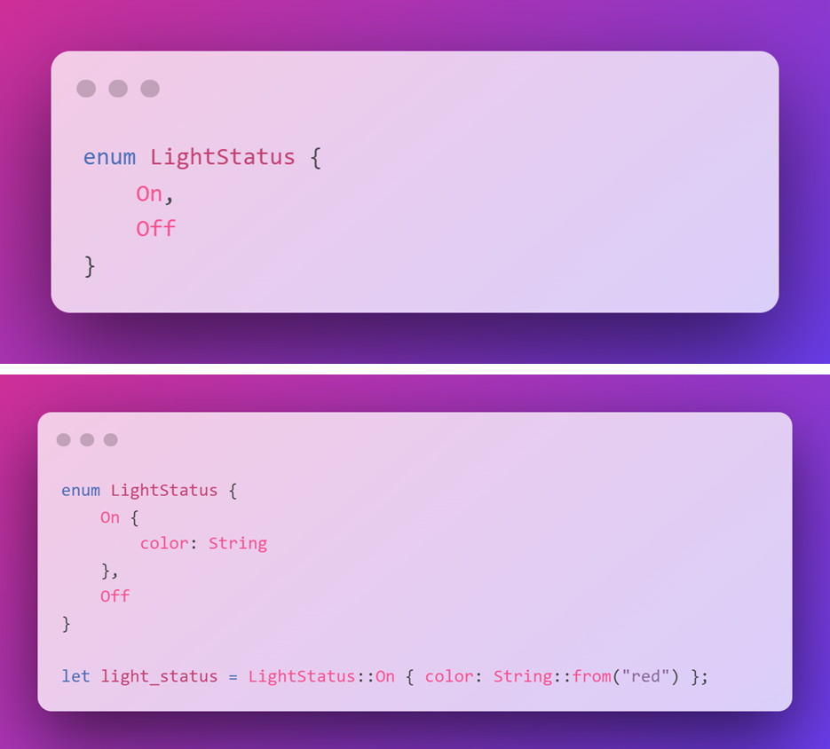
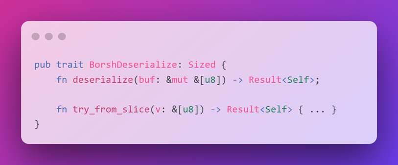
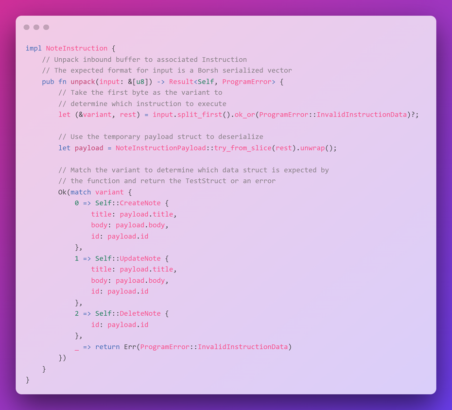

# 🎂 Rust的分层蛋糕

我们将在游乐场上制作一个简单的Hello World程序。它只会在交易日志中记录一条消息，哈哈，我们已经打招呼了。现在是时候学习如何处理指令数据了，就像我们在客户端开发中所做的一样。

在我们开始构建之前，我想先介绍一些我们将要使用的概念。还记得我提到的规则、能力和互动吗？我会带你了解一下你需要了解的能力和规则，以便编写一个本地的Solana程序。这里的本地很重要 - 我们将在后面由Anchor来处理我们所学到的很多内容。

我们学习原生开发的原因是因为了解底层工作原理非常重要。一旦你理解了事物在原子级别上是如何运作的，你就能够利用像Anchor这样的工具来构建更强大的程序。可以把它想象成与不同类型的敌人进行的首领战 - 在同时对抗它们之前，你需要学会如何对抗每个个体怪物（以及你自己的能力）。


当我刚开始学习这个东西的时候，我很难理解自己缺少了什么，所以我将它分解成了“层次”。你学习的每个主题都是建立在一层知识的基础上的。如果有什么不明白的地方，回到它所建立的层次上，确保你理解它们。

Rust的分层蛋糕


这是一个由Rust制作的蛋糕。

> 注意 - 图层表示重量哈哈

## 👶 变量声明和可变性

变量。你知道它们。你用过它们。你甚至可能拼错过它们。关于Rust变量唯一的新东西就是可变性。在Rust中，所有变量默认都是不可变的 - 一旦声明了变量，就不能改变其值。

你所要做的就是告诉编译器你想要一个可变的变量，通过添加 `mut` 关键字。简单易懂。如果我们不提供类型，编译器会根据我们提供的数据进行推断。然后它会强制我们在时间上保持该类型。


## 🍱 结构体

结构体是自定义的数据结构：一种将数据组合在一起的方式。它们是你定义的自定义数据类型，类似于JavaScript中的对象。Rust并非完全面向对象 - 结构体本身除了保存有组织的数据外，无法执行任何操作。你可以向结构体添加内容，使其更像对象。


## 📜 枚举、变体和匹配

枚举很简单 - 它们就像代码中的下拉列表。它们强制你从几个可能的变体中选择一个。




Rust中枚举的酷炫之处在于你可以（可选地）向其添加数据，使其几乎像一个迷你if语句。在这个例子中，你正在选择交通信号灯的状态。如果它是开启的，你需要指定颜色 - 是红色、黄色还是绿色？


当与匹配语句结合使用时，枚举非常有用。它们是一种检查变量值并根据该值执行代码的方式，与JavaScript中的switch语句相同。

## 📦 Implementations

结构体很酷，但如果你能给它们添加函数会怎样呢？让我们来介绍一下实现：它们允许你给结构体添加方法，使其更像对象。


如果你对“向结构体添加方法”的含义感到困惑 - 就像给结构体赋予能力一样。你可以拥有一个简单的`user`结构体，它具有速度、健康和伤害属性。通过使用 `impl` 来添加一个 `wordPerMinute` 方法，你可以计算用户的打字速度⌨️。

## 🎁 Traits

最后，来说说“糕点”的顶部。特征与实现类似-它们为类型添加功能。将其视为类型可以具备的品质。

回到我们的 `user` 结构体，如果我添加了一个 `ThreeArms` `Traits` ，用户将能够以更快的速度输入，因为他们将有额外的手臂！`Traits`有点抽象，所以让我们看一个实际的场景，我们将在其中使用它们：



正如你所记得的，我们的指令数据以字节数组（1和0）的形式提供，并且我们在程序中对其进行反序列化（将其转换为Rust类型）。我们将使用 `BorshDeserialize` 特性来实现这一点：它具有一个 `deserialize` 方法，将我们的数据转换为我们想要的类型。这意味着如果我们将 `BorshDeserialize` 特性添加到我们的指令结构体中，我们就可以使用 `deserialize` 方法将我们的指令数据实例转换为Rust类型。


如果这段话让你感到困惑，随时可以再读一遍哈哈，我也花了一些时间才理解清楚。

这是实际操作中的样子：


> 注意 - 你可能忘记了一个层次，宏：它们生成代码。

在我们的情况下，特质与宏一起使用。例如， `BorshDeserialize Traits` 有两个必须实现的函数。 `deserialize` 和 `try_from_slice` 。我们可以使用 `#[derive(BorshDeserialize)]` 属性告诉编译器在给定类型上（即指令数据结构）为我们实现这两个函数。
流程是：

- 通过宏将`Traits`添加到结构体中
- 编译器将会寻找`Traits`定义
- 编译器将为该`Traits`实现底层函数
- 你的结构体现在具有了`Traits`的功能


这里实际上发生的是宏在编译时生成了用于反序列化字符串的函数。使用这个`Traits`，我们告诉Rust：“嘿，我想要能够反序列化字符串，请为我生成代码。”

在我们的情况下，唯一的要求是`Borsh`需要支持所有的结构数据类型（在我们的情况下是字符串）。如果你有一个`Borsh`不支持的自定义数据类型，你需要通过添加到宏中自己实现这些功能。

如果这还没有点击，别担心！我在看到整个流程运作之前也没有理解，所以现在让我们来做吧！

## 🎂 把所有的东西放在一起

我们刚刚讨论了一系列相互关联的抽象主题。如果仅仅描述每一层，我无法想象出一个蛋糕的样子，所以让我们把它们整合在一起吧！


假设我们正在构建一个链上的笔记程序。我们将保持简单：你只能创建、更新和删除笔记。我们需要一条指令来完成这些操作，所以让我们为此创建一个枚举类型：


每个指令变体的字节数组都有自己的数据类型，我们在这里有它们！

既然我们知道指令数据的样子，我们需要将其从字节转换为这些类型。第一步是反序列化，我们将使用一个专门为有效负载创建的新结构体上的 `BorshDeserialize Traits` 来完成。

```rust
#[derive(BorshDeserialize)]
struct NoteInstructionPayload {
    id: u64,
    title: String,
    body: String
}
```

我们在这里有 `title` 和 `body` ，因为这就是字节数组中的内容。`Borsh`所做的只是添加反序列化的支持！它实际上并没有进行反序列化。它只是添加了我们可以调用的反序列化函数。


接下来，我们需要实际使用这些函数来反序列化数据。我们将在一个实现中定义这个行为。这是手动工作（暂时）！

```rust
impl NoteInstruction {
    // Unpack inbound buffer to associated Instruction
    // The expected format for input is a Borsh serialized vector
    pub fn unpack(input: &[u8]) -> Result<Self, ProgramError> {
        // Take the first byte as the variant to
        // determine which instruction to execute
        let (&variant, rest) = input.split_first().ok_or(ProgramError::InvalidInstructionData)?;
        // Use the temporary payload struct to deserialize
        let payload = NoteInstructionPayload::try_from_slice(rest).unwrap();
        // Match the variant to determine which data struct is expected by
        // the function and return the TestStruct or an error
        Ok(match variant {
            0 => Self::CreateNote {
                title: payload.title,
                body: payload.body,
                id: payload.id
            },
            1 => Self::UpdateNote {
                title: payload.title,
                body: payload.body,
                id: payload.id
            },
            2 => Self::DeleteNote {
                id: payload.id
            },
            _ => return Err(ProgramError::InvalidInstructionData)
        })
    }
}
```



这可能看起来吓人，但你很快就会笑出声来，因为它其实非常简单！让我们来分解一下 🕺💃👯‍♂️

```rust
pub fn unpack(input: &[u8]) -> Result<Self, ProgramError> {
```

我们的解包函数将从指令中获取字节，并返回一个`NoteInstruction`类型（这就是 `Self` ）或一个 `ProgramError` 。

```rust
let (&variant, rest) = input.split_first().ok_or(ProgramError::InvalidInstructionData)?;
```

是时候将我们的数据从字节中解包并调用反序列化函数了。

在这个程序中，我们指令数据的第一个字节是一个整数，告诉我们正在处理哪个指令。我们需要这样做是因为每个指令可能有不同的关联数据。也许我们正在编写一个食谱程序，而不是烹饪食谱，我们最终删除了它。我们需要知道我们正在处理哪个指令，以便能够正确解析数据。


我们这样做的方式是使用Rust内置的 `split_first` 函数。它接受一个字节切片并返回一个元组。第一个元素是切片中的第一个字节，第二个元素是切片的剩余部分。如果切片为空， `ok_or` 只是返回 `ProgramError` 枚举中的 `InvalidInstructionData` 错误。

```rust
let payload = NoteInstructionPayload::try_from_slice(rest).unwrap();
```

现在我们有两个变量要处理 - 指令指示器和指令的有效载荷（数据）。`Borsh`在我们的有效载荷结构中添加了 `try_from_slice` 函数，这样我们就可以在有效载荷变量 `rest` 上调用它。这就是反序列化的过程！如果没有错误， `unwrap` 将从这个函数中返回值。

我们快到了！到目前为止，我们已经：

- 将我们的指令数据定义为 `Rust` 类型中的枚举
- 定义了我们的负载结构体
- 在负载结构体上声明了 `BorshDeserialize` 宏
- 为负载结构创建了一个实现（字节 -> 结构体）
- 创建了一个`unpack`函数，该函数接收指令数据并对其进行反序列化

我们`unpack`函数的最后一步是将反序列化的数据转换为枚举变体（即指令数据类型）。

```rust
Ok(match variant {
    0 => Self::CreateNote {
        title: payload.title,
        body: payload.body,
        id: payload.id
    },
    1 => Self::UpdateNote {
        title: payload.title,
        body: payload.body,
        id: payload.id
    },
    2 => Self::DeleteNote {
        id: payload.id
    },
    _ => return Err(ProgramError::InvalidInstructionData)
})
```

我们将使用匹配语句来完成这个操作。通过匹配指令指示器，我们可以返回枚举的正确变体。可以将其视为使用指令中的数据来创建正确类型的变量。


现在你知道蛋糕的样子了！我发现你需要很多脑力来一次性将蛋糕的每一块都放入工作记忆中，所以如果你需要回过头来读几次也没关系。


这是很多内容。可能会让人感到困惑。别担心：我们会进行大量练习，以便熟悉这些内容。相信经过一段时间和几次重复练习，这些内容会开始变得有意义。

##  🚀 程序逻辑


我们已经将指令数据解压并准备就绪。现在我们需要为每个指令编写逻辑。这是最简单的部分！反序列化是耗时的“嗯，这是怎么回事”的部分（Anchor会为你处理）。


首先，我们要做的是定义程序的入口点。函数 `process_instruction` 的定义与我们的`Hello World`程序相同。然后，我们将在 `NoteInstruction` 的实现中使用 `unpack` 函数来获取指令数据。然后，我们可以使用 `NoteInstruction` 枚举来匹配类型。

我们这里没有这个逻辑，我们会在真正开始建设时添加它！


## 📂 文件结构说明

当编写自定义程序时，最好将代码分成不同的文件。这样可以重复使用代码，并且更容易找到所需的内容。


除了 `lib.rs` 文件之外，我们将把程序的各个部分分别放在不同的文件中。最明显的一个就是 `instruction.rs` 文件。在这里，我们将定义指令数据类型并实现对指令数据的解包。


**你做得很棒👏👏👏**

我想花点时间来赞赏你所付出的努力。你正在学习一些非常强大的知识，这些知识可以在 Solana 之外的领域中使用，Rust 有很多应用。Solana 可能会有一些困难，这里有一条来自 FormFunction 创始人的推文，大约一年前他提到了他发现它有多么困难：


FormFunction已经筹集了超过470万美元，并且是Solana上最好的1/1 NFT平台（在我看来）。Matt坚持不懈地建立了一些令人难以置信的东西。你能想象一下拥有这些技能一年后你会在哪里吗？
