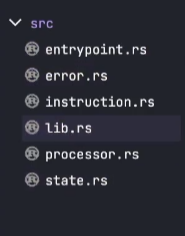

# 🛠️ 构建NFT质押程序

今天，我们将编写质押程序，并实现所有必要的质押功能，暂时不涉及任何代币转账。我将陪伴你，一步一步讲解整个过程，解释每个环节，以便你了解正在进行的操作。首先，让我们进入[`Solana Playground`](https://beta.solpg.io/?utm_source=buildspace.so&utm_medium=buildspace_project)，点击`create a new project`，并创建一个名为`src`的新文件夹，其中包括一个名为`lib.rs`的文件。

这就是你的集成开发环境应该呈现的样子。

目前，主要目标是编写一个程序，跟踪每个用户的质押状态。下面是一些基本步骤：


准备就绪后，我们将继续创建剩余的文件，就像我们在之前的课程中所做的那样。让我们继续在你的`src`文件夹中创建以下5个文件：`entrypoint.rs`，`error.rs`，`instruction.rs`，`processor.rs`和`state.rs`。

现在，文件结构应该如下所示：



我们已经准备好了！现在让我们用以下代码填充我们的`lib.rs`文件：

```rust
// Lib.rs
pub mod entrypoint;
pub mod error;
pub mod instruction;
pub mod processor;
pub mod state;
```

接着，进入`entrypoint.rs`并添加以下代码：

```rust
// Entrypoint.rs
use solana_program::{
    account_info::AccountInfo,
    entrypoint,
    entrypoint::ProgramResult,
    pubkey::Pubkey
};
use crate::processor;

// This macro will help process all incoming instructions
entrypoint!(process_instruction);

pub fn process_instruction(
    program_id: &Pubkey,
    accounts: &[AccountInfo],
    instruction_data: &[u8]
) -> ProgramResult {
    processor::process_instruction(program_id, accounts, instruction_data)?;
    Ok(())
}
```

当你运行代码时，会注意到一个错误，因为我们还没有在`processor.rs`中定义`process_instruction`函数。现在让我们创建这个函数。转到`processor.rs`并添加以下代码：

```rust
// Processor.rs
use solana_program::{
    account_info::AccountInfo,
    entrypoint::ProgramResult,
    pubkey::Pubkey
};

pub fn process_instruction(
    program_id: &Pubkey,
    accounts: &[AccountInfo],
    instruction_data: &[u8]
) -> ProgramResult {
    Ok(())
}
```

修复了`processor.rs`的错误后，你可能会注意到编译代码时仍有一些错误。这是因为在你的`lib.rs`中，我们导入了一些空模块。不过别担心，我们会在下一节中修复它们 😊 在开始处理`process_instruction`中的任何内容之前，我们需要在`instruction.rs`中编写我们的指令，所以让我们开始定义我们的指令。

继续创建一个名为`StakeInstruction`的枚举，并向其中添加四个指令。基本上，这是定义我们的指令应执行什么操作的地方。将下面的代码复制粘贴到你的`instruction.rs`中：

```rust
// Instruction.rs
use solana_program::{ program_error::ProgramError };

pub enum StakeInstruction {
    InitializeStakeAccount,
    Stake,
    Redeem,
    Unstake
}

impl StakeInstruction {
    pub fn unpack(input: &[u8]) -> Result<Self, ProgramError> {
        let (&variant, _rest) = input.split_first().ok_or(ProgramError::InvalidInstructionData)?;
        Ok(match variant {
            0 => Self::InitializeStakeAccount,
            1 => Self::Stake,
            2 => Self::Redeem,
            3 => Self::Unstake,
            _ => return Err(ProgramError::InvalidInstructionData)
        })
    }
}
```

现在让我们深入了解一下我们在这里做的事情。在`instruction.rs`中，我们创建了一个枚举，用来表示每个离散的指令，并创建了一个解包函数来反序列化数据，这里的数据是一个整数。

让我们返回到 `processor.rs` 文件并定义我们的 `process_instruction` 函数：

```rust
// processor.rs
use solana_program::{
    account_info::{AccountInfo, next_account_info},
    entrypoint::ProgramResult,
    pubkey::Pubkey,
};
use crate::instruction::StakeInstruction;

pub fn process_instruction(
    program_id: &Pubkey,
    accounts: &[AccountInfo],
    instruction_data: &[u8]
) -> ProgramResult {
    let instruction = StakeInstruction::unpack(instruction_data)?;

    match instruction {
        StakeInstruction::InitializeStakeAccount => process_initialize_stake_account(program_id, accounts),
        StakeInstruction::Stake => process_stake(program_id, accounts),
        StakeInstruction::Redeem => process_redeem(program_id, accounts),
        StakeInstruction::Unstake => process_unstake(program_id, accounts),
    }
}

/**
此函数的作用是创建一个属于您和您的NFT的独特PDA账户。
这将存储有关程序状态的信息，从而决定它是否已质押。
**/
fn process_initialize_stake_account(
    program_id: &Pubkey,
    accounts: &[AccountInfo]
) -> ProgramResult {
    let account_info_iter = &mut accounts.iter();
    let user = next_account_info(account_info_iter)?;
    let nft_token = next_account_info(account_info_iter)?;
    let stake_state = next_account_info(account_info_iter)?;
    let system_program = next_account_info(account_info_iter)?;

    Ok(())
}

fn process_stake(
    program_id: &Pubkey,
    accounts: &[AccountInfo]
) -> ProgramResult {
    Ok(())
}

fn process_redeem(
    program_id: &Pubkey,
    accounts: &[AccountInfo]
) -> ProgramResult {
    Ok(())
}

fn process_unstake(
    program_id: &Pubkey,
    accounts: &[AccountInfo]
) -> ProgramResult {
    Ok(())
}
```

请注意，我们在 `process_initialize_stake_account` 函数中定义了一些变量，但它们在任何地方都没有被使用。这是因为我们需要一个结构体来表示程序的当前状态。因此，让我们转到 `state.rs` 文件并定义我们的结构体。

```rust
// state.rs
use borsh::{BorshSerialize, BorshDeserialize};
use solana_program::{
    program_pack::{IsInitialized, Sealed},
    pubkey::Pubkey,
    clock::UnixTimestamp,
};

#[derive(BorshSerialize, BorshDeserialize, Debug)]
pub struct UserStakeInfo {
    pub is_initialized: bool,
    pub token_account: Pubkey,
    pub stake_start_time: UnixTimestamp,
    pub last_stake_redeem: UnixTimestamp,
    pub user_pubkey: Pubkey,
    pub stake_state: StakeState,
}

impl Sealed for UserStakeInfo {}
impl IsInitialized for UserStakeInfo {
    fn is_initialized(&self) -> bool {
        self.is_initialized
    }
}

#[derive(BorshSerialize, BorshDeserialize, Debug, PartialEq)]
pub enum StakeState {
    Staked,
    Unstaked,
}
```

## 🚫 自定义错误

现在我们来到 `error.rs` 文件，为我们的程序定义一些自定义的错误。

```rust
// error.rs
use solana_program::{program_error::ProgramError};
use thiserror::Error;

#[derive(Debug, Error)]
pub enum StakeError {
    #[error("账户尚未初始化")]
    UninitializedAccount,

    #[error("派生的PDA与传入的PDA不符")]
    InvalidPda,

    #[error("无效的代币账户")]
    InvalidTokenAccount,

    #[error("无效的质押账户")]
    InvalidStakeAccount,
}

impl From<StakeError> for ProgramError {
    fn from(e: StakeError) -> Self {
        ProgramError::Custom(e as u32)
    }
}
```

太棒了，现在您已经在 `error.rs` 文件中创建了自定义错误的枚举。当您运行程序时，不应再出现任何错误。

## 🫙 完善代码

现在，让我们返回到 `processor.rs` 文件，并完成 `process_initialize_stake_account` 函数。

```rust
// processor.rs
use solana_program::{
    account_info::{ AccountInfo, next_account_info },
    entrypoint::ProgramResult,
    pubkey::Pubkey,
    msg,
    sysvar::{ rent::Rent, Sysvar },
    clock::Clock,
    program_pack::IsInitialized,
    system_instruction,
    program::invoke_signed,
    borsh::try_from_slice_unchecked,
    program_error::ProgramError
};
use borsh::BorshSerialize;
use crate::instruction::StakeInstruction;
use crate::error::StakeError;
use crate::state::{ UserStakeInfo, StakeState };

fn process_initialize_stake_account(
    program_id: &Pubkey,
    accounts: &[AccountInfo]
) -> ProgramResult {
    let account_info_iter = &mut accounts.iter();
    let user = next_account_info(account_info_iter)?;
    let nft_token_account = next_account_info(account_info_iter)?;
    let stake_state = next_account_info(account_info_iter)?;
    let system_program = next_account_info(account_info_iter)?;

    let (stake_state_pda, bump_seed) = Pubkey::find_program_address(
        &[user.key.as_ref(), nft_token_account.key.as_ref()],
        program_id
    );

    // Check to ensure that you're using the right PDA
    if stake_state_pda != *stake_state.key {
        msg!("Invalid seeds for PDA");
        return Err(StakeError::InvalidPda.into());
    }

    let rent = Rent::get()?;
    let rent_lamports = rent.minimum_balance(UserStakeInfo::SIZE);

    msg!("Creating state account at {:?}", stake_state_pda);
    invoke_signed(
        &system_instruction::create_account(
            user.key,
            stake_state.key,
            rent_lamports,
            UserStakeInfo::SIZE.try_into().unwrap(),
            program_id
        ),
        &[user.clone(), stake_state.clone(), system_program.clone()],
        &[&[
            user.key.as_ref(),
            nft_token_account.key.as_ref(),
            &[bump_seed],
        ]],
    )?;

    // Let's create account
    let mut account_data = try_from_slice_unchecked::<UserStakeInfo>(&stake_state.data.borrow()).unwrap();

    if account_data.is_initialized() {
        msg!("Account already initialized");
        return Err(ProgramError::AccountAlreadyInitialized);
    }

    account_data.token_account = *nft_token_account.key;
    account_data.user_pubkey = *user.key;
    account_data.stake_state = StakeState::Unstaked;
    account_data.is_initialized = true;

    account_data.serialize(&mut &mut stake_state.data.borrow_mut()[..])?;

    Ok(())
}
```

让我们转到 `state.rs` 文件，并存储用户的质押信息，使用适当的数据大小。您可以将此代码段放在 `impl Sealed` 之上。

```rust
// state.rs

impl UserStakeInfo {
    /**
        这里是我们如何确定数据大小的方法。在您的UserStakeInfo结构体中，我们有以下数据：

        pub is_initialized: bool,                 // 1字节
        pub token_account: Pubkey,                // 32字节
        pub stake_start_time: UnixTimestamp,      // 64字节
        pub last_stake_redeem: UnixTimestamp,     // 64字节
        pub user_pubkey: Pubkey,                  // 32字节
        pub stake_state: StakeState,              // 1字节
    **/
    pub const SIZE: usize = 1 + 32 + 64 + 64 + 32 + 1;
}
```

现在我们刚刚为 `process_initialize_stake_account` 写了许多代码。如果您还不明白，请不要担心。我们将继续添加更多的代码来实现其他功能。现在让我们进入 `process_stake` 函数并使用这段代码。请记住，这只是代码的一部分，不要盲目地复制粘贴。

```rust
// processor.rs

fn process_stake(
    program_id: &Pubkey,
    accounts: &[AccountInfo]
) -> ProgramResult {
    let account_info_iter = &mut accounts.iter();
    let user = next_account_info(account_info_iter)?;
    let nft_token_account = next_account_info(account_info_iter)?;
    let stake_state = next_account_info(account_info_iter)?;

    let (stake_state_pda, _bump_seed) = Pubkey::find_program_address(
        &[user.key.as_ref(), nft_token_account.key.as_ref()],
        program_id,
    );

    if stake_state_pda != *stake_state.key {
        msg!("PDA种子无效");
        return Err(StakeError::InvalidPda.into());
    }

     // 创建账户
    let mut account_data = try_from_slice_unchecked::<UserStakeInfo>(&stake_state.data.borrow()).unwrap();

    if !account_data.is_initialized() {
        msg!("账户尚未初始化");
        return Err(ProgramError::UninitializedAccount.into());
    }

    let clock = Clock::get()?;

    account_data.token_account = *nft_token_account.key;
    account_data.user_pubkey = *user.key;
    account_data.stake_state = StakeState::Staked;
    account_data.stake_start_time = clock.unix_timestamp;
    account_data.last_stake_redeem = clock.unix_timestamp;
    account_data.is_initialized = true;

    account_data.serialize(&mut &mut stake_state.data.borrow_mut()[..])?;

    Ok(())
}
```

就是这样！我们现在已经完成了 `process_stake` 函数。接下来，我们将继续 `process_redeem` 函数。该部分的代码将与前两个函数非常相似。


```rust
// process.rs

fn process_redeem(
    program_id: &Pubkey,
    accounts: &[AccountInfo]
) -> ProgramResult {
    let account_info_iter = &mut accounts.iter();
    let user = next_account_info(account_info_iter)?;
    let nft_token_account = next_account_info(account_info_iter)?;
    let stake_state = next_account_info(account_info_iter)?;

    let (stake_state_pda, _bump_seed) = Pubkey::find_program_address(
        &[user.key.as_ref(), nft_token_account.key.as_ref()],
        program_id,
    );

    if stake_state_pda != *stake_state.key {
        msg!("Invalid seeds for PDA");
        return Err(StakeError::InvalidPda.into());
    }

    // For verification, we need to make sure it's the right signer
    if !user.is_signer {
        msg!("Missing required signature");
        return Err(ProgramError::MissingRequiredSignature);
    }

     // Let's create account
    let mut account_data = try_from_slice_unchecked::<UserStakeInfo>(&stake_state.data.borrow()).unwrap();

    if !account_data.is_initialized() {
        msg!("Account not initialized");
        return Err(ProgramError::UninitializedAccount.into());
    }

    if account_data.stake_state != StakeState::Staked {
        msg!("Stake account is not staking anything");
        return Err(ProgramError::InvalidArgument);
    }

    if *user.key != account_data.user_pubkey {
        msg!("Incorrect stake account for user");
        return Err(StakeError::InvalidStakeAccount.into());
    }

    if *nft_token_account.key != account_data.token_account {
        msg!("NFT Token account do not match");
        return Err(StakeError::InvalidTokenAccount.into());
    }

    let clock = Clock::get()?;
    let unix_time = clock.unix_timestamp - account_data.last_stake_redeem;
    let redeem_amount = unix_time;
    msg!("Redeeming {} tokens", redeem_amount);

    account_data.last_stake_redeem = clock.unix_timestamp;
    account_data.serialize(&mut &mut stake_state.data.borrow_mut()[..])?;

    Ok(())
}
```

太棒了！我们现在就快到了。接下来进入最后一个功能 `process_unstake` 。

```rust
// process.rs

fn process_unstake(
    program_id: &Pubkey,
    accounts: &[AccountInfo]
) -> ProgramResult {
    let account_info_iter = &mut accounts.iter();
    let user = next_account_info(account_info_iter)?;
    let nft_token_account = next_account_info(account_info_iter)?;
    let stake_state = next_account_info(account_info_iter)?;

    let (stake_state_pda, _bump_seed) = Pubkey::find_program_address(
        &[user.key.as_ref(), nft_token_account.key.as_ref()],
        program_id,
    );

    if stake_state_pda != *stake_state.key {
        msg!("Invalid seeds for PDA");
        return Err(StakeError::InvalidPda.into());
    }

    // For verification, we need to make sure it's the right signer
    if !user.is_signer {
        msg!("Missing required signature");
        return Err(ProgramError::MissingRequiredSignature);
    }

     // Let's create account
    let mut account_data = try_from_slice_unchecked::<UserStakeInfo>(&stake_state.data.borrow()).unwrap();

    if !account_data.is_initialized() {
        msg!("Account not initialized");
        return Err(ProgramError::UninitializedAccount.into());
    }

    if account_data.stake_state != StakeState::Staked {
        msg!("Stake account is not staking anything");
        return Err(ProgramError::InvalidArgument)
    }

    let clock = Clock::get()?;
    let unix_time = clock.unix_timestamp - account_data.last_stake_redeem;
    let redeem_amount = unix_time;
    msg!("Redeeming {} tokens", redeem_amount);

    msg!("Setting stake state to unstaked");
    account_data.stake_state = StakeState::Unstaked;
    account_data.serialize(&mut &mut stake_state.data.borrow_mut()[..]);

    Ok(())
}
```

`LFG（Let's Go）`!!! 我们终于完成了所有的函数定义。现在如果你运行程序，它应该会显示“构建成功”。太棒了！我们已经完成了第三周的任务，已经过半了！加油，继续保持这样的势头，我们一起朝着最终目标前进！如果你有任何问题或需要进一步的帮助，请随时联系我。
