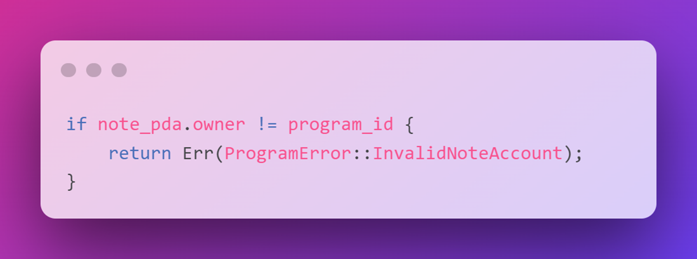
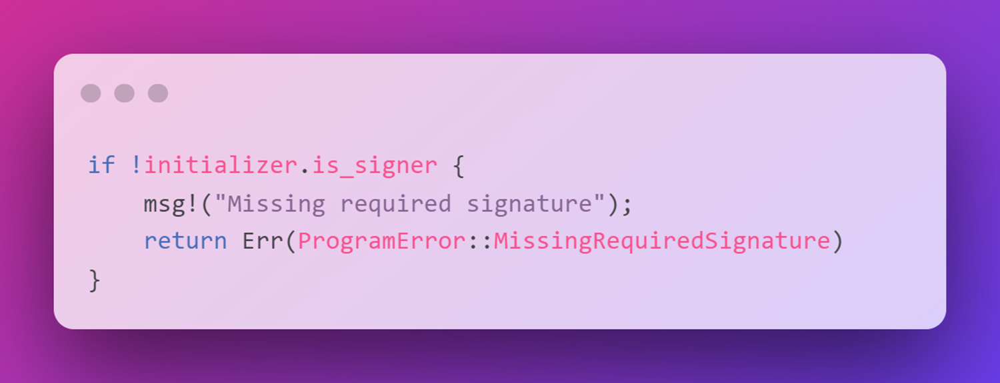

# ❗ 错误处理和数据验证

嘿！准备好成为一位州长了吗？不不，我们不是在做那种国家管理。我们所说的州是指我们程序中存储在链上的数据。如果你要建立，就必须准备好进行防御。在这节课中，我们将介绍一些需要注意的基本陷阱。这远非是程序安全的全面概述，但它将帮助你像攻击者一样思考，并提出重要的问题：我该如何破解这个？

## 😡 自定义错误

Rust拥有一个非常强大的错误处理系统。你已经遇到了一些规则和编译器如何强制你处理异常情况的情况。

这是我们为我们的笔记程序创建自定义错误的方法：


```rust
use solana_program::{program_error::ProgramError};
use thiserror::Error;

#[derive(Error)]
pub enum NoteError {
  #[error("Wrong note owner")]
  Forbidden,

  #[error("Text is too long")]
  InvalidLength
}
```

derive宏属性接受错误特质并将其应用于`NoteError`枚举，为其提供默认实现以使其成为错误。

我们将为每种错误类型提供自己的`#[error("...")]`标记来提供错误信息。


**返回自定义错误**

程序返回的错误必须是类型 `ProgramError`
使用 `impl` 将我们的自定义错误和 `ProgramError` 类型转换


在Solana程序中，我们只能从 `solana_program crate`返回 `ProgramError` 类型的错误。我们可以实现 `From trait`将我们自定义的错误转换为 `ProgramError` 类型。

```rust
impl From<NoteError> for ProgramError {
    fn from(e: NoteError) -> Self {
        ProgramError::Custom(e as u32)
    }
}
```
然后当我们需要实际返回错误时，我们使用 `into()` 方法将错误转换为 `ProgramError` 的实例

```rust
if pda != *note_pda.key {
    return Err(NoteError::Forbidden.into());
}
```

## 🔓 基本安全

有几项基本的安全措施可以帮助你提高程序的安全性：

- 所有权检查 - 验证账户是否由该程序拥有
- 签名者检查 - 验证账户是否已签署交易
- 通用账户验证 - 验证账户是否为预期账户
- 数据验证 - 验证用户提供的输入

一般来说，你应该始终验证从用户那里收到的输入。当你处理用户提供的数据时，这尤为重要。记住 - 程序不会保存状态。它们不知道它们的所有者是谁，除非你告诉它们，它们也不会检查谁在调用它们。

### 所有权检查

所有权检查验证账户是否由预期的程序拥有。一定要确保只有你能够访问它。

用户有可能发送与账户数据结构匹配但由不同程序创建的数据。




```rust
if note_pda.owner != program_id {
    return Err(ProgramError::InvalidNoteAccount);
}
```

### 签署者检查


签名者检查只是验证一个账户是否签署了一笔交易




```rust
if !initializer.is_signer {
    msg!("Missing required signature");
    return Err(ProgramError::MissingRequiredSignature)
}
```

例如，我们希望在处理 `update` 指令之前验证笔记创建者是否已签署该交易。否则，任何人都可以通过将用户的公钥作为初始化器来更新另一个用户的笔记。

### 数据验证


在适当的情况下，你还应该验证客户提供的指令数据。


例如，你可能有一个游戏程序，用户可以将角色属性点分配给各个类别。

你可能希望验证现有的积分分配加上新的分配是否超过了最大值

```rust
if character.agility + new_agility > 100 {
    msg!("Attribute points cannot exceed 100");
    return Err(AttributeError::TooHigh.into())
}
```

或者，角色可能有一定数量的属性点可以分配，你希望确保他们不超过这个限额。

```rust
if attribute_allowance > new_agility {
    msg!("Trying to allocate more points than allowed");
    return Err(AttributeError::ExceedsAllowance.into())
}
```

### 整数溢出和下溢

Rust整数具有固定的大小，意味着它们只能支持特定范围的数字。如果进行算术运算得到的值超出了范围，那么结果将会被包裹回来。


如果你曾经听说过电子游戏《文明》中的核[甘地](https://en.wikipedia.org/wiki/Nuclear_Gandhi?utm_source=buildspace.so&utm_medium=buildspace_project)，这就是导致这一情况的原因。他本应是一个非常冷静和和平的领导者，具有非常低的攻击性指数。但开发人员没有验证该指数不会溢出，结果从0增加到255，他反而成为了一个具有最高攻击性的核战争领袖。糟糕。

为了避免整数溢出和下溢，可以选择以下方法之一：

- 确保逻辑上不会发生溢出或下溢的情况
- 使用已检查的数学符号 `checked_add` 而不是 `+`

```rust
let first_int: u8 = 5;
let second_int: u8 = 255;
let sum = first_int.checked_add(second_int);
```
想想那些连最基本的安全措施都没有采取的程序。想象一下那些漏洞赏金🥵🤑。
