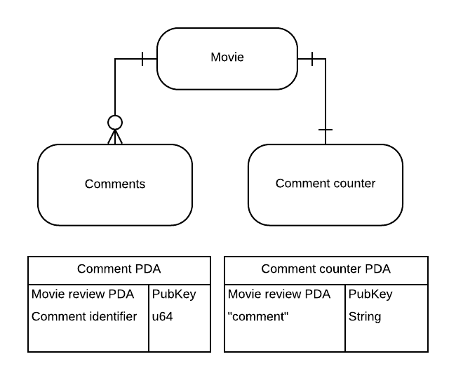

# 💬 链上评论功能的构建

现在是时候充分利用`PDA`的功能了。我们将给我们的旧电影评论程序添加评论支持功能。

首先，在本地环境中新建一个项目并设置好。

```bash
cargo new --lib movie-review-comments
cd movie-review-comments
```

然后，打开 `Cargo.toml` 文件，这样我们就可以添加所需的依赖项和进行其他配置了：

```toml
[package]
name = "movie-review-comments"
version = "0.1.0"
edition = "2021"

# 更多关键字和定义，请查看：https://doc.rust-lang.org/cargo/reference/manifest.html

[features]
no-entrypoint = []

[dependencies]
solana-program = "1.10.29"
borsh = "0.9.3"
thiserror = "1.0.31"

[lib]
crate-type = ["cdylib", "lib"]
```

:::caution
这里需要注意的是`solana-program`, `borsh`, `thiserror` 的版本可能会太低了，请使用`cargo add <crates-name>`安装。
:::

此外，你还需要将我们之前用过的[所有文件和代码搬过来](https://beta.solpg.io/6312eaf988a7fca897ad7d15?utm_source=buildspace.so&utm_medium=buildspace_project)。你可以找到我们上次离开时的电影评论程序，并将文件结构和内容复制到新的本地项目中。

完成这些操作后，可以通过构建程序来确认一切是否准备就绪：

```bash
cargo build-sbf
```

首次运行可能会花费几分钟。如果一切顺利，你应该会看到一个显示“完成”的绿色消息。

我们现在已经准备好开始组合构建项目了！

:::info
**开始前的提示**

请注意，这是一堂较为深入的课程。我们将编写大量代码，这可能会让你觉得有些压力重重。但当你编写实际的程序时，不必进行如此繁琐的工作，速度会快得多。下周我们将深入学习如何使用`Anchor`，这会让整个过程变得更简单。我们现在选择采用原生方式，以便深入了解这些概念并为你奠定坚实的基础。
:::


## 🤓 数据结构化

在存储数据时，决定如何摆放和连接物品是非常关键的。想象一下，我们需要为每个电影评论存储其下的评论。那么这在链上会是什么样子呢？当我们在客户端上阅读时，又该如何找到特定评论的评论呢？这就涉及到了数据映射。

在这里并没有一成不变的“规则”，你需要用上计算机工程师的智慧来弄明白该如何做，就像设计数据库模式一样。通常，我们期望的结构具备以下特性：

- 结构不要过于复杂
- 能让数据容易检索

具体的实现方式可能因情况而异，但有些常见的模式是你会经常看到的。一旦你明白了如何组织和连接存储数据的方法，你就能找出最适合你情况的最佳解决方案。

### 存储评论

我们首先需要决定评论将存储在何处。你可能还记得，在 `add_movie_review` 中，我们为每个电影评论创建了一个新的`PDA`。因此，我们是否可以简单地将一个大的评论数组添加到`PDA`中，然后就大功告成了呢？答案是否定的。由于账户的空间有限，所以我们很快就会用完空间。

那么让我们按照电影评论的方式来进行。我们将为每条评论创建一个新的`PDA`，这样我们就可以存储尽可能多的评论了！为了将评论与它们所属的评论连接起来，我们将使用电影评论的`PDA`地址作为评论账户的种子。

### 阅读评论

我们的结构将为每个电影评论提供理论上无限数量的评论。然而，对于每个电影评论，没有任何特性来区分评论之间的关系。我们该如何知道每个电影评论有多少条评论呢？

我们可以创建另一个账户来存储这个信息！并且，我们还可以使用一个编号系统来跟踪评论账户。

是否感到困惑？我当时确实觉得很复杂。以下是一个方便的图表，有助于你形象地理解这个结构：



对于每一篇电影评论，我们将拥有一个评论计数器`PDA`和许多评论`PDA`。我还列出了每个`PDA`的种子 - 这是我们获取账户的方式。

这样，如果我想要获取评论`#5`，就知道可以在从电影评论PDA和`5`派生的账户中找到它。

## 📦 构建基本组件

我们想要创建两个新账户来存储数据。下面是我们在程序中需要完成的所有步骤：

- 定义结构体，用于表示评论计数器和评论账户
- 更新现有的 `MovieAccountState`，增加一个鉴别器字段（稍后将详细解释）
- 添加一个指令变体，用来表示 `add_comment` 指令
- 更新现有的 `add_movie_review` 指令，包括创建评论计数器账户的部分
- 创建一个新的 `add_comment` 指令

首先，我们从为新账户创建结构体开始。我们需要定义每个账户中存储的数据。打开 `state.rs` 文件并将其更新为以下内容：

```rust
use borsh::{BorshSerialize, BorshDeserialize};
use solana_program::{
    // 引入 Pubkey
    pubkey::Pubkey,
    program_pack::{IsInitialized, Sealed},
};

#[derive(BorshSerialize, BorshDeserialize)]
pub struct MovieAccountState {
    // 新增了两个字段 - discriminator 和 reviewer
    pub discriminator: String,
    pub is_initialized: bool,
    pub reviewer: Pubkey,
    pub rating: u8,
    pub title: String,
    pub description: String,
}

// 新结构体，记录评论总数
#[derive(BorshSerialize, BorshDeserialize)]
pub struct MovieCommentCounter {
    pub discriminator: String,
    pub is_initialized: bool,
    pub counter: u64,
}

// 新结构体，存储单个评论
#[derive(BorshSerialize, BorshDeserialize)]
pub struct MovieComment {
    pub discriminator: String,
    pub is_initialized: bool,
    pub review: Pubkey,
    pub commenter: Pubkey,
    pub comment: String,
    pub count: u64,
}

impl Sealed for MovieAccountState {}

impl IsInitialized for MovieAccountState {
    fn is_initialized(&self) -> bool {
        self.is_initialized
    }
}
```

这些新结构体都需要可序列化，所以我们在这里使用了 `Borsh` 派生宏。我们还添加了一个 `is_initialized` 字段，用于确认该账户是否已准备好使用。

由于现在我们在程序中有多种类型的账户，所以我们需要一种方式来区分这些不同的账户。当我们在客户端上执行时，我们将获取我们电影评论程序的所有账户。这就是 `getProgramAccounts` 的作用。我们可以通过指定账户数据的前 `8` 个字节来过滤账户列表。

我们选择使用字符串作为鉴别器，因为我们可以事先确定鉴别器的内容，这样在过滤时我们就知道要在客户端上寻找什么。

最后，我们需要为这些新结构体实现 `IsInitialized` 接口。我只是从 `MovieAccountState` 中复制/粘贴了实现代码，并将其放在了一旁：

```rust
impl IsInitialized for MovieCommentCounter {
    fn is_initialized(&self) -> bool {
        self.is_initialized
    }
}

impl IsInitialized for MovieComment {
    fn is_initialized(&self) -> bool {
        self.is_initialized
    }
}
```

## 📏 定义账户大小

如果你查看位于 `processor.rs` 中的 `add_movie_review`，你会发现我们在创建账户时计算账户的大小。这样做并不是特别实用，因为这个计算是不可复用的。所以现在我们将针对这些账户进行实现，代码如下：

```rust
impl MovieAccountState {
    pub const DISCRIMINATOR: &'static str = "review";

    pub fn get_account_size(title: String, description: String) -> usize {
        // 4个字节存储后续动态数据（字符串）的大小
        (4 + MovieAccountState::DISCRIMINATOR.len())
            + 1 // 1个字节用于is_initialized（布尔值）
            + 32 // 32个字节用于电影评论账户密钥
            + 1 // 1个字节用于评分
            + (4 + title.len()) // 4个字节存储后续动态数据（字符串）的大小
            + (4 + description.len()) // 同上
    }
}

impl MovieComment {
    pub const DISCRIMINATOR: &'static str = "comment";

    pub fn get_account_size(comment: String) -> usize {
        (4 + MovieComment::DISCRIMINATOR.len())
        + 1  // 1个字节用于is_initialized（布尔值）
        + 32 // 32个字节用于电影评论账户密钥
        + 32 // 32个字节用于评论者密钥的大小
        + (4 + comment.len()) // 4个字节存储后续动态数据（字符串）的大小
        + 8 // 8个字节用于计数（u64）
    }
}

impl MovieCommentCounter {
    pub const DISCRIMINATOR: &'static str = "counter";
    pub const SIZE: usize = (4 + MovieCommentCounter::DISCRIMINATOR.len()) + 1 + 8;
}

impl Sealed for MovieCommentCounter{}
```

由于电影评论账户和电影评论都有动态内容，所以我们需要函数来获取它们的大小。代码注释解释了每个字节的用途。

`MovieCommentCounter` 的大小始终保持不变，因此我们可以声明一个常量代替函数。

在这里，我们也看到了我们的鉴别器！由于它不会改变，我们使用 `'static` 关键字来创建一个[静态常量](https://doc.rust-lang.org/rust-by-example/scope/lifetime/static_lifetime.html?utm_source=buildspace.so&utm_medium=buildspace_project)，在整个程序的运行期间保持不变。代码注释解释了每个字节的用途。

最后，由于我们正在进行实现，我还包括了 `MovieCommentCounter` 的 `Sealed` 实现。提醒一下，当结构体的大小已知时， `Sealed` 特性可以让编译器进行一些优化。由于 `MovieCommentCounter` 有已知的固定大小，所以我们需要实现它！

至此，你已完成了 `state.rs` 的整体结构，它的大纲应该如下图所示：


总的来说，对于每个账户状态，我们有：

- 一个用来表示账户数据的结构体
- 一个函数实现，用于告知我们账户是否已准备好
- 一个函数实现，用于计算每个账户内容的大小
- 一个静态常量，用于区分账户
- 如果账户大小不是动态的，则可以选择实现一个 `Sealed` 方案。


## 👨‍🏫 更新我们的指令

现在我们已经完成了所有状态的处理，可以开始更新我们的指令处理程序，并实现实际的评论逻辑。

首先从指令处理程序开始，我们需要更新指令枚举，以支持在 `instruction.rs` 中的评论功能：

```rust
pub enum MovieInstruction {
    AddMovieReview {
        title: String,
        rating: u8,
        description: String
    },
    UpdateMovieReview {
        title: String,
        rating: u8,
        description: String
    },
    AddComment {
        comment: String
    }
}
```

用于表示指令数据的结构体非常简洁：

```rust
#[derive(BorshDeserialize)]
struct CommentPayload {
    comment: String
}
```

此外，我们还需要稍微重构一下 `unpack` 函数的实现。由于以前的添加和更新指令的有效载荷是相同的，我们可以在匹配语句之前对其进行反序列化。但现在，我们引入了带有不同类型有效载荷的评论功能，所以我们将把反序列化操作移到匹配语句中。具体如下：

```rust
impl MovieInstruction {
    pub fn unpack(input: &[u8]) -> Result<Self, ProgramError> {
        let (&variant, rest) = input
            .split_first()
            .ok_or(ProgramError::InvalidInstructionData)?;

        Ok(match variant {
            0 => {
                let payload = MovieReviewPayload::try_from_slice(rest)
                    .map_err(|_| ProgramError::from(Error::ParseMovieReviewPayloadFailed))?;

                Self::AddMovieReview {
                    title: payload.title,
                    rating: payload.rating,
                    description: payload.description,
                }
            }
            1 => {
                let payload = MovieReviewPayload::try_from_slice(rest)
                    .map_err(|_| ProgramError::from(Error::ParseMovieReviewPayloadFailed))?;

                Self::UpdateMovieReview {
                    title: payload.title,
                    rating: payload.rating,
                    description: payload.description,
                }
            }
            2 => {
                // 评论载荷使用自己的反序列化器，因为数据类型不同
                let payload = CommentPayload::try_from_slice(rest)
                    .map_err(|_| ProgramError::from(Error::ParseMovieCommentPayloadFailed))?;

                Self::AddComment {
                    comment: payload.comment,
                }
            }
            _ => return Err(ProgramError::InvalidInstructionData),
        })
    }
}
```

现在你应该对这部分内容感到非常熟悉了 :)

最后一部分是更新 `process_instruction` 中的 `match` 语句：

```rust
pub fn process_instruction(
    program_id: &Pubkey,
    accounts: &[AccountInfo],
    instruction_data: &[u8]
) -> ProgramResult {
    let instruction = MovieInstruction::unpack(instruction_data)?;
    match instruction {
        MovieInstruction::AddMovieReview { title, rating, description } => {
            add_movie_review(program_id, accounts, title, rating, description)
        },

        MovieInstruction::UpdateMovieReview { title, rating, description } => {
            update_movie_review(program_id, accounts, title, rating, description)
        },

        MovieInstruction::AddComment { comment } => {
            add_comment(program_id, accounts, comment)
        }
    }
}
```

总结一下，我们所做的工作是：

- 更新指令枚举以包括新的评论指令
- 添加指令有效载荷的结构体以便我们进行反序列化操作
- 更新了 `unpack` 函数，以涵盖新的指令类型
- 更新了 `match` 语句，以便在 `process_instruction` 函数中处理新的指令

你可能会在这里遇到一个错误，因为 `add_comment` 还不存在，你可以暂时添加一个空函数来解决这个问题：

```rust
pub fn add_comment(
  program_id: &Pubkey,
  accounts: &[AccountInfo],
  comment: String
) -> ProgramResult {
    Ok(())
}
```

## 🎬 为创建评论计数器账户更新 add_movie_review

由于每个电影评论都需要一个计数器账户，因此我们需要在 `add_movie_review` 函数中增加逻辑来创建该计数器账户。

首先，在 `processor.rs` 文件的 `add_movie_review` 函数中，我们要新增一个 `pda_counter`，代表将要初始化的新评论计数器账户和电影评论账户。

```rust
let account_info_iter = &mut accounts.iter();

let initializer = next_account_info(account_info_iter)?;
let pda_account = next_account_info(account_info_iter)?;
let system_program = next_account_info(account_info_iter)?;
// 用于存储评论计数的新账户
let pda_counter = next_account_info(account_info_iter)?;
```

在创建`PDA`时验证它是个好习惯，这样就能确保你永远不会忘记。请在 `pda_account` 验证后添加以下内容：

```rust
let (counter_pda, counter_bump_seed) = Pubkey::find_program_address(
  &[pda.as_ref(), "comment".as_ref()],
  program_id
)

if counter_pda != *pda_counter.key {
    msg!("计数器PDA的种子无效");
    return Err(ProgramError::InvalidArgument)
}
```

还记得我们将账户大小移至 `state.rs` 吗？好，现在我们需要用它来计算账户的大小。将以下内容替换到 `total_len` 调用处：

```rust
let account_len: usize = 1000;

if MovieAccountState::get_account_size(title.clone(), description.clone()) > account_len {
    msg!("数据长度大于1000字节");
    return Err(ReviewError::InvalidDataLength.into());
}
```

我们还增加了一个 `discriminator` 字段，所以我们需要更新 `account_data` 段的数据结构体：

```rust
account_data.discriminator = MovieAccountState::DISCRIMINATOR.to_string();
account_data.reviewer = *initializer.key;
account_data.title = title;
account_data.rating = rating;
account_data.description = description;
account_data.is_initialized = true;
```

最后，在 `add_movie_review` 函数中增加逻辑来初始化评论计数器账户：

```rust
msg!("创建评论计数器");
let rent = Rent::get()?;
let counter_rent_lamports = rent.minimum_balance(MovieCommentCounter::SIZE);

// 推导地址并验证传入的PDA种子是否正确
let (counter, counter_bump) =
    Pubkey::find_program_address(&[pda.as_ref(), "comment".as_ref()], program_id);
if counter != *pda_counter.key {
    msg!("PDA的种子无效");
    return Err(ProgramError::InvalidArgument);
}

// 创建评论计数器账户
invoke_signed(
    &system_instruction::create_account(
        initializer.key, // 租金支付者
        pda_counter.key, // 要创建账户的地址
        counter_rent_lamports, // 存入账户的租金数量
        MovieCommentCounter::SIZE.try_into().unwrap(), // 账户的大小
        program_id,
    ),
    &[
        // 将要读/写的账户列表
        initializer.clone(),
        pda_counter.clone(),
        system_program.clone(),
    ],
    // PDA的种子
    // PDA账户
    // 字符串"comment"
    &[&[pda.as_ref(), "comment".as_ref(), &[counter_bump]]],
)?;
msg!("评论计数器已创建");

// 反序列化新创建的计数器账户
let mut counter_data =
    try_from_slice_unchecked::<MovieCommentCounter>(&pda_counter.data.borrow()).unwrap();

msg!("检查计数器账户是否已初始化");
if counter_data.is_initialized() {
    msg!("账户已初始化");
    return Err(ProgramError::AccountAlreadyInitialized);
}

counter_data.discriminator = MovieCommentCounter::DISCRIMINATOR.to_string();
counter_data.counter = 0;
counter_data.is_initialized = true;
msg!("评论计数: {}", counter_data.counter);
counter_data.serialize(&mut &mut pda_counter.data.borrow_mut()[..])?;

msg!("评论计数器已初始化");
Ok(())
```

简要回顾一下这段复杂代码在做什么：

- 计算评论计数器账户所需的租金。
- 验证`PDA`的种子是否正确。
- 使用 `invoke_signed` 创建评论计数器账户。
- 从新创建的账户中反序列化数据。
- 检查账户是否已初始化。
- 设置数据并初始化账户。
- 序列化数据。

请仔细查看评论，每一行代码都有相应的解释。

现在，每当创建新的评论时，都会初始化两个账户：

- 第一个是存储评论内容的审核账户。这与我们开始的程序版本相同。
- 第二个账户是用于存储评论计数器的。

## 💬 添加评论支持

最后的一块拼图是在 `processor.rs` 文件底部实现 `add_comment` 函数。

这是我们在这个函数中需要执行的步骤：

- 遍历传入的程序账户。
- 计算新评论账户所需的租金免税金额。
- 使用评论地址和当前评论计数作为种子，推导评论账户的PDA。
- 调用系统程序创建新的评论账户。
- 为新创建的账户设置适当的值。
- 将账户数据序列化并从函数中返回。

```rust
pub fn add_comment(
    program_id: &Pubkey,
    accounts: &[AccountInfo],
    comment: String
) -> ProgramResult {
    msg!("正在添加评论...");
    msg!("评论内容：{}", comment);

    let account_info_iter = &mut accounts.iter();

    let commenter = next_account_info(account_info_iter)?;
    let pda_review = next_account_info(account_info_iter)?;
    let pda_counter = next_account_info(account_info_iter)?;
    let pda_comment = next_account_info(account_info_iter)?;
    let system_program = next_account_info(account_info_iter)?;

    let mut counter_data = try_from_slice_unchecked::<MovieCommentCounter>(&pda_counter.data.borrow()).unwrap();

      let account_len = MovieComment::get_account_size(comment.clone());

      let rent = Rent::get()?;
      let rent_lamports = rent.minimum_balance(account_len);

      let (pda, bump_seed) = Pubkey::find_program_address(&[pda_review.key.as_ref(), counter_data.counter.to_be_bytes().as_ref(),], program_id);
      if pda != *pda_comment.key {
          msg!("Invalid seeds for PDA");
          return Err(ReviewError::InvalidPDA.into())
      }

      invoke_signed(
          &system_instruction::create_account(
          commenter.key,
          pda_comment.key,
          rent_lamports,
          account_len.try_into().unwrap(),
          program_id,
          ),
          &[commenter.clone(), pda_comment.clone(), system_program.clone()],
          &[&[pda_review.key.as_ref(), counter_data.counter.to_be_bytes().as_ref(), &[bump_seed]]],
      )?;

      msg!("Created Comment Account");

      let mut comment_data = try_from_slice_unchecked::<MovieComment>(&pda_comment.data.borrow()).unwrap();

      msg!("checking if comment account is already initialized");
      if comment_data.is_initialized() {
          msg!("Account already initialized");
          return Err(ProgramError::AccountAlreadyInitialized);
      }

      comment_data.discriminator = MovieComment::DISCRIMINATOR.to_string();
      comment_data.review = *pda_review.key;
      comment_data.commenter = *commenter.key;
      comment_data.comment = comment;
      comment_data.is_initialized = true;
      comment_data.serialize(&mut &mut pda_comment.data.borrow_mut()[..])?;

      msg!("Comment Count: {}", counter_data.counter);
      counter_data.counter += 1;
      counter_data.serialize(&mut &mut pda_counter.data.borrow_mut()[..])?;

    Ok(())
}
```

这段代码大量重复了我们之前所了解的操作，所以我不再赘述。

我们经历了许多改变。[点击这里](https://beta.solpg.io/6313104b88a7fca897ad7d19?utm_source=buildspace.so&utm_medium=buildspace_project)查看最终版本，以便你可以比较并检查是否有问题。

## 🚀 部署程序

我们准备好部署了！

本地部署与在游乐场上点击部署按钮的操作略有不同。

首先，你需要构建程序：

```bash
cargo build-sbf
```

接下来，我们可以部署。请确保替换 `<PATH>` 为你的路径：

```bash
solana program deploy <PATH>
```

测试非常简单，只需设置以下前端：

```bash
git clone https://github.com/buildspace/solana-movie-frontend/
cd solana-movie-frontend
git checkout solution-add-comments
```

在你可以发表一些高质量的电影评论之前，你需要：

- 在 `utils/constants.ts` 文件中更新程序地址。
- 将端点设置在 `WalletContextProvider.tsx` 为 `http://127.0.0.1:8899`。
- 将`Phantom`网络更改为`localhost`。
- 使用 `solana airdrop 2 PHANTOM_WALLET_ADDRESS` 获取本地主机`SOL`。

你会看到在 `localhost:3000` 上，通过运行 `npm run dev`，评论的魔法就开始了！

:::info
热门提示 - 本地程序日志
遇到错误吗？有什么异常吗？你可以在本地主机上查看程序日志：

```bash
solana logs PROGRAM_ID
```
:::

## 🚢 挑战

现在轮到你独立地构建一些东西了，你可以在之前课程中使用过的学生介绍程序的基础上进行扩展。

利用你在本课程中学到的知识，尝试将所学应用到学生介绍计划中。你的扩展应该让其他用户能够对介绍进行回复。

要进行测试，你需要获取此前端的 `solution-paging-account-data` 分支，并添加一个用于显示和提交评论的组件，或者你可以编写一个向程序发送交易的脚本。

### 起始代码:

如果你没有保存之前的`starter`代码，可以随意使用[此存储库](https://github.com/buildspace/solana-student-intro-program)的 `starter` 分支。

### 解决方案代码

尽量自己完成这个任务！但如果遇到困难，可以参考 `solution-add-replies` 分支。
