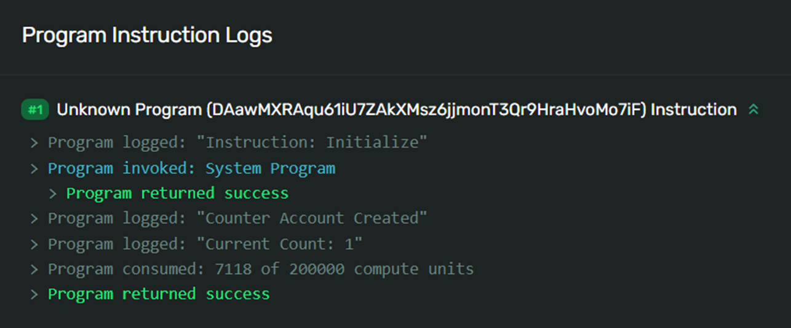

# 🧪 测试 Solana 程序

上节课的内容为准备 `Mint` 账户奠定了基础。预备阶段已完结，现在是真正行动的时候了。通过强大的测试流程，我们可以在问题真正显现之前捕捉开发人员引入的错误，从而最大限度地减少生产环境中的 `bug` 数量。

本课程将涉及两种类型的测试：单元测试和集成测试。

- 单元测试更小、更专注，一次只测试一个隔离的模块，并能测试私有接口。
- 集成测试与你的库完全外部无关，使用你的代码的方式与使用其他外部代码相同，仅使用公共接口，并可能在每个测试中涉及多个模块。

## 🔢 单元测试

单元测试的目的是隔离其他代码，测试每个代码单元的工作情况，以快速确认代码是否按预期执行。

在 `Rust` 中，单元测试通常与它们所测试的代码放置在同一文件中，并在名为 `tests` 的模块内声明，该模块带有 `cfg(test)` 的注解。

- 通过 `#[test]` 属性在 `tests` 模块中定义测试。
- `cfg` 属性代表配置，指示 Rust 只有在特定配置下才包含随后的代码。
- `#[cfg(test)]` 注解告诉 `Cargo` 只有在运行 `cargo test-sbf` 时才编译测试代码。
- 运行 `cargo test-sbf` 时，该模块中标记为测试的每个函数都会执行。

你还可以在模块中创建非测试的辅助函数，例如：

```rust
// 示例测试模块，包含一个单元测试
#[cfg(test)]
mod tests {
    #[test]
    fn it_works() {
        let result = 2 + 2;
        assert_eq!(result, 4);
    }

    fn helper_function() {
        doSomething()
    }
}
```

## ❓ 如何构建单元测试

使用 [`solana_sdk`](https://docs.rs/solana-sdk/latest/solana_sdk/) 来创建 Solana 程序的单元测试。这个 `crate` 在 `Rust` 中与 `Typescript` 的 `@solana/web3.js` 包相对应。

[`solana_program_test`](https://docs.rs/solana-program-test/latest/solana_program_test/#) 也用于测试 `Solana` 程序，并包含一个基于 `BanksClient` 的测试框架。

在下面的代码片段中，我们为我们的 `program_id` 创建了一个公钥，然后初始化了一个 `ProgramTest` 对象。

从 `banks_client` 返回的 `ProgramTest` 将作为我们进入测试环境的接口。

其中，`payer` 变量是使用 `SOL` 生成的新密钥对，将用于签名和支付交易。

接着，我们创建一个第二个 `Keypair`，并使用合适的参数构建我们的 `Transaction`。

最后，我们使用 `ProgramTest::new` 调用时返回的 `banks_client` 来处理此交易，并检查返回值是否等于 `Ok(_)`。

该函数使用 `#[tokio::test]` 属性进行注解。

`Tokio` 是一个用于编写异步代码的 `Rust crate`，该属性仅将我们的测试函数标记为 `async`。

```rust
// 位于 processor.rs 内部的测试模块
#[cfg(test)]
mod tests {
     use {
         super::*,
         assert_matches::*,
         solana_program::instruction::{AccountMeta, Instruction},
         solana_program_test::*,
         solana_sdk::{signature::Signer, transaction::Transaction, signer::keypair::Keypair},
     };

     #[tokio::test]
     async fn it_works() {
         let program_id = Pubkey::new_unique();

         let (mut banks_client, payer, recent_blockhash) = ProgramTest::new(
             "program_name",
             program_id,
             processor!(process_instruction),
         )
         .start()
         .await;

         let test_acct = Keypair::new();

         let mut transaction = Transaction::new_with_payer(
             &[Instruction {
                 program_id,
                 accounts: vec![
                     AccountMeta::new(payer.pubkey(), true),
                     AccountMeta::new(test_acct.pubkey(), true)
                 ],
                 data: vec![1, 2, 3],
             }],
             Some(&payer.pubkey()),
         );
         transaction.sign(&[&payer, &test_acct], recent_blockhash);

         assert_matches!(banks_client.process_transaction(transaction).await, Ok(_));
     }
}
```

## 集成测试

集成测试旨在完全与其测试的代码分离，以验证不同代码部分是否能够协同工作。

这些测试通过公共接口与你的代码进行交互，确保其他人能够按预期的方式访问它。虽然在单独运行时正常工作的代码单元可能在集成时出现问题，因此对集成代码的测试覆盖范围同样重要。

### ❓ 如何构建集成测试

1. **创建集成测试目录**: 在项目目录的顶层创建一个 `tests` 目录，在这个目录下创建任意数量的测试文件，每个文件都作为独立的集成测试。

2. **独立测试**: `tests` 目录中的每个文件都是一个独立的`crate`，因此我们需要将我们想要测试的代码库引入每个文件的作用域。

3. **编写集成测试**: 集成测试示例如下：
    ```rust
    // Example of integration test inside /tests/integration_test.rs file
    use example_lib;

    #[test]
    fn it_adds_two() {
        assert_eq!(4, example_lib::add_two(2));
    }
    ```

4. **运行集成测试**: 运行 `cargo test-bpf` 命令即可执行编写的测试。

5. **输出包括三个部分**: 单元测试、集成测试和文档测试。

## 🔌 使用Typescript进行集成测试

除了`Rust`集成测试外，还可以通过将程序部署到`Devnet`或本地验证器，并从你创建的客户端向其发送交易来进行测试。

### 使用Typescript编写客户端测试脚本的步骤:

1. **安装测试框架**: 使用 `npm install mocha chai` 安装 `Mocha` 和 `Chai`。

2. **更新`package.json`文件**: 这会告诉编译器在运行命令 `npm run test` 时执行 `/test` 目录中的`TypeScript`文件或文件。

3. **编写测试代码**: 使用“`describe`”关键字声明，并用`it`指定每个测试。

    ```typescript
    describe("begin tests", async () => {
        // First Mocha test
        it('first test', async () => {
            // Initialization code here to send the transaction
            ...
            // Fetch account info and deserialize
            const acct_info = await connection.getAccountInfo(pda)
            const acct = acct_struct.decode(acct_info.data)

            // Compare the value in the account to what you expect it to be
            chai.expect(acct.num).to.equal(1)
        }
    })
    ```

4. **运行测试**: 执行 `npm run test` 将执行所有测试，并返回每个测试是否通过或失败的结果。

通过将测试集成到你的开发过程中，你可以确保代码质量和稳定性，同时减少未来可能出现的问题。在`Solana`开发中，这样的测试流程更是不可或缺的一环。

```bash
> scripts@1.0.0 test
> mocha -r ts-node/register ./test/*.ts

    ✔ first test (1308ms)
    ✔ second test

    2 passing (1s)
```


## ❌ 错误代码

程序错误通常显示为程序返回的错误枚举中错误的十进制索引的十六进制形式。

例如，当你在向`SPL`代币程序发送交易时遇到错误，错误代码 `0x01` 的十进制等价物就是`1`。

通过查看[Token程序](https://github.com/solana-labs/solana-program-library/blob/master/token/program/src/error.rs?utm_source=buildspace.so&utm_medium=buildspace_project)的源代码，我们能发现程序错误枚举中该索引位置的错误为 `InsufficientFunds`。

要翻译任何返回自定义程序错误代码的程序，你需要能访问其源代码。

## 📜 程序日志

`Solana`提供了非常简单的创建新自定义日志的方法，只需使用 `msg!()` 宏。



在`Rust`中编写单元测试时，请注意测试本身不能使用 `msg!()` 宏来记录信息。

你需要使用`Rust`的本地 `println!()` 宏。

程序代码中的该语句仍然有效，只是你不能在测试中使用它进行日志记录。

## 🧮 计算预算

开发区块链上的程序会遇到一些特殊限制，其中之一就是`Solana`上的计算预算。

计算预算的目的在于防止程序滥用资源。

当程序消耗完整个预算或超出限制时，运行时会终止程序并返回错误。

默认情况下，计算预算被设置为`200k`计算单元乘以指令数量，最多不超过`1.4M`计算单元。

基础费用为`5,000 Lamports`。一个微`Lamport`相当于`0.000001 Lamports`。

你可以使用 `ComputeBudgetProgram.setComputeUnitLimit({ units: number })` 来设置新的计算预算。

`ComputeBudgetProgram.setComputeUnitPrice({ microLamports: number })` 可以将交易费用提高到基本费用（`5,000 Lamports`）之上。

- 以微`Lamports`为单位的价值将乘以`CU`预算，从而确定`Lamports`中的优先费用。
- 例如，如果你的`CU`预算为`1M CU`，并且你每`CU`增加了`1`微`Lamport`，那么优先费用将为`1 Lamport（1M * 0.000001）`。
- 总费用将达到`5001 Lamports`。

要更改交易的计算预算，你必须将交易的前三条指令之一设置为预算设置指令。

```ts
const modifyComputeUnits = ComputeBudgetProgram.setComputeUnitLimit({
  units: 1000000
});

const addPriorityFee = ComputeBudgetProgram.setComputeUnitPrice({
  microLamports: 1
});

const transaction = new Transaction()
.add(modifyComputeUnits)
.add(addPriorityFee)
.add(
    SystemProgram.transfer({
      fromPubkey: payer.publicKey,
      toPubkey: toAccount,
      lamports: 10000000,
    })
  );
```

你还可以使用 `sol_log_compute_units()` 函数来打印当前指令中程序剩余的计算单元数量。

```rust
use solana_program::log::sol_log_compute_units;

pub fn process_instruction(
    program_id: &Pubkey,
    accounts: &[AccountInfo],
    instruction_data: &[u8],
) -> ProgramResult {

    sol_log_compute_units();

...
}
```

## 📦 堆栈大小

每个程序在执行过程中都可以访问`4KB`的堆栈帧大小。在`Rust`中，所有值默认都在栈上分配。

在像`Rust`这样的系统编程语言中，一个值是在栈上还是堆上分配的区别可能很重要，特别是在受限制的环境中，如区块链工作场景。

当你处理更大、更复杂的程序时，可能会开始遇到使用完整`4KB`内存的问题。

这通常称为"[堆栈溢出](https://en.wikipedia.org/wiki/Stack_overflow?utm_source=buildspace.so&utm_medium=buildspace_project)"或"栈溢出"。

程序可能会以两种方式达到堆栈限制：

- 一些依赖的包可能包含违反堆栈帧限制的功能；
- 或者程序本身在运行时达到堆栈限制。

以下是当堆栈违规由依赖包引起时，可能出现的错误消息示例。

```bash
Error: Function _ZN16curve25519_dalek7edwards21EdwardsBasepointTable6create17h178b3d2411f7f082E Stack offset of -30728 exceeded max offset of -4096 by 26632 bytes, please minimize large stack variables
```

如果一个程序在运行时达到了`4KB`的堆栈限制，它将停止运行并返回一个错误：`AccessViolation`

```bash
Program failed to complete: Access violation in stack frame 3 at address 0x200003f70 of size 8 by instruction #5128
```

为了解决这个问题，你可以重构代码以更节省内存，或者将一部分内存分配到堆上。

所有程序都可以访问一个`32KB`的运行时堆，这可以帮助你在堆栈上节省一些内存。

为了实现这一点，你需要使用[Box](https://doc.rust-lang.org/std/boxed/struct.Box.html?utm_source=buildspace.so&utm_medium=buildspace_project)结构体。

一个 `box` 是一个指向堆上类型为 `T` 的值的智能指针。

你可以使用解引用运算符来访问封装的值。

在下面的示例中，从`Pubkey::create_program_address`返回的值（一个公钥）将存储在堆上，而`authority_pubkey`变量则会持有指向堆上存储公钥位置的指针。

```rust
let authority_pubkey = Box::new(Pubkey::create_program_address(authority_signer_seeds, program_id)?);

if *authority_pubkey != *authority_info.key {
    msg!("Derived lending market authority {} does not match the lending market authority provided {}");
    return Err();
}
```

通过这样的调整，代码不仅可以避免堆栈溢出问题，还能使整体结构更加清晰合理。
