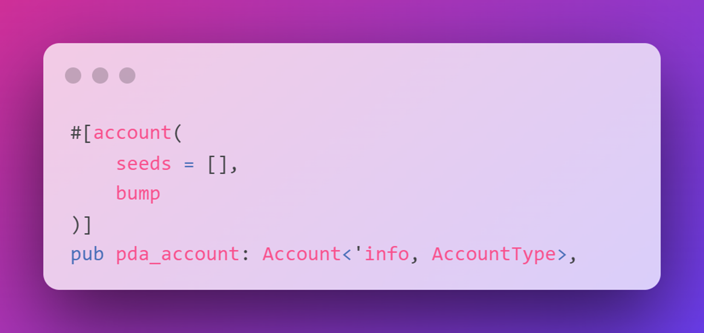
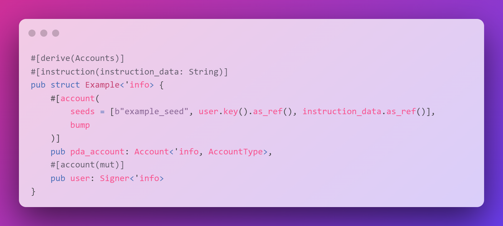
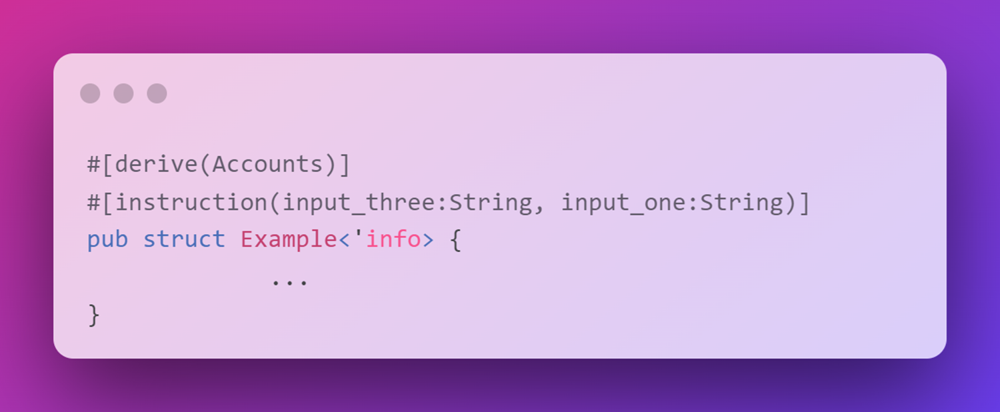
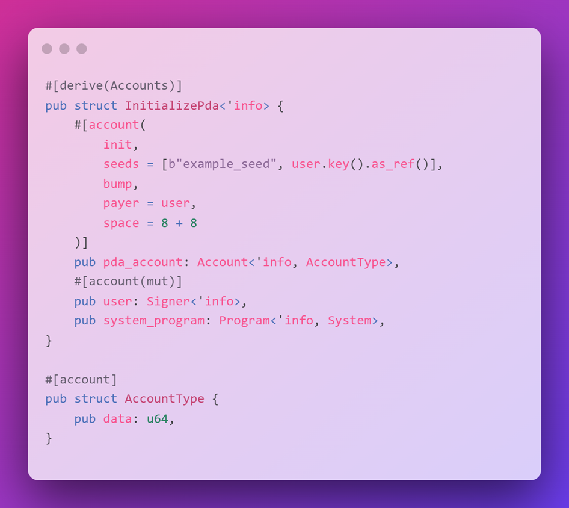
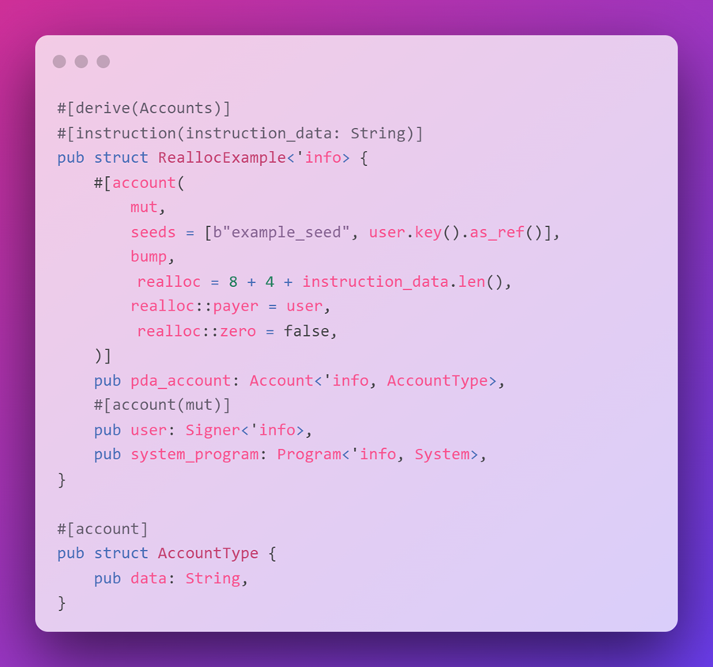
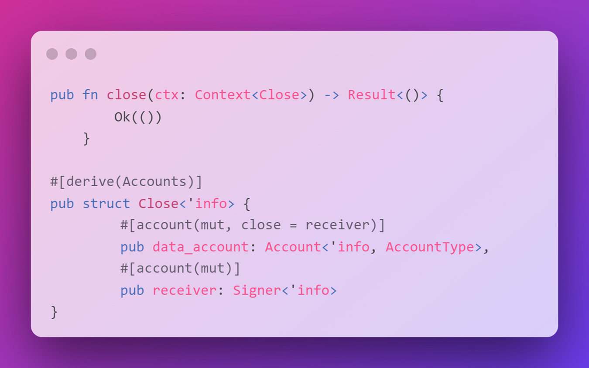

# 🛣 Anchor中的PDA

## 🛣 锚点中的PDA

现在你很棒。让我们把它提升到11。

在本课程中，我们将讨论如何使用 `#[account(...)]` 属性，并介绍以下限制条件：

- `seeds` 和 `bump` - 初始化和验证`PDA`
- `realloc` - 重新分配账户上的空间
- `close` - 关闭账户

## 🛣 锚点中的PDA

回想一下，[PDA](https://github.com/Unboxed-Software/solana-course/blob/main/content/pda.md?utm_source=buildspace.so&utm_medium=buildspace_project)是使用一系列可选的种子、一个凸起的种子和一个 `programId` 来衍生的。锚点提供了一种方便的方法来验证带有 seeds 和 `bump` 约束的`PDA`。

在账户验证过程中，Anchor将使用 `seeds` 约束中指定的种子生成一个`PDA`，并验证传入指令的账户是否与使用指定 `seeds` 找到的`PDA`匹配。

当包含碰撞约束但未指定具体碰撞时，Anchor将默认使用规范碰撞（即导致有效`PDA`的第一个碰撞）。

在这个例子中，使用种子和碰撞约束来验证`pda_account`的地址是否是预期的`PDA`。

用于推导`PDA`的 `seeds` 包括：

- `example_seed` - 一个硬编码的字符串值
- `user.key()` - 传入的账户的公钥 `user`
- `instruction_data` - 传入指令的指令数据。
    - 您可以使用 `#[instruction(...)]` 属性访问指令数据。

- 使用 `#[instruction(...)]` 属性时，指令数据必须按照传入指令的顺序排列。
- 你可以忽略最后一个你不需要的参数之后的所有参数。

如果输入的顺序不同，就会导致错误

您可以将 `init` 约束与 `seeds` 和 `bump` 约束结合使用，使用PDA初始化账户。

`init` 约束必须与以下内容结合使用：

- `payer` - 指定用于支付初始化的账户
- `space` - 为新账户分配的空间
- `system_program` - `init` 约束要求在账户验证结构中存在 `system_program`

默认情况下，init将创建的账户的所有者设置为当前正在执行的程序。

- 使用 `init` 与 `seeds` 和 `bump` 来初始化`PDA`账户时，所有者必须是执行程序。
- 这是因为创建一个账户需要一个签名，只有执行程序的`PDAs`才能提供
- （即，如果用于派生`PDA`的`programId`与执行程序的`programId`不匹配，则`PDA`帐户初始化的签名验证将失败）。
- 由于 `init` 使用 `find_program_address` 来推导`PDA`，因此无需指定 `bump` 的值。
- 这意味着PDA将使用`canonical bump`起来推导。
- 在为由执行的锚定程序初始化和拥有的账户分配 `space` 时，请记住前8个字节是保留给唯一账户辨别器的，锚定程序使用该辨别器来识别程序账户类型。

## 🧮 重新分配

更多时候，你会更新现有的账户，而不是创建新的账户。Anchor拥有令人赞叹的`realloc`约束条件，为现有账户提供了一种简单的方式来重新分配空间。

`realloc` 约束必须与以下内容结合使用：

- `mut` - 账户必须设置为可变的
- `realloc::payer` - 根据重新分配的账户空间是减少还是增加，来减少或增加拉姆波特的账户
- `realloc::zero` - 一个布尔值，用于指定是否应该将新内存初始化为零
- `system_program` - `realloc` 约束要求在账户验证结构中存在 `system_program`

例如，重新分配用于存储类型为 `String` 的字段的帐户的空间。

- 使用 `String` 类型时，除了为 `String` 本身分配的空间外，还需要额外使用4个字节的空间来存储 `String` 的长度。
- 如果账户数据长度的变化是可加的，为了保持租金豁免，`Lamport`将从 `realloc::payer` 转移到程序账户中。
- 如果变化是减法的话，`Lamport`将从程序账户转回 `realloc::payer` 。
- 需要 `realloc::zero` 约束以确定在重新分配后是否应该对新内存进行零初始化。
- 在之前减少过的账户上扩展空间时，应将此约束设置为true。

## ❌ 关闭

当你完成一个账户并且不想让它存在时会发生什么？你可以关闭它！

这样你就可以腾出空间，把为租金支付的SOL拿回来！

这是通过使用 `close` 约束来完成的：

- `close` 约束在指令执行结束时将账户标记为已关闭，通过将其鉴别器设置为 `CLOSED_ACCOUNT_DISCRIMINATOR` 并将其 `lamports` 发送到指定的账户。
- 将鉴别器设置为特殊变体可以防止账户复活攻击（即后续指令再次添加租金豁免的`lamports`）。
- 我们将关闭 `data_account` 并将分配给租金的`lamports`发送到 `receiver` 账户。
- 然而，目前任何人都可以调用关闭指令并关闭 `data_account`

- `has_one` 约束可以用来检查传入指令的账户是否与存储在 `data` 账户字段上的账户匹配
- 您必须在您使用的账户的 `data` 字段上使用命名约定，以便对其进行 `has_one` 约束检查
- 使用 `has_one = receiver` ：
    - 账户的 `data` 与之对比的字段应该有一个 `receiver`
    - 在 `#[derive(Accounts)]` 结构中，账户名称也必须被称为 `receiver`
- 请注意，使用 `close` 约束只是一个示例，而 `has_one` 约束可以更广泛地使用
