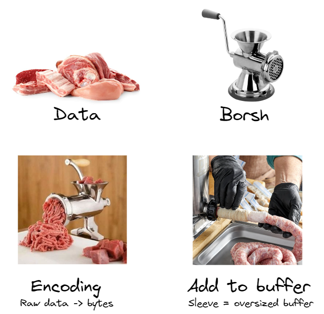

# 🤔 自定义指令

现在我们已经设置了钱包连接，让我们的 ping 按钮实际执行一些操作！您现在知道如何通过简单的交易读取数据并写入网络。几乎立刻，您就会发现自己希望通过交易发送数据。那么让我们看看如何向 Solana 区块链讲述您的故事。

Solana 中数据的棘手之处在于程序是无状态的。与以太坊等其他区块链中的智能合约不同，程序不存储任何数据，仅存储逻辑。


图为：Solana 创始人 `Anatoly Yakovenko` 正在制作 Solana。

Solana 程序中绝对不存储任何内容。它不知道所有者是谁，甚至不知道是谁部署了它。一切都存储在帐户内。

## 📧 指令数据

我们要深入了解一下。在实践中，我们在本节中要做的很多事情将由像 Anchor 这样的库为我们处理，但了解原子指令级别发生的事情很重要。

让我们退后一步看看指令数据所在的位置。


事务可以有一条或多条指令，每条指令可以有数据。

指令数据最重要的是格式——它是 8 位数据。 “位”表示它是机器代码：1 和 0。 8 只是指大小，例如 32 位或 64 位。如果您的指令数据不是这种格式，Solana 运行时将无法识别它。

这就是 Solana 速度如此之快的原因！您无需让网络转换您的数据，而是向其提供转换后的数据，它只会处理它。想象一下，如果您在开始烹饪之前准备好一道菜的所有原料 - 您将能够更快地烹饪，因为您不必切东西。

您不需要知道机器代码如何工作。您需要记住的是，指令数据具有某种类型，并且当您想要将其包含在指令中时，您需要将数据转换为该类型。

> 这段话在解释 Solana 网络如何处理事务和指令数据的。在 Solana 中，一个事务可以包含一条或多条指令，每条指令都可以携带一些数据。
>
> 重点是，这些指令数据需要以特定格式提供，即 8 位数据。这里的 “8位” 不是指数据的大小，而是指数据的格式，这种格式是机器代码格式，用 1 和 0 表示。如果你提供的指令数据不是这种格式，Solana 运行时就无法识别和处理它。
>
> 这种处理方式是 Solana 能够高速运行的一个原因。你不需要让网络转换你的数据，而是自己转换数据并提供给网络，网络只负责处理它。这就像在开始烹饪前就准备好所有食材，这样你就能更快地烹饪，因为你不需要在烹饪过程中去切东西。
>
> 作者强调的是，你并不需要了解机器代码是如何工作的。你需要记住的是，当你想要在指令中包含一些数据时，这些数据需要是特定类型的，你需要把你的数据转换为这种类型。这就意味着在你编写和提交给 Solana 网络的代码中，你需要负责把你的数据转换为适当的格式。
>
> 这是低级别编程的一个常见特性。虽然很多高级编程语言（比如 Python 或 JavaScript）会自动处理这些类型转换，但在低级语言（比如 Rust，这也是 Solana 主要使用的语言）中，你需要自己处理这些转换。然而，有些库，如 Anchor，可以帮助你处理这些转换，让编程更简单。

## 🔨 序列化和borsh


这就是序列化的用武之地——它将常规代码或数据转换为字节数组（机器代码：1 和 0）的过程。

我们将在我们的项目中使用 [Borsh](https://borsh.io/) 序列化格式，因为它有一个方便我们使用的库。

让我们通过一个例子来看看它是如何工作的——目标是装备一个链上游戏物品。为此，我们需要三个数据

- variant - 我们要调用的命令的名称（即装备或删除）
- playerId - 装备该物品的玩家的ID
- itemId - 我们想要装备的物品

序列化此数据有四个步骤：

- 1. 为您的数据创建模式/映射
- 2. 为比需要大得多的数据分配缓冲区
- 3. 对我们的数据进行编码并将其添加到缓冲区中
- 4. 砍掉缓冲区末尾的多余空间

作为网络开发人员，我们永远不需要处理这样的低级内容，所以我这样做是为了让它感觉不那么抽象：



我希望这是有道理的，哈哈。让我们看一些代码以了解其实际情况。

```ts
import * as Borsh from "@project-serum/borsh"

const equipPlayerSchema = Borsh.struct([
  Borsh.u8("variant"),
  Borsh.u8("playerId"),
  Borsh.u8("itemId"),
])
```

我们将从为装备物品指令创建一个模式开始。我们正在使用三段数据创建一个 borsh 结构，所有数据都是无符号整数，但大小不同 - 8、16 和 256 位。

由于我们的数据将成为一长串 1 和 0 的列表，因此我们需要知道每个数据项的开始和结束位置。这就是为什么我们为每件商品赋予特定的尺寸。当程序需要读取这些数据时，它会知道 variant 在哪里结束， playerId 在哪里开始。

想象一下蒙着眼睛试图从链接上切香肠。只有知道每根香肠的长度，才能在正确的位置切。


在我们的例子中，第二根和第三根香肠会长很多，但我想你明白了，哈哈。


```ts
import * as Borsh from "@project-serum/borsh"

const equipPlayerSchema = Borsh.struct([
  Borsh.u8("variant"),
  Borsh.u8("playerId"),
  Borsh.u8("itemId"),
])

const buffer = Buffer.alloc(1000)
equipPlayerSchems.encode({ variant: 2, playerId: 1435, itemId: 737498}, buffer)

const instructBuffer = buffer.slice(0, equipPlayerSchems.getSpan(buffer))
```

这里发生第二步、第三步和第四步。我们创建一个 1000 字节长的缓冲区。我们对数据进行编码并将其添加到缓冲区中。然后我们将末端切成薄片，使其长度达到需要的长度。

```ts
const endpoint = clusterApiUrl("devnet")
const connection = new Connection(endpoint)

const transaction = new Transaction().add({
  key: [
    {
      pubkey: player.Publickey,
      isSigner: true,
      isWritable: false,
    },
    {
      pubkey: playerInfoAccount,
      isSigner: false,
      isWritable: true,
    },
    {
      pubkey: SystemProgram.programId,
      isSigner: false,
      isWritable: false,
    },
  ],
  data: instructBuffer,
  programId: PROGRAM_ID,
})

sendAndConfirmTransaction(connection, transaction, [player])
```

一旦我们获得了正确格式的数据，剩下的就是 ezpz！这笔交易看起来应该很熟悉。这里唯一的“新”东西是我们以前没有的可选 data 项。

我在这里对您的知识做了一些假设 - 您粗略地知道什么是机器代码以及内存分配如何发挥作用。你不需要知道所有这些东西，我当然不需要。只需在 YouTube 上观看一两个视频，直到您对正在发生的事情有一个大概的了解。


没有多少现代开发人员定期处理字节缓冲区 - 它被认为是低级别的，所以如果这感觉不熟悉或新鲜，请不要担心。接下来我们将使用它进行构建，这样您就可以称自己为软件工程师😎
