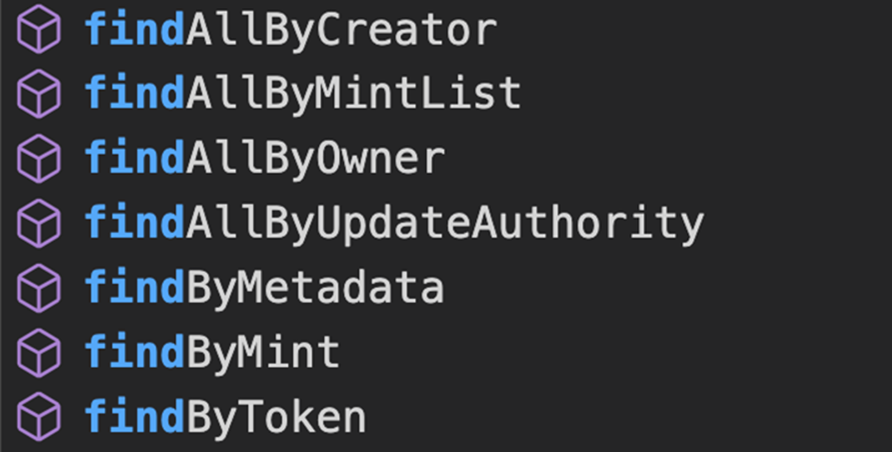

# 展示NFTs 💃

既然我们已经铸造了一个NFT，现在我们将学习如何铸造一系列的NFT。我们将使用Candy Machine来完成这个任务——这是一个Solana程序，让创作者能够将他们的资产上链。这不是创建系列的唯一方式，但在Solana上它是标准的，因为它具有许多有用的功能，如机器人保护和安全随机化。如果你不能炫耀你的NFT，那它有什么用呢！在这节课中，我们将帮助你展示你的作品（假设你的NFT是赚钱的）：首先在钱包中展示它，然后在Candy Machine中展示它。

你可能会想这样做的意义是什么。想象一下，你的朋友在你的网站上从你的收藏中铸造了一个很酷的Pepe NFT。他们铸造了很多与Pepe相关的东西，所以他们的钱包里有几十个NFT。他们怎么知道哪一个是来自你的收藏呢？你得给他们看！

你会记得从第一周开始，我们想要的一切都存储在账户中。这意味着你只需使用钱包地址就可以获取它们的NFT，但这需要更多的工作。

相反，我们将使用Metaplex SDK，它使得一切都变得像调用API一样简单。以下是它的样子：

你需要进行通常的Metaplex设置，但我们使用 `walletAdapterIdentity` 而不是 `keypairIdentity` 来进行连接，因为我们不想要他们的密钥对哈哈。完成后，我们只需使用Metaplex对象调用 `findAllByOwner` 方法即可。

这是单个NFT的NFT数据在控制台上的打印结果，我们主要关注的是 `uri` 字段：

顺便说一下，还有很多其他方法可以获取NFT：

让我们写些代码吧！
