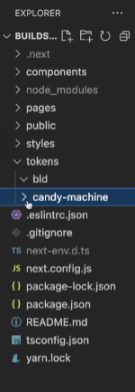
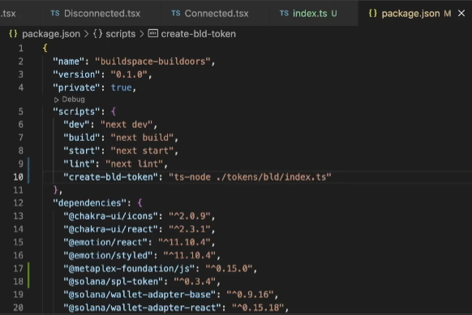

# 🎨 创建奖励代币

现在我们已经铸造了一个NFT，我们将学习如何铸造一系列的NFT。我们将使用Candy Machine来完成这个任务——这是一个Solana程序，允许创作者将他们的资产上链。这不是创建系列的唯一方式，但在Solana上它是标准的，因为它具有一些有用的功能，如机器人保护和安全随机化。是时候回到我们的自定义NFT质押应用了。我们将利用我们在代币程序和糖果机上的经验来构建我们的应用。

请继续，在您的根目录中创建一个名为 `tokens` 的新文件夹。在该文件夹内，我们需要创建2个名为 `bld` 和 `candy-machine` 的子文件夹。它应该看起来像这样：



我们创建这个的原因是为了我们堆叠 Builder 时的奖励代币，以及与我们的 NFT 相关的东西。

现在让我们开始创建我们的资源文件夹。这将用于我们代币的图像。进入您的 `bld` 文件夹，并创建一个名为 `assets` 的新文件夹，并在您的 `bld` 文件夹内创建一个名为 `index.ts` 的新文件。它应该看起来像这样。

```bash
├── styles
├── tokens
│   ├── bld
│   |   ├── assets
│   |   ├── index.ts
```

注意：确保你的`index.ts`文件在bld文件夹中，而不是在`assets`文件夹中。

你会注意到你的 `index.ts` 文件被标记为红色。这是因为我们目前还没有任何代码。让我们通过向你的 `index.ts` 中添加一些代码来解决这个问题。我们还需要将 `initializeKeypair` 文件移动到 `bld` 文件夹中。你还需要向 `bld/assets` 文件夹中添加一张图片，这将是你的令牌图片。

```ts
import * as web3 from "@solana/web3.js";
import * as token from "@solana/spl-token";
import { initializeKeypair } from "./initializeKeypair";

async function main() {
  const connection = new web3.Connection(web3.clusterApiUrl("devnet"));
  const payer = await initializeKeypair(connection);
}

main()
  .then(() => {
    console.log("Finished successfully");
    process.exit(0);
  })
  .catch((error) => {
    console.log(error);
    process.exit(1);
  });
```

太棒了！现在我们有了开始的代码，让我们把下一段代码粘贴到你的 `index.ts` 文件中。你可以把它放在你的 `main` 函数上方。

```ts
import * as fs from "fs";
import {
  bundlrStorage,
  keypairIdentity,
  Metaplex,
  toMetaplexFile,
} from "@metaplex-foundation/js";

import {
  DataV2,
  createCreateMetadataAccountV2Instruction,
} from "@metaplex-foundation/mpl-token-metadata";

const TOKEN_NAME = "BUILD";
const TOKEN_SYMBOL = "BLD";
const TOKEN_DESCRIPTION = "A token for buildoors";
const TOKEN_IMAGE_NAME = "unicorn.png"; // Replace unicorn.png with your image name
const TOKEN_IMAGE_PATH = `tokens/bld/assets/${TOKEN_IMAGE_NAME}`;

async function createBldToken(
  connection: web3.Connection,
  payer: web3.Keypair
) {
    // This will create a token with all the necessary inputs
    const tokenMint = await token.createMint(
        connection, // Connection
        payer, // Payer
        payer.publicKey, // Your wallet public key
        payer.publicKey, // Freeze authority
        2 // Decimals
    );

    // Create a metaplex object so that we can create a metaplex metadata
    const metaplex = Metaplex.make(connection)
        .use(keypairIdentity(payer))
        .use(
        bundlrStorage({
            address: "https://devnet.bundlr.network",
            providerUrl: "https://api.devnet.solana.com",
            timeout: 60000,
        })
        );

    // Read image file
    const imageBuffer = fs.readFileSync(TOKEN_IMAGE_PATH);
    const file = toMetaplexFile(imageBuffer, TOKEN_IMAGE_NAME);
    const imageUri = await metaplex.storage().upload(file);

    // Upload the rest of offchain metadata
    const { uri } = await metaplex
        .nfts()
        .uploadMetadata({
        name: TOKEN_NAME,
        description: TOKEN_DESCRIPTION,
        image: imageUri,
        });

    // Finding out the address where the metadata is stored
    const metadataPda = metaplex.nfts().pdas().metadata({mint: tokenMint});
    const tokenMetadata = {
        name: TOKEN_NAME,
        symbol: TOKEN_SYMBOL,
        uri: uri,
        sellerFeeBasisPoints: 0,
        creators: null,
        collection: null,
        uses: null,
    } as DataV2

    const instruction = createCreateMetadataAccountV2Instruction({
        metadata: metadataPda,
        mint: tokenMint,
        mintAuthority: payer.publicKey,
        payer: payer.publicKey,
        updateAuthority: payer.publicKey
    },
    {
        createMetadataAccountArgsV2: {
            data: tokenMetadata,
            isMutable: true
        }
    })

    const transaction = new web3.Transaction()
    transaction.add(instruction)

    const transactionSignature = await web3.sendAndConfirmTransaction(
        connection,
        transaction,
        [payer]
    )
}

// The rest of your main function
```

## 🥳 代码解析

好的，让我们把这一切都分解开来，就像制作柠檬水一样简单。

在这里，我们正在调用 `createMint` 函数来创建并初始化一个新的铸币。您可以在[这里](https://solana-labs.github.io/solana-program-library/token/js/modules.html#createMint?utm_source=buildspace.so&utm_medium=buildspace_project)阅读更多关于这个函数的信息。

```ts
// This will create a token with all the necessary inputs
const tokenMint = await token.createMint(
  connection, // Connection
  payer, // Payer
  payer.publicKey, // Your wallet public key
  payer.publicKey, // Freeze authority
  2 // Decimals
);
```

接下来，我们正在创建一个metaplex对象，以便它可以生成metaplex元数据并将其上传到bundlrStorage。

```ts
// Create a metaplex object so that we can create a metaplex metadata
const metaplex = Metaplex.make(connection)
  .use(keypairIdentity(payer))
  .use(
    bundlrStorage({
      address: "https://devnet.bundlr.network",
      providerUrl: "https://api.devnet.solana.com",
      timeout: 60000,
    })
  );
```

这部分很容易理解。我们现在正在尝试读取我们放在 `bld/assets` 文件夹中的图像文件，并将元数据上传到存储空间。

```ts
// Read image file
const imageBuffer = fs.readFileSync(TOKEN_IMAGE_PATH);
const file = toMetaplexFile(imageBuffer, TOKEN_IMAGE_NAME);
const imageUri = await metaplex.storage().upload(file);
// Upload the rest of offchain metadata
const { uri } = await metaplex
  .nfts()
  .uploadMetadata({
    name: TOKEN_NAME,
    description: TOKEN_DESCRIPTION,
    image: imageUri,
  });
```

一旦我们成功将图像上传到metaplex，我们将通过调用下面的部分来获取地址。

```ts
// Finding out the address where the metadata is stored
const metadataPda = metaplex.nfts().pdas().metadata({mint: tokenMint});
const tokenMetadata = {
    name: TOKEN_NAME,
    symbol: TOKEN_SYMBOL,
    uri: uri,
    sellerFeeBasisPoints: 0,
    creators: null,
    collection: null,
    uses: null,
} as DataV2

const instruction = createCreateMetadataAccountV2Instruction({
    metadata: metadataPda,
    mint: tokenMint,
    mintAuthority: payer.publicKey,
    payer: payer.publicKey,
    updateAuthority: payer.publicKey
},
{
    createMetadataAccountArgsV2: {
        data: tokenMetadata,
        isMutable: true
    }
})

const transaction = new web3.Transaction()
transaction.add(instruction)
const transactionSignature = await web3.sendAndConfirmTransaction(
    connection,
    transaction,
    [payer]
)
```

## 🫙 元数据的存储

现在我们已经创建了带有以下元数据的薄荷。让我们继续下一步吧！现在我们将通过编写以下代码将元数据文件写入我们的文件夹中。

就在您定义 `transactionSignature` 的下方，让我们把这段代码放在这里。

```ts
fs.writeFileSync(
  "tokens/bld/cache.json",
  JSON.stringify({
    mint: tokenMint.toBase58(),
    imageUri: imageUri,
    metadataUri: uri,
    tokenMetadata: metadataPda.toBase58(),
    metadataTransaction: transactionSignature,
  })
);
```
太棒了！现在我们已经完成了编写我们的 createBldToken 函数。现在，让我们在下面的 main 函数中开始调用这个函数。你的 main 函数现在应该是这个样子。

```ts
async function main() {
  const connection = new web3.Connection(web3.clusterApiUrl("devnet"));
  const payer = await initializeKeypair(connection);

  await createBldToken(connection, payer);
}
```

就这样了。你现在完成了。让我们开始运行我们的代码。

## 🚀 运行我们的代码

在VS Code中打开终端。首先需要安装一个名为 ts-node 的模块。这是必需的，因为我们将运行一些TypeScript命令。在终端中输入 npm install --save-dev ts-node 。现在，转到您的 package.json 并将此行添加到 scripts 部分。

```json
"create-bld-token": "ts-node ./src/tokens/bld/index.ts"
```


现在应该是这个样子。



记得保存你的更改！现在你应该能够通过在终端中运行 `npm run create-bld-token` 来使用你添加的新命令。这将开始在开发网络中为你创建和铸造代币。一旦完成，你应该能够在你的文件夹中看到一个 `cache.json` 。打开它，它应该是这个样子。

注意：如果您收到类似 `SyntaxError: Cannot use import statement outside a module` 的错误，请检查您的 `tsconfig.json` 并添加/更改为 `"module": "CommonJS"`


请复制 `mint` 中列出的地址，并将其粘贴到`https://explorer.solana.com/?cluster=devnet`。现在，您应该能够看到您选择的图像的代币，就像这样。


