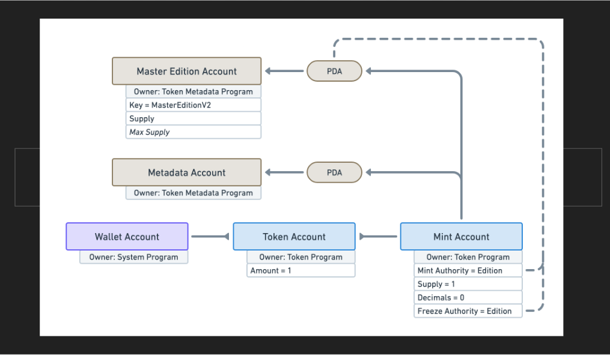
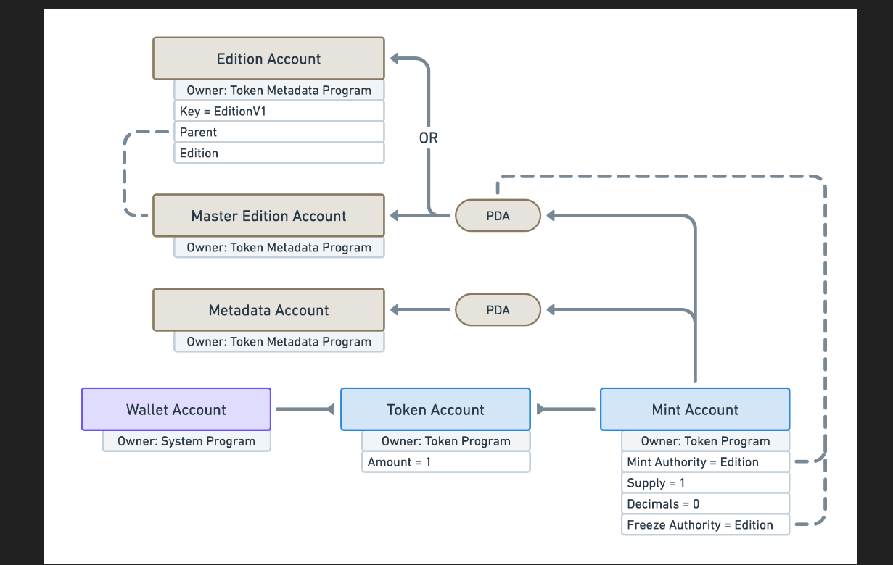

# 🎨 NFTs on Solana

我们到了。没花太长时间。猴子图片。猿类。岩石。还有其他动物主题的头像，看起来丑得要命，但却能卖到10万美元，这就是NFT。

与以太坊不同，Solana上的NFT铸造非常便宜，这使得它们更加有趣。即使在这些熊市的日子里，在以太坊上铸造一个NFT也只需5美元，这实在是有点无聊。为什么我要支付5美元来让我的模因永垂不朽呢？

## 🫣 NFTs 是代币

Solana上的NFT价格便宜的一个重要原因是它们并不是特别的代码，它们只是普通的代币，附带了额外的数据。

第一个主要的区别是铸造账户。对于NFTs来说，铸造账户

- **供应量为1**，意味着只有一个代币在流通。
- **没有小数点**，意味着不存在0.5个代币这样的事情。
- **没有铸币机构**，意味着没有人可以铸造额外的代币。

正如你可能猜到的那样，额外的数据存储在程序派生的账户中。让我们来见识一下这些新账户 :D

## 🐙 Master Edition  账户

Token Metadata程序为NFTs提供了另一个专门的账户，称为Master Edition账户。它不会废除Mint权限，而是将Mint权限和冻结权限都转移到Master Edition PDA。

换句话说，造币权被转移到属于Token Metadata程序的PDA上。这确保任何人在未经过Token Metadata程序的情况下无法铸造或冻结代币。

只有程序提供的指令才能使用它，而程序中并不存在这样的指令。这样做的原因是为了让Metaplex能够部署Token Metadata程序的升级，并将现有的NFT迁移到新版本。

## 🪰 Editions 账户

除了作为不可替代性证据，Master Edition账户还允许用户打印一个或多个NFT的副本。这个功能使创作者能够提供多个1/1 NFT的副本。

Master Edition  账户包含一个可选的 Max Supply 属性：

- 如果设置为 0 ，则禁用打印功能
- 如果设置为 None ，可以打印无限数量的副本。

## 🧰 Metaplex SDK

通过我们的新朋友Metaplex SDK，所有这些都变得轻而易举。它让您轻松创建和更新NFTs - 您只需提供最基本的信息，它会自动填充其余的默认值。

就像令牌元数据一样，我们将使用相同的流程来：

- 上传一张图片
- 上传元数据
- 然后使用元数据 URI 创建一个 NFT

你能猜到代码会是什么样子吗？在我们开始之前，试着在脑海中形象化它，然后我们一起来解决它吧 :)
