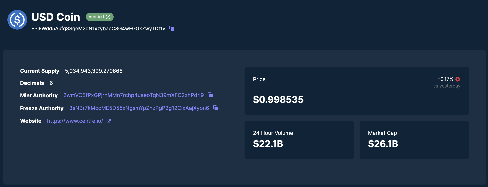

# 💵 The Token Program

是时候让代币与它们的创造者（你）相遇了。我们将在之前的构建部分中继续进行。如果需要，你可以从[这里获取起始代码](https://github.com/buildspace/solana-token-client/tree/solution-without-burn)（确保你在 `solution-without-burn` 分支上）。作为区块链最初的承诺，也可能是你安装钱包的主要原因，这些谦逊的代币是对区块链上资产的最纯粹的表达，从合成股票到数百种狗币。

这节课主要讲解Solana上的代币工作原理。如果你对其他区块链有所了解，可能会发现这里有一些不同之处，所以尽量不要将当前对代币的理解与之联系起来。

谈论Solana中令牌的工作原理也是一个了解不同程序如何使用账户的绝佳机会。你越深入了解Solana，就越能意识到账户的重要性。它们像文件系统中的文件一样抽象和灵活，但这也意味着任何给定程序上的账户可能变得复杂！刚开始可能会感到困惑，但给它一些时间，它会变得更加清晰。

Solana上的代币是通过`Solana Token Program`进行创建和管理的，它是`Solana Program Library（SPL）`中的几个程序之一。常规代币和非同质化代币（NFTs）都是Solana程序库中的代币。今天我们不会涉及NFTs，但不用担心，我们很快会介绍。


## 🗃 账户关系

我们首先要了解一下情况。`The token program`需要三个必要的账户:


- `Wallet Account` - 这是你的钱包！
- `Mint Account` - 存储有关代币Mint的元数据
- `Token Account` - 这与钱包绑定，并存储有关该特定钱包的信息，例如它拥有多少令牌。

让我们深入了解每个账户，并看看它们内部的情况。

## 🌌 Mint Account


Mint账户存储有关代币本身的元数据，而不是您对代币的所有权，而是更广泛地涉及代币。它具有以下属性：

- `mint authority` - 只有一个账户可以从Mint账户签名并Mint代币。当您创建Mint账户时，必须指定Mint权限，可以是您的个人钱包或其他程序。
- `supply` - 有多少总代币存在。供应基本上是在说，“码农大神，你好！这是发行的总代币数量。”
- `decimals` - 小数位数是我们允许令牌被分割成的小数位数 - 我们令牌的精度。这可能会变得棘手，因为实际上链上没有小数。什么？总供应量表示为整数，所以你必须进行数学计算来在小数之间进行转换。例如，如果你将小数位数设置为两位，而你的供应量是一百，那么实际上你只有一个令牌。供应中只有一个令牌，但你允许它被分割成该令牌的较小面额。
- `Is Initialized`  - 基本上是指该账户是否准备就绪。这与账户本身有关，而不是`token program`。
- `Freeze authority ` - 冻结权限类似于`Mint权限`，意味着一个人或程序拥有冻结（或Mint）的权限。


将Mint权限设置给你的钱包是相当标准的做法，你可以Mint任何你想要的东西，然后取消Mint权限，基本上意味着未来不会再发行更多的供应量。或者，如果你有某种动态发行代币的方式，常见的做法是将其放入权限中，作为一个程序来管理代币的Mint。

冻结权限的工作方式相同。


##  👛 Token Accounts

你可能已经看到了大量在生态系统中流通的不同代币。你的钱包现在可能装满了各种不同的代币。那么，网络是如何知道你持有某些代币的呢？一个账户存储着这些数据！最好的方式是通过一个关联的代币账户来实现。看看吧


这是数据关系和账户属性的样子。

Token账户必须与用户或钱包关联。一个简单的方法是创建一个PDA，其地址链接了Mint账户和钱包。令牌账户PDA的种子是铸币账户的地址和钱包地址（令牌程序ID默认存在）。

有很多不同的信息包含在内，但现在只需要知道你的钱包实际上并不持有具体的代币。它与你拥有的另一个账户相关联，该账户存储了代币的数量。另外，还有一个铸币账户，存储了关于所有代币和铸币的更广泛信息。

花点时间盯着这个图表，然后搜索一下那些不明白的部分（比如关联的令牌程序到底是什么鬼？）。在处理完所有的繁琐事情之后，这就很简单了！

## 🤑 代币Mint过程

别再看图表了，让我们来看一些代码，看看这一切是如何发生的。

要创建一个新的SPL-Token，首先必须创建一个Token Mint（保存有关该特定代币的数据的账户）。

把它想象成烤比萨饼。你需要一个食谱（关于代币的数据），食材（铸币账户和钱包地址），以及有人把它们组合在一起（派生一个新的PDA）。就像制作比萨饼一样，如果你拥有所有正确的食材并按照食谱操作，最终你将得到一枚美味的新代币！

由于令牌计划是SPL的一部分，您可以使用 [`@solana/spl-token`](https://www.npmjs.com/package/@solana/spl-token) TypeScript SDK相当容易地创建交易。

这是一个`createMint`的样子：

```ts
const tokenMint = await createMint(
  connection,
  payer,
  mintAuthority,
  freezeAuthority,
  decimals,
)
```

你需要这些参数：
- `connection` - 与集群的JSON-RPC连接
- `payer` - 付款方交易的公钥
- `mintAuthority` - 被授权Mint新代币的账户
- `freezeAuthority` - 一个被授权冻结代币的账户。如果您不想冻结代币，请将其设置为null！
- `decimals` - 指定令牌的所需小数精度

一旦完成这个步骤，你就可以继续下一步了：

- 创建关联的Token账户
- 将代币Mint到一个账户中
- 如果你想要使用转账功能进行空投到多个账户，

你需要的一切都在 `@solana/spl-token` SDK中。如果你对某个具体部分感兴趣，可以在这里[查看文档](https://spl.solana.com/token)。

大多数情况下，您不需要自己创建原始交易，SDK就足够了。

关于这个很酷的附注——如果出于某种原因，你想要在创建Mint指令的同时创建另一个指令，你会希望自己创建这些指令，并将它们打包成一个事务，以确保所有操作都是原子性的。也许你正在构建一个超级机密的代币程序，你希望在铸币后立即锁定所有代币，而没有人能够转移它们。

不用说，这些代币周围发生了很多疯狂的事情。您可以在[这里](https://www.soldev.app/course/token-program)查看每个功能在幕后发生的情况，甚至可以查看一些关于销毁代币之类的说明。:)


## Reference

- [Create Tokens With The Token Program](https://www.soldev.app/course/token-program)

---


---

# 使用Token程序创建令牌


## 简而言之

- SPL代币代表Solana网络上的所有非本地代币。Solana上的可替代和不可替代代币（NFT）都是SPL代币。
- `Token Program`包含了创建和与SPL-Tokens进行交互的指令
- `Token Mints` 是指保存特定 Token 数据的账户，但不持有 Tokens
- `Token Account`用于持有特定Token Mint的Token
- 创建代币Mint和Token账户需要分配 SOL 作为租金。代币账户的租金在关闭账户时可以退还，然而，目前无法关闭代币铸币。

## 概述

Token计划是Solana程序库（SPL）提供的众多计划之一。它包含了创建和与SPL-Tokens进行交互的指令。这些代币代表了Solana网络上的所有非本地（即非SOL）代币。

本课程将重点介绍使用Token程序创建和管理新的SPL-Token的基础知识

1. 创建一个新的`Token Mint`
2. 创建`Token accounts`
3. Mint
4. 将代币从一个持有人转移到另一个持有人
5. 燃烧代币

我们将从开发过程的客户端角度来处理，使用`@solana/spl-token` JavaScript库。


## 代币铸造

要创建一个新的SPL-Token，首先必须创建一个Token Mint。Token Mint是保存特定代币数据的账户。

以USD Coin (USDC)在[Solana Explorer](https://solana.fm/address/EPjFWdd5AufqSSqeM2qN1xzybapC8G4wEGGkZwyTDt1v?cluster=mainnet-qn1)上为例。USDC的代币铸造地址是`EPjFWdd5AufqSSqeM2qN1xzybapC8G4wEGGkZwyTDt1v`。通过浏览器，我们可以查看有关USDC代币铸造的特定细节，例如代币的当前供应量、铸造和冻结权限的地址，以及代币的小数精度。



要创建一个新的代币铸造，您需要向代币程序发送正确的交易指令。为此，我们将使用`@solana/spl-token`中的`createMint`函数。

```ts
const tokenMint = await createMint(
    connection,
    payer,
    mintAuthority,
    freezeAuthority,
    decimal
);
```

`createMint`函数返回新`Token Mint`的公钥。此函数需要以下参数：

- `connection` - 与集群的JSON-RPC连接
- `payer` - 交易的付款人的公钥
- `mintAuthority` - 授权进行从`Token Mint`中实际铸造代币的账户。
- `freezeAuthority` - 一个被授权冻结代币账户的账户。如果不需要冻结功能，该参数可以设置为null。
- `decimals` - 指定令牌的所需小数精度

当使用具有访问您的秘钥权限的脚本创建新的铸币时，您可以简单地使用`createMint`函数。然而，如果您要构建一个允许用户创建新的代币铸币的网站，您需要在不让用户暴露秘钥给浏览器的情况下完成。在这种情况下，您需要构建并提交一笔包含正确指令的交易。

在内部，`createMint`函数只是创建了一个包含两个指令的交易：

1. 创建一个新账户
2. 初始化一个新的Mint

这将如下所示：

```ts
import * as web3 from '@solana/web3'
import * as token from '@solana/spl-token'

async function buildCreateMintTransaction(
    connection: web3.Connection,
    payer: web3.PublicKey,
    decimals: number
): Promise<web3.Transaction> {
    const lamports = await token.getMinimumBalanceForRentExemptMint(connection);
    const accountKeypair = web3.Keypair.generate();
    const programId = token.TOKEN_PROGRAM_ID

    const transaction = new web3.Transaction().add(
        web3.SystemProgram.createAccount({
            fromPubkey: payer,
            newAccountPubkey: accountKeypair.publicKey,
            space: token.MINT_SIZE,
            lamports,
            programId,
        }),
        token.createInitializeMintInstruction(
            accountKeypair.publicKey,
            decimals,
            payer,
            payer,
            programId
        )
    );

    return transaction
}
```

在手动构建创建新代币铸造指令时，请确保将创建账户和初始化铸造指令添加到同一笔交易中。如果您将每个步骤分开进行交易，理论上有可能让其他人接管您创建的账户并将其用于自己的铸造。

## 租金和租金豁免

请注意，前面代码片段的函数体中的第一行包含对`getMinimumBalanceForRentExemptMint`的调用，其结果传递给`createAccount`函数。这是账户初始化中的租金豁免的一部分。

直到最近，Solana上的所有账户都需要执行以下操作之一，以避免被解除分配：

1. 按特定间隔支付租金
2. 初始化时存入足够的SOL以被视为免租金

最近，第一个选项被取消了，现在在初始化新账户时，需要存入足够的SOL以免除租金。

在这种情况下，我们正在为一个代币铸造创建一个新的账户，所以我们使用了 `@solana/spl-token` 库中的 `getMinimumBalanceForRentExemptMint` 方法。然而，这个概念适用于所有账户，你可以在 Connection 上使用更通用的 `getMinimumBalanceForRentExemption` 方法来创建其他可能需要的账户。

## 令牌账户

在您可以铸造代币（发行新供应）之前，您需要一个代币账户来持有新发行的代币。

一个代币账户持有特定“铸币”所发行的代币，并指定了账户的“所有者”。只有所有者有权减少代币账户的余额（转账、销毁等），而任何人都可以向代币账户发送代币以增加其余额。

您可以使用`spl-token`库的`createAccount`函数来创建新的令牌账户：

```ts
const tokenAccount = await createAccount(
    connection,
    payer,
    mint,
    owner,
    keypair
);
```

`createAccount`函数返回新令牌账户的公钥。此函数需要以下参数：

- `connection` - 与集群的JSON-RPC连接
- `payer` - 交易的付款人的公钥
- `mint` - 与新代币账户关联的代币铸币
- `owner` - 新代币账户的所有者账户
- `keypair` - 这是一个可选参数，用于指定新的令牌账户地址。如果没有提供`keypair`，则`createAccount`函数将默认从关联的铸币和所有者账户派生。

请注意，这个`createAccount`函数与我们在查看`createMint`函数内部时所展示的`createAccount`函数不同。之前我们在`SystemProgram`上使用`createAccount`函数来返回创建所有账户的指令。而这里的`createAccount`函数是`spl-token`库中的一个辅助函数，它会提交一个包含两个指令的交易。第一个指令用于创建账户，第二个指令用于将账户初始化为代币账户。

就像创建一个Token Mint一样，如果我们需要手动构建`createAccount`的交易，我们可以复制函数在内部所做的操作：

1. 使用`getMint`来检索与Mint相关的数据
2. 使用`getAccountLenForMint`函数来计算代币账户所需的空间
3. 使用`getMinimumBalanceForRentExemption`函数来计算租金豁免所需的Lamports数量
4. 使用`SystemProgram.createAccount`和`createInitializeAccountInstruction`创建一个新的交易。请注意，这里的`createAccount`是来自`@solana/web3.js`，用于创建一个通用的新账户。`createInitializeAccountInstruction`使用这个新账户来初始化新的代币账户。

```ts
import * as web3 from '@solana/web3'
import * as token from '@solana/spl-token'

async function buildCreateTokenAccountTransaction(
    connection: web3.Connection,
    payer: web3.PublicKey,
    mint: web3.PublicKey
): Promise<web3.Transaction> {
    const mintState = await token.getMint(connection, mint)
    const accountKeypair = await web3.Keypair.generate()
    const space = token.getAccountLenForMint(mintState);
    const lamports = await connection.getMinimumBalanceForRentExemption(space);
    const programId = token.TOKEN_PROGRAM_ID

    const transaction = new web3.Transaction().add(
        web3.SystemProgram.createAccount({
            fromPubkey: payer,
            newAccountPubkey: accountKeypair.publicKey,
            space,
            lamports,
            programId,
        }),
        token.createInitializeAccountInstruction(
            accountKeypair.publicKey,
            mint,
            payer,
            programId
        )
    );

    return transaction
}
```

## 关联代币账户

关联代币账户是一种使用所有者的公钥和代币铸币地址派生出的代币账户。关联代币账户提供了一种确定性的方式，用于找到特定公钥所拥有的特定代币铸币的代币账户。大多数情况下，创建代币账户时，您希望它成为关联代币账户。

与上述类似，您可以使用`spl-token`库的`createAssociatedTokenAccount`函数创建一个关联的代币账户。

```ts
const associatedTokenAccount = await createAssociatedTokenAccount(
    connection,
	payer,
	mint,
	owner,
);
```

该函数返回新关联令牌账户的公钥，并需要以下参数：

- `connection` - 与集群的JSON-RPC连接
- `payer` - 交易的付款人的公钥
- `mint` - 与新代币账户关联的代币铸币
- `owner` - 新代币账户的所有者账户

您还可以使用`getOrCreateAssociatedTokenAccount`来获取与给定地址关联的Token账户，如果该账户不存在，则创建它。例如，如果您正在编写代码向给定用户空投代币，您很可能会使用此函数来确保与给定用户关联的Token账户在不存在时被创建。

在底层，`createAssociatedTokenAccount`正在执行两个操作：

1. 使用 `getAssociatedTokenAddress`从铸币和所有者中推导出关联的代币账户地址
2. 使用`createAssociatedTokenAccountInstruction`指令构建交易

```ts
import * as web3 from '@solana/web3'
import * as token from '@solana/spl-token'

async function buildCreateAssociatedTokenAccountTransaction(
    payer: web3.PublicKey,
    mint: web3.PublicKey
): Promise<web3.Transaction> {
    const associatedTokenAddress = await token.getAssociatedTokenAddress(mint, payer, false);

    const transaction = new web3.Transaction().add(
        token.createAssociatedTokenAccountInstruction(
            payer,
            associatedTokenAddress,
            payer,
            mint
        )
    )

    return transaction
}
```

## Mint token

铸币是将新代币发行到流通中的过程。当你铸造代币时，你增加了代币铸造的供应，并将新铸造的代币存入代币账户。只有代币铸造的铸币机构才被允许铸造新的代币。


使用`spl-token`库来铸造代币，您可以使用`mintTo`函数。

```ts
const transactionSignature = await mintTo(
    connection,
    payer,
    mint,
    destination,
    authority,
    amount
);
```

`mintTo`函数返回一个可以在Solana Explorer上查看的TransactionSignature。mintTo函数需要以下参数：

- `connection` - 与集群的JSON-RPC连接
- `payer` - 交易的付款人的公钥
- `mint` - 与新代币账户关联的代币铸币
- `destination` - 接收新铸造代币的代币账户
- `authority` - 授权用于铸造代币的账户
- `amount` - 在小数点之外铸造的代币的原始数量，例如，如果Scrooge Coin的小数属性设置为2，则要获得1个完整的Scrooge Coin，您需要将此属性设置为100。

 在代币铸造完成后，将铸币权限更新为`null`并不罕见。这将设定最大供应量，并确保未来无法再铸造任何代币。相反地，可以将铸币权限授予一个程序，以便代币可以根据固定间隔或可编程条件自动铸造。


 在内部，`mintTo`函数只是使用从`createMintToInstruction`函数获取的指令创建一个交易。

 ```ts
 import * as web3 from '@solana/web3'
 import * as token from '@solana/spl-token'

 async function buildMintToTransaction(
     authority: web3.PublicKey,
     mint: web3.PublicKey,
     amount: number,
     destination: web3.PublicKey
 ): Promise<web3.Transaction> {
     const transaction = new web3.Transaction().add(
         token.createMintToInstruction(
             mint,
             destination,
             authority,
             amount
         )
     )

     return transaction
 }
 ```

 ## 转移代币


 SPL-Token转账需要发送方和接收方都拥有相应代币的账户。代币从发送方的账户转移到接收方的账户。

 在获取接收者的关联代币账户时，您可以使用`getOrCreateAssociatedTokenAccount`函数来确保其代币账户在转账之前已存在。只需记住，如果账户尚不存在，该函数将创建该账户，并且交易的付款方将被扣除所需的`lamports`用于账户创建。

 一旦您知道接收者的令牌账户地址，您可以使用spl-token库的转账函数进行令牌转账。

 ```ts
 const transactionSignature = await transfer(
     connection,
     payer,
     source,
     destination,
     owner,
     amount
 )
 ```


转账函数返回一个可以在Solana Explorer上查看的`TransactionSignature`。
转账函数需要以下参数：

- `connection` - 与集群的JSON-RPC连接
- `payer` - 交易的付款人的公钥
- `source` - 发送代币的代币账户
- `destination` - 接收代币的代币账户
- `owner` - 发送代币的代币账户的所有者
- `amount` - 要转移的代币的数量

在底层，转账函数只是根据从`createTransferInstruction`函数获取的指令创建一个交易：

```ts
import * as web3 from '@solana/web3'
import * as token from '@solana/spl-token'

async function buildTransferTransaction(
    source: web3.PublicKey,
    destination: web3.PublicKey,
    owner: web3.PublicKey,
    amount: number
): Promise<web3.Transaction> {
    const transaction = new web3.Transaction().add(
        token.createTransferInstruction(
            source,
            destination,
            owner,
            amount,
        )
    )

    return transaction
}
```

## 燃烧代币


燃烧代币是减少特定代币发行量的过程。燃烧代币会将其从特定代币账户和更广泛的流通中移除。

使用spl-token库烧毁代币时，您需要使用`burn`函数。

```ts
const transactionSignature = await burn(
    connection,
    payer,
    account,
    mint,
    owner,
    amount
)
```

`burn`函数返回一个可以在Solana Explorer上查看的`TransactionSignature`。`burn`函数需要以下参数：


- `connection` - 与集群的JSON-RPC连接
- `payer` - 交易的付款人的公钥
- `account` - 要燃烧的代币账户
- `mint` - 与代币账户关联的代币铸币
- `owner` - 代币账户的所有者
- `amount` - 要燃烧的代币的数量

在内部，`burn`函数通过`createBurnInstruction`函数获取的指令创建了一个交易：

```ts
import * as web3 from '@solana/web3'
import * as token from '@solana/spl-token'

async function buildBurnTransaction(
    account: web3.PublicKey,
    mint: web3.PublicKey,
    owner: web3.PublicKey,
    amount: number
): Promise<web3.Transaction> {
    const transaction = new web3.Transaction().add(
        token.createBurnInstruction(
            account,
            mint,
            owner,
            amount
        )
    )

    return transaction
}
```

## 批准委派

批准委托是授权另一个账户从代币账户中转移或销毁代币的过程。使用委托时，对代币账户的控制权仍归原始所有者所有。委托账户可以在原始所有者批准委托时指定可转移或销毁的代币最大数量。请注意，一个代币账户在任何给定时间只能关联一个委托账户。

使用spl-token库来批准委托人，您需要使用`approve`函数。


```ts
const transactionSignature = await approve(
    connection,
    payer,
    account,
    delegate,
    owner,
    amount
  )
```

批准功能返回一个可以在Solana Explorer上查看的`TransactionSignature`。批准功能需要以下参数：

- `connection` - 与集群的JSON-RPC连接
- `payer` - 支付人的账户用于交易
- `account` - 考虑将代币从令牌账户委托出去
- `delegate` - 委托账户的所有者授权转移或销毁代币
- `owner` - 账户的所有者令牌账户的所有者
- `amount` - 委托账户可以转移或销毁的代币的最大数量

在内部，`approve`函数使用从`createApproveInstruction`函数获取的指令创建一个交易：

```ts
import * as web3 from '@solana/web3'
import * as token from '@solana/spl-token'

async function buildApproveTransaction(
    account: web3.PublicKey,
    delegate: web3.PublicKey,
    owner: web3.PublicKey,
    amount: number
): Promise<web3.Transaction> {
    const transaction = new web3.Transaction().add(
        token.createApproveInstruction(
            account,
            delegate,
            owner,
            amount
        )
    )

    return transaction
}
```

## 撤销委托

之前已批准的代表令牌账户的委托可以被撤销。一旦委托被撤销，委托人将无法再从所有者的令牌账户中转移令牌。之前批准的剩余金额也无法再由委托人进行转移。

使用spl-token库撤销委托，您可以使用`revoke`函数。

```ts
const transactionSignature = await revoke(
    connection,
    payer,
    account,
    owner,
  )
```

撤销函数返回一个可以在Solana Explorer上查看的`TransactionSignature`。撤销函数需要以下参数:

- `connection` - 与集群的JSON-RPC连接
- `payer` - 交易的付款人的公钥
- `account` - 撤销代表权限的令牌账户
- `owner` - 令牌账户的所有者


在底层，`revoke`函数通过`createRevokeInstruction`函数获取的指令创建了一个交易：

```ts
import * as web3 from '@solana/web3'
import * as token from '@solana/spl-token'

async function buildRevokeTransaction(
    account: web3.PublicKey,
    owner: web3.PublicKey,
): Promise<web3.Transaction> {
    const transaction = new web3.Transaction().add(
        token.createRevokeInstruction(
            account,
            owner,
        )
    )

    return transaction
}
```

## 演示

我们将创建一个与Token程序上的指令进行交互的脚本。我们将创建一个Token铸造厂，创建Token账户，铸造代币，批准委托人，转移代币，并销毁代币。

### 1. 基本脚手架

让我们从一些基本的脚手架开始。您可以根据自己的需要设置项目，但我们将使用一个简单的TypeScript项目，并依赖于`@solana/web3.js`和`@solana/spl-token`包。


您可以在命令行中使用 `npx create-solana-client [INSERT_NAME_HERE] --initialize-keypair` 命令来克隆我们将要开始的[模板](https://github.com/Unboxed-Software/solana-npx-client-template/tree/with-keypair-env)。或者您也可以手动在此处克隆模板。请注意，如果您直接使用 git 仓库作为起点，我们将从 `with-keypair-env` 分支开始。

然后，您需要在`@solana/spl-token`上添加一个依赖项。从新创建的目录中的命令行中，使用命令`npm install @solana/spl-token`。

### 2. 创建Token Mint

我们将使用`@solana/spl-token`库，所以让我们从文件顶部导入它。

```ts
import * as token from '@solana/spl-token'
```

接下来，声明一个名为`createNewMint`的新函数，它带有参数`connection`、`payer`、`mintAuthority`、`freezeAuthority`和`decimals`。

在函数Import的主体中，从`@solana/spl-token`中创建`createMint`函数，然后创建一个调用`createMint`的函数

```ts
async function createNewMint(
    connection: web3.Connection,
    payer: web3.Keypair,
    mintAuthority: web3.PublicKey,
    freezeAuthority: web3.PublicKey,
    decimals: number
): Promise<web3.PublicKey> {

    const tokenMint = await token.createMint(
        connection,
        payer,
        mintAuthority,
        freezeAuthority,
        decimals
    );

    console.log(
        `Token Mint: https://explorer.solana.com/address/${tokenMint}?cluster=devnet`
    );

    return tokenMint;
}
```

完成该功能后，从`main`函数的主体中调用它，将`user`设置为付款方，`mintAuthority`和`freezeAuthority`。

创建新的铸币后，让我们使用`getMint`函数获取账户数据，并将其存储在名为`mintInfo`的变量中。稍后我们将使用这些数据来调整铸币的小数精度。


```ts
async function main() {
    const connection = new web3.Connection(web3.clusterApiUrl("devnet"))
    const user = await initializeKeypair(connection)

    const mint = await createNewMint(
        connection,
        user,
        user.publicKey,
        user.publicKey,
        2
    )

    const mintInfo = await token.getMint(connection, mint);
}
```

### 3. 创建令牌账户

既然我们已经创建了铸币机构，那么让我们创建一个新的代币账户，指定用户为所有者。

`createAccount`函数创建一个新的Token账户，并可以选择指定Token账户的地址。请注意，如果没有提供地址，`createAccount`函数将默认使用通过`mint`和`owner`派生的关联Token账户。

另外，函数`createAssociatedTokenAccount`也会根据代币和所有者的公钥派生出相同地址的关联代币账户。

为了进行演示，我们将使用`thegetOrCreateAssociatedTokenAccount`函数来创建我们的代币账户。如果该函数已存在，则获取代币账户的地址。如果不存在，则在适当的地址上创建一个新的关联代币账户。

```ts
async function createTokenAccount(
    connection: web3.Connection,
    payer: web3.Keypair,
    mint: web3.PublicKey,
    owner: web3.PublicKey
) {
    const tokenAccount = await token.getOrCreateAssociatedTokenAccount(
        connection,
        payer,
        mint,
        owner
    )

    console.log(
        `Token Account: https://explorer.solana.com/address/${tokenAccount.address}?cluster=devnet`
    )

    return tokenAccount
}
```

在主函数中添加一个调用`createTokenAccount`的语句，将之前创建的货币传递进去，并将用户设置为支付者和所有者。

```ts
async function main() {
    const connection = new web3.Connection(web3.clusterApiUrl("devnet"))
    const user = await initializeKeypair(connection)

    const mint = await createNewMint(
        connection,
        user,
        user.publicKey,
        user.publicKey,
        2
    )

    const mintInfo = await token.getMint(connection, mint);

    const tokenAccount = await createTokenAccount(
        connection,
        user,
        mint,
        user.publicKey
    )
}
```

### 4. Mint token

现在我们有一个代币铸造和一个代币账户，让我们将代币铸造到代币账户中。请注意，只有铸币授权者才能将新的代币铸造到代币账户中。回想一下，我们将用户设置为我们创建的代币的铸币授权者。


创建一个名为`mintTokens`的函数，该函数使用spl-token函数`mintTo`来铸造代币：


```ts
async function mintTokens(
    connection: web3.Connection,
    payer: web3.Keypair,
    mint: web3.PublicKey,
    destination: web3.PublicKey,
    authority: web3.Keypair,
    amount: number
) {
    const transactionSignature = await token.mintTo(
        connection,
        payer,
        mint,
        destination,
        authority,
        amount
    )

    console.log(
        `Mint Token Transaction: https://explorer.solana.com/tx/${transactionSignature}?cluster=devnet`
    )
}
```

让我们在主函数中使用之前创建的 `mint` 和 `tokenAccount` 来调用该函数。

请注意，我们需要根据铸币的小数精度调整输入金额。我们的铸币代币具有2位小数精度。如果我们只指定100作为输入金额，那么只会铸造1个代币到我们的代币账户。

```ts
async function main() {
    const connection = new web3.Connection(web3.clusterApiUrl("devnet"))
    const user = await initializeKeypair(connection)

    const mint = await createNewMint(
        connection,
        user,
        user.publicKey,
        user.publicKey,
        2
    )

    const mintInfo = await token.getMint(connection, mint);

    const tokenAccount = await createTokenAccount(
        connection,
        user,
        mint,
        user.publicKey
    )

    await mintTokens(
        connection,
        user,
        mint,
        tokenAccount.address,
        user,
        100 * 10 ** mintInfo.decimals
    )
}
```

### 5. 批准委派

现在我们已经有了一个代币铸造和一个代币账户，让我们授权一个代表来代表我们转移代币。

创建一个名为`approveDelegate`的函数，该函数使用spl-token函数`approve`来铸造代币：

```ts
async function approveDelegate(
    connection: web3.Connection,
    payer: web3.Keypair,
    account: web3.PublicKey,
    delegate: web3.PublicKey,
    owner: web3.Signer | web3.PublicKey,
    amount: number
) {
    const transactionSignature = await token.approve(
        connection,
        payer,
        account,
        delegate,
        owner,
        amount
  )

    console.log(
        `Approve Delegate Transaction: https://explorer.solana.com/tx/${transactionSignature}?cluster=devnet`
    )
}
```


首先，在主函数中，让我们生成一个新的密钥对来代表委托账户。然后，让我们调用我们的新`approveDelegate`函数，并授权委托账户从用户代币账户中转移最多50个代币。记得根据代币的小数精度调整金额。

```ts
async function main() {
    const connection = new web3.Connection(web3.clusterApiUrl("devnet"))
    const user = await initializeKeypair(connection)

    const mint = await createNewMint(
        connection,
        user,
        user.publicKey,
        user.publicKey,
        2
    )

    const mintInfo = await token.getMint(connection, mint);

    const tokenAccount = await createTokenAccount(
        connection,
        user,
        mint,
        user.publicKey
    )

    await mintTokens(
        connection,
        user,
        mint,
        tokenAccount.address,
        user,
        100 * 10 ** mintInfo.decimals
    )

    const delegate = web3.Keypair.generate();

    await approveDelegate(
      connection,
      user,
      tokenAccount.address,
      delegate.publicKey,
      user.publicKey,
      50 * 10 ** mintInfo.decimals
    )
}
```

### 6. 转移代币

接下来，让我们使用spl-token库的转账功能，转移一些刚刚铸造的代币。

```ts
async function transferTokens(
    connection: web3.Connection,
    payer: web3.Keypair,
    source: web3.PublicKey,
    destination: web3.PublicKey,
    owner: web3.Keypair,
    amount: number
) {
    const transactionSignature = await token.transfer(
        connection,
        payer,
        source,
        destination,
        owner,
        amount
    )

    console.log(
        `Transfer Transaction: https://explorer.solana.com/tx/${transactionSignature}?cluster=devnet`
    )
}
```

在我们调用这个新功能之前，我们需要知道将要转移代币的账户。

在主函数中，让我们生成一个新的密钥对作为接收者（但请记住，这只是模拟有人可以发送代币给的情况 - 在真实应用中，您需要知道接收代币的人的钱包地址）。

然后，为接收者创建一个令牌账户。最后，让我们调用我们的新的`transferTokens`函数，将令牌从用户令牌账户转移到接收者令牌账户。我们将使用在前一步中批准的委托来代表我们执行转账。

```ts
async function main() {
    const connection = new web3.Connection(web3.clusterApiUrl("devnet"))
    const user = await initializeKeypair(connection)

    const mint = await createNewMint(
        connection,
        user,
        user.publicKey,
        user.publicKey,
        2
    )

    const tokenAccount = await createTokenAccount(
        connection,
        user,
        mint,
        user.publicKey
    )

    const mintInfo = await token.getMint(connection, mint);

    await mintTokens(
        connection,
        user,
        mint,
        tokenAccount.address,
        user,
        100 * 10 ** mintInfo.decimals
    )

    const receiver = web3.Keypair.generate().publicKey
    const receiverTokenAccount = await createTokenAccount(
        connection,
        user,
        mint,
        receiver
    )

    const delegate = web3.Keypair.generate();
    await approveDelegate(
        connection,
        user,
        tokenAccount.address,
        delegate.publicKey,
        user.publicKey,
        50 * 10 ** mintInfo.decimals
    )

    await transferTokens(
        connection,
        user,
        tokenAccount.address,
        receiverTokenAccount.address,
        delegate,
        50 * 10 ** mintInfo.decimals
    )
}
```

### 7. 撤销委托

现在我们已经完成了代币的转移，让我们使用spl-token库的`revoke`函数来撤销委托。

```ts
async function revokeDelegate(
    connection: web3.Connection,
    payer: web3.Keypair,
    account: web3.PublicKey,
    owner: web3.Signer | web3.PublicKey,
) {
    const transactionSignature = await token.revoke(
        connection,
        payer,
        account,
        owner,
  )

    console.log(
        `Revote Delegate Transaction: https://explorer.solana.com/tx/${transactionSignature}?cluster=devnet`
    )
}
```

撤销将会将代币账户的委托设置为`null`，并将委托数量重置为0。我们只需要代币账户和用户来执行这个功能。让我们调用我们的新`revokeDelegate`函数来从用户的代币账户中撤销委托。

```ts
async function main() {
    const connection = new web3.Connection(web3.clusterApiUrl("devnet"))
    const user = await initializeKeypair(connection)

    const mint = await createNewMint(
        connection,
        user,
        user.publicKey,
        user.publicKey,
        2
    )

    const mintInfo = await token.getMint(connection, mint);

    const tokenAccount = await createTokenAccount(
        connection,
        user,
        mint,
        user.publicKey
    )

    await mintTokens(
        connection,
        user,
        mint,
        tokenAccount.address,
        user,
        100 * 10 ** mintInfo.decimals
    )

    const receiver = web3.Keypair.generate().publicKey
    const receiverTokenAccount = await createTokenAccount(
        connection,
        user,
        mint,
        receiver
    )

    const delegate = web3.Keypair.generate();
    await approveDelegate(
        connection,
        user,
        tokenAccount.address,
        delegate.publicKey,
        user.publicKey,
        50 * 10 ** mintInfo.decimals
    )

    await transferTokens(
        connection,
        user,
        tokenAccount.address,
        receiverTokenAccount.address,
        delegate,
        50 * 10 ** mintInfo.decimals
    )

    await revokeDelegate(
        connection,
        user,
        tokenAccount.address,
        user.publicKey,
    )
}
```

### 8. 燃烧代币

最后，让我们通过销毁一些代币来减少流通量。


创建一个`burnTokens`函数，该函数使用spl-token库的`burn`函数将您的代币供应量减少一半。


```ts
async function burnTokens(
    connection: web3.Connection,
    payer: web3.Keypair,
    account: web3.PublicKey,
    mint: web3.PublicKey,
    owner: web3.Keypair,
    amount: number
) {
    const transactionSignature = await token.burn(
        connection,
        payer,
        account,
        mint,
        owner,
        amount
    )

    console.log(
        `Burn Transaction: https://explorer.solana.com/tx/${transactionSignature}?cluster=devnet`
    )
}
```

现在在主函数中调用这个新函数，烧掉用户代币中的25个。记得根据铸币的小数精度调整数量。

```ts
async function main() {
    const connection = new web3.Connection(web3.clusterApiUrl("devnet"))
    const user = await initializeKeypair(connection)

    const mint = await createNewMint(
        connection,
        user,
        user.publicKey,
        user.publicKey,
        2
    )

    const mintInfo = await token.getMint(connection, mint);

    const tokenAccount = await createTokenAccount(
        connection,
        user,
        mint,
        user.publicKey
    )

    await mintTokens(
        connection,
        user,
        mint,
        tokenAccount.address,
        user,
        100 * 10 ** mintInfo.decimals
    )

    const receiver = web3.Keypair.generate().publicKey
    const receiverTokenAccount = await createTokenAccount(
        connection,
        user,
        mint,
        receiver
    )

    const delegate = web3.Keypair.generate();
    await approveDelegate(
        connection,
        user,
        tokenAccount.address,
        delegate.publicKey,
        user.publicKey,
        50 * 10 ** mintInfo.decimals
    )

    await transferTokens(
        connection,
        user,
        tokenAccount.address,
        receiverTokenAccount.address,
        delegate,
        50 * 10 ** mintInfo.decimals
    )

    await revokeDelegate(
        connection,
        user,
        tokenAccount.address,
        user.publicKey,
    )

    await burnTokens(
        connection,
        user,
        tokenAccount.address,
        mint, user,
        25 * 10 ** mintInfo.decimals
    )
}
```

### 9. 全部测试一下

有了这些，运行`npm start`。您应该在控制台上看到一系列Solana Explorer链接的日志。点击它们，看看每个步骤发生了什么！您创建了一个新的代币铸造，创建了一个代币账户，铸造了100个代币，批准了一个委托人，使用委托人转移了50个代币，撤销了委托人，并烧毁了另外25个代币。您正在成为一个代币专家的道路上进展顺利。

如果你需要更多时间来完成这个项目并感到舒适，可以查看完整的[解决方案代码](https://github.com/RustyCab/solana-token-client)


## 挑战

现在轮到你独立建立一些东西了。创建一个应用程序，允许用户创建新的铸币、创建代币账户并铸造代币。

请注意，您将无法直接使用我们在演示中介绍的辅助功能。为了使用Phantom钱包适配器与Token程序进行交互，您需要手动构建每个交易并将交易提交给Phantom进行批准。


1. 你可以从零开始构建这个项目，或者你可以在这里下载[起始代码](https://github.com/RustyCab/solana-token-frontend/tree/starter)。

2. 在`CreateMint`组件中创建一个新的Token Mint。

创建新的货币时，新生成的密钥对也必须对交易进行签名。当除了连接的钱包外还需要额外的签名者时，请使用以下格式：

```ts
sendTransaction(transaction, connection, {
    signers: [Keypair],
})
```

3. 在`CreateTokenAccount`组件中创建一个新的Token账户。

4. 在`MintToForm`组件中铸造Mint代币。

如果你遇到困难，随时可以参考[解决方案代码](https://github.com/ZYJLiu/solana-token-frontend)。

记住，对这些挑战要有创意，让它们成为你自己的！
