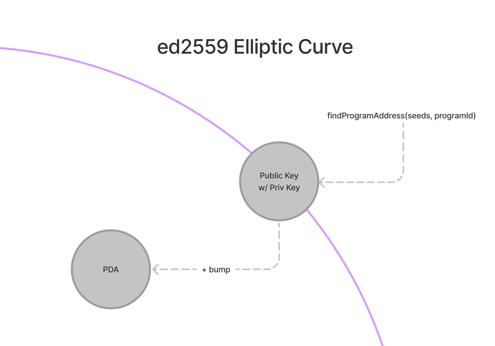

# 📡 运行回来 - 反序列化

现在我们已经设置了钱包连接，让我们的 ping 按钮实际执行一些操作！将数据写入网络帐户只是成功的一半，另一半是读取数据。在第一部分中，我们使用 Web3.js 库中内置的函数来读取内容。这仅适用于绝对重要的数据，例如余额和交易详细信息。正如我们在上一节中看到的，所有好东西都在 PDA 中。

## 🧾 程序派生地址

账目是 Solana 的热门话题。如果您听说过“帐户”这个词，您可能听说过有人在谈论 PDA。 PDA 是 Solana 上用于存储数据的特殊类型帐户。但它不是一个帐户 - 它们实际上是通过地址而不是帐户进行的，因为它们没有私钥。它们只能由创建它们的程序控制。


常规 Solana 帐户是使用 [Ed25519](https://ed25519.cr.yp.to/?utm_source=buildspace.so&utm_medium=buildspace_project) 签名系统创建的 - 该系统为我们提供了公钥和私钥。由于 PDA 是由程序控制的，因此它们不需要私钥。因此，我们使用不在 Ed25519 曲线上的地址来制作 PDA。



有时， findProgramAddress 给我们一个位于曲线上的密钥（意味着它也有一个私钥），因此我们添加一个可选的“bump”参数以将其移出曲线。

就是这样。您不需要了解 Ed25519，甚至不需要了解数字签名算法是什么。您只需要知道 PDA 看起来就像常规 Solana 地址并且由程序控制。

您需要了解 PDA 工作原理的原因是，它们是链上和链下程序定位数据的确定性方式。把它想象成一个键值存储。 seeds 、 programId 和 bump 组合起来形成密钥，以及网络在该地址存储的值。如果我们知道密钥是什么，这使我们能够可靠且一致地查找存储在网络上的数据。

借助 PDA，我们拥有了 Solana 上所有程序都可以访问的通用数据库。回想一下我们交互的第一个程序 - 我们对它执行 ping 操作，它增加了一个数字。您可以通过以下方式查找与程序交互的所有帐户共享的数据：

```ts
const [pda, bump] = await PublicKey.findProgramAddress(
  [Buffer.from("GLOBAL_STATE")],
  programId
);
```

这有点像 Javascript 中的全局变量。

如果您想为每个用户存储一个单独的计数器怎么办？使用他们的公钥作为种子：

```ts
const [pda, bump] = await PublicKey.findProgramAddress(
  [
    publickey.toBuffer()
  ],
  programId
);
```

也许您想制作一个链上笔记系统，每个用户都可以存储自己的笔记？将公钥与标识符结合起来：
```ts
const [pda, bump] = await PublicKey.findProgramAddress(
  [
    publickey.toBuffer(),
    Buffer.from("First Note")
  ],
  programId
);
```

请记住，您或调用者必须付费才能存储内容，并且每个帐户有 10 MB 的限制，因此您需要谨慎选择将内容放在链上。

##  🎢 反序列化


找到要读取的帐户后，您需要反序列化数据，以便您的应用程序可以使用它。回想一下我们在这个程序中学到的第一件事——帐户及其包含的内容。回顾一下：

| FIELD | 描述 |
| --- | --- |
| lamports |  该账户拥有的lamports数量 |
| 所有者 |  该帐户的程序所有者 |
| 可执行文件	| 该账户是否可以处理指令（可执行） |
| 数据	|  该账户存储的原始数据字节数组 |
| 租金纪元 | 该帐户将欠租金的下一个纪元 |

数据字段包含大量字节数组。就像我们如何将可读数据转换为指令字节一样，我们将在这里做相反的事情：将字节数组转换为我们的应用程序可以使用的数据。这是真正的魔法开始的时候，你真的感觉就像在玻璃上冲浪😎

我们在这里见到了我们最好的新老朋友 Borsh 先生：

```ts
impot * as borsh from '@project-serum/borsh';

borshAccountSchema = borsh.struct({
  borsh.bool('initialized'),
  borsh.u16('playerId'),
  borsh.str('name')
});

const { playerId, name } = borshAccountSchema.decode(buffer)
```

这些步骤与我们对序列化所做的类似：
1.创建字节数组中存储内容的模式/映射
2.使用模式来解码数据
3.提取我们想要的项目

这应该感觉很熟悉，但如果不熟悉，当我们付诸行动时就会有意义！

## 构建一个解串器

有没有想过您会构建一个解串器？好吧——我们将继续使用我们的电影评论应用程序。您可以继续上一节（推荐）的项目，也可以使用完成的版本进行设置：

```bash
git clone https://github.com/buildspace/solana-movie-frontend.git
cd solana-movie-frontend
git checkout solution-serialize-instruction-data
npm i
```

当您运行 npm run dev 时，您将看到一堆模拟数据。与假 yeezy 不同，假数据是蹩脚的。让我们在 Movie.ts 中保持真实（仅复制/粘贴新内容）：

```ts
import * as borsh from '@project-serum/borsh'

export class Movie {
    title: string;
    rating: number;
    description: string;
...

  static borshAccountSchema = borsh.struct([
    borsh.bool('initialized'),
    borsh.u8('rating'),
    borsh.str('title'),
    borsh.str('description'),
  ])

  static deserialize(buffer?: Buffer): Movie|null {
    if (!buffer) {
        return null
    }

    try {
        const { title, rating, description } = this.borshAccountSchema.decode(buffer)
        return new Movie(title, rating, description)
    } catch(error) {
        console.log('Deserialization error:', error)
        return null
    }
  }
}
```

就像序列化一样，我们有一个模式和一个方法。该架构具有：

1. initialized 作为一个布尔值，表示帐户是否已初始化。
2. rating 作为无符号 8 位整数，表示评论者对电影的评分（满分 5 分）。
3. title 作为表示所评论电影的标题的字符串。
4. description 作为表示评论的书面部分的字符串.

看起来很熟悉！好东西在 deserialize 中。这里的返回类型可以是 Movie 或 null ，因为帐户可能根本没有任何数据。

最后，我们需要在页面加载时使用此方法从 PDA 获取数据。我们在 MovieList.tsx 中执行此操作：

```ts
import { Card } from './Card'
import { FC, useEffect, useState } from 'react'
import { Movie } from '../models/Movie'
import * as web3 from '@solana/web3.js'

const MOVIE_REVIEW_PROGRAM_ID = 'CenYq6bDRB7p73EjsPEpiYN7uveyPUTdXkDkgUduboaN'

export const MovieList: FC = () => {
    const connection = new web3.Connection(web3.clusterApiUrl('devnet'))
    const [movies, setMovies] = useState<Movie[]>([])

    useEffect(() => {
        connection.getProgramAccounts(new web3.PublicKey(MOVIE_REVIEW_PROGRAM_ID))
        .then(async (accounts) => {
            const movies: Movie[] = accounts.reduce((accum: Movie[], { pubkey, account }) => {
                const movie = Movie.deserialize(account.data)
                if (!movie) {
                    return accum
                }

                return [...accum, movie]
            }, [])
            setMovies(movies)
        })
    }, [])

    return (
        <div>
            {
                movies.map((movie, i) => <Card key={i} movie={movie} /> )
            }
        </div>
    )
}
```

就像以前一样，我们设置了导入和连接。主要更改在 useEffect 中。


```ts
connection.getProgramAccounts(new web3.PublicKey(MOVIE_REVIEW_PROGRAM_ID))
```

在获取电影评论之前，我们需要获取包含它们的帐户。我们可以通过使用 getProgramAccounts 端点获取电影评论程序的所有程序帐户来实现这一点。

**这是一个相当繁重的端点 - 如果您在像 Magic Eden 程序这样的大型程序上尝试它，您将得到数十万到数百万的结果。如果你不小心的话，这会破坏东西。在现实世界中，您很少[需要同时获得多个帐户](https://twitter.com/redacted_noah/status/1593831571014012929?utm_source=buildspace.so&utm_medium=buildspace_project)，所以现在不用担心。只需知道您不应该对数据进行建模，使得 getProgramAccounts 是必要的。**

```ts
.then(async (accounts) => {
          const movies: Movie[] = accounts.reduce((accum: Movie[], { pubkey, account }) => {
              // Try to extract movie item from account data
              const movie = Movie.deserialize(account.data)

              // If the account does not have a review, movie will be null
              if (!movie) {
                  return accum
              }

              return [...accum, movie]
          }, [])
          setMovies(movies)
})
```

为了存储我们的电影评论，我们将创建一个 Movie 类型的数组。为了填充它，我们将使用 reduce 反序列化每个帐户并尝试解构 movie 项。如果该帐户中有电影数据，那么这将起作用！如果没有，电影将为空，我们可以返回累积的电影列表。


如果这看起来令人困惑，请逐行浏览代码并确保您知道 reduce 方法是如何工作的。

确保您正在运行 npm run dev 并转到 localhost:3000 ，您应该会看到其他构建者添加的一堆随机评论：D

## 🚢 船舶挑战

我们现在可以序列化和反序列化数据。好的。让我们切换到我们在序列化部分开始的 Student Intros 应用程序。

目标：更新应用程序以获取并反序列化程序的帐户数据。支持此功能的 Solana 程序位于： HdE95RSVsdb315jfJtaykXhXY478h53X6okDupVfY9yf

您可以从上次挑战中离开的位置开始，也可以从此存储库中获取代码。确保您从 solution-serialize-instruction-data 分支开始。

### Hints:

在 StudentIntro.ts 中创建帐户缓冲区布局。账户数据包含：
1. initialized 作为一个布尔值，表示帐户是否已初始化
2. name 作为表示学生姓名的字符串
3. message 作为表示学生分享的有关 Solana 旅程的消息的字符串

在 StudentIntro.ts 中创建一个静态方法，该方法将使用缓冲区布局将帐户数据缓冲区反序列化为 StudentIntro 对象。


在 StudentIntroList 组件的 useEffect 中，获取程序的帐户并将其数据反序列化到 StudentIntro 对象列表中。

### Solution code:

解决方案代码：
与往常一样，首先尝试独立执行此操作，但如果您陷入困境或只是想将您的解决方案与我们的解决方案进行比较，请查看此存储库中的 solution-deserialize-account-data [分支](https://github.com/buildspace/solana-student-intros-frontend/tree/solution-deserialize-account-data?utm_source=buildspace.so&utm_medium=buildspace_project)。

祝你好运！
