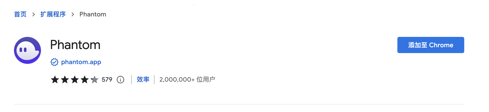
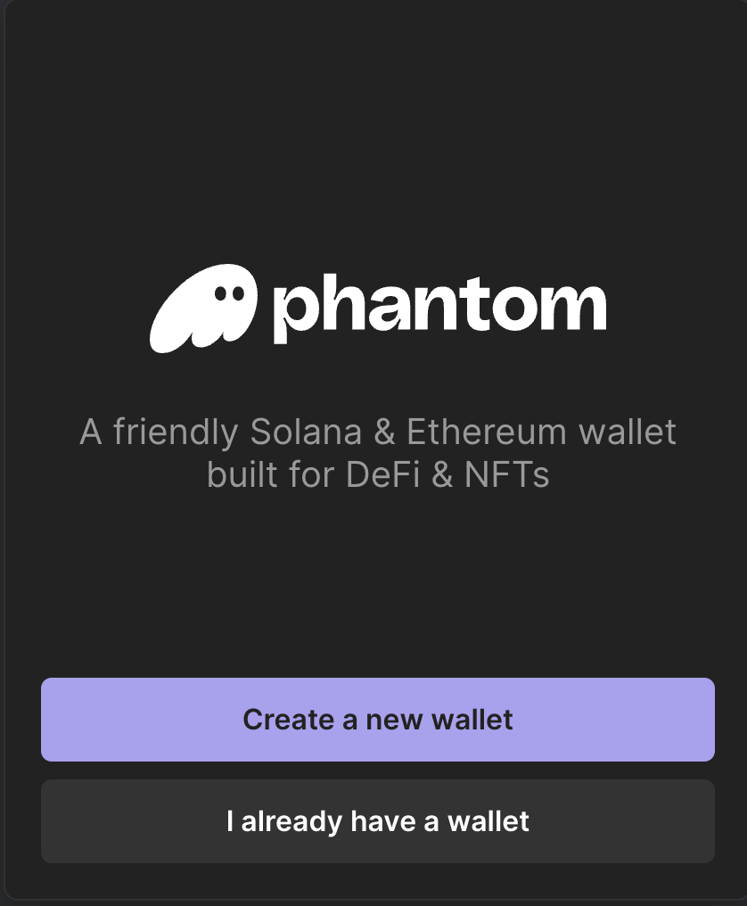
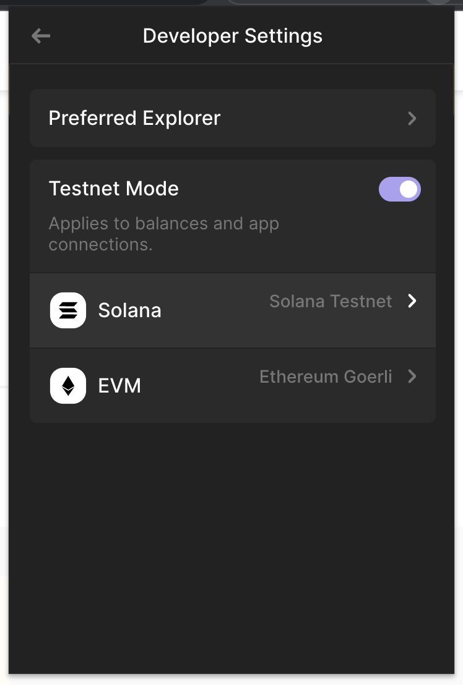

# 钱包使用

Solana的钱包目前以Phantom、Solfare等Chrome插件为主， 类似TokenPocket、MathWallet等手机钱包为辅。甚至还有Solana Saga手机设备作为钱包。

比如打开raydium的链接钱包界面，我们可以看到这么多钱包：

五花八门，实在是太多了。这里我们抽选Phantom来举例使用。

安装
这里我们以Phantom的Chrome插件为例，来演示其基本操作。当然Phantom还有Firefox、手机 等版本。其操作类似。

首先在Chrome中打开：

[https://chrome.google.com/webstore/detail/phantom/bfnaelmomeimhlpmgjnjophhpkkoljpa](https://chrome.google.com/webstore/detail/phantom/bfnaelmomeimhlpmgjnjophhpkkoljpa)

点击"添加至Chrome"

## 创建/导入账号

如果没有账号可以在扩展打开的时候，选择创建账号，创建账号的时候，需要记住这里的助记词，并设置一个 密码，就可以创建新账号了。

这里的助记词和我们的命令行工具的助记词是一样的。因此我们还可以选择导入账号，输入我们的已有的助记词， 并设置好密码。

同时我们还可以选择不同的网络环境，这里我们选择开发网，就可以看到我们前面领的水龙头代币了。

## 转账

转账分为转移SOL代币和普通的SPL-Token代币，在很久以前，这里需要注意对方账户地址， 普通用户的SOL账号地址，和SPL-Token地址不一样，现在因为有了ATA账号的存在，可以直接通过 SOL账号地址进行推导，所以只需要知道对方的钱包地址也就是公钥就可以了。

## 在应用中打开钱包

在DApp应用中，当我们点击"Connect"的时候，会弹出钱包选择界面。如前文中列出来的一样。

在这里我们选择Phantom,然后看到钱包提示我们链接应用，选择后，就可以看到账号信息了。这些 步骤和Metamask基本类似。
